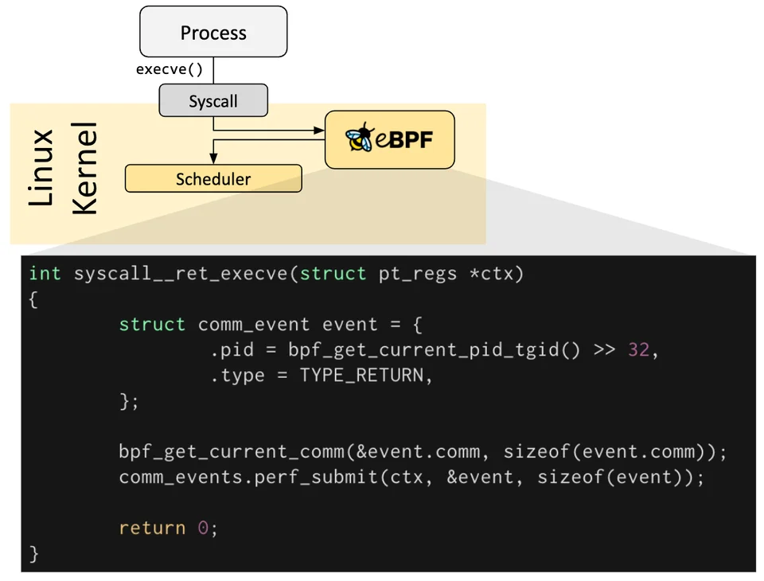
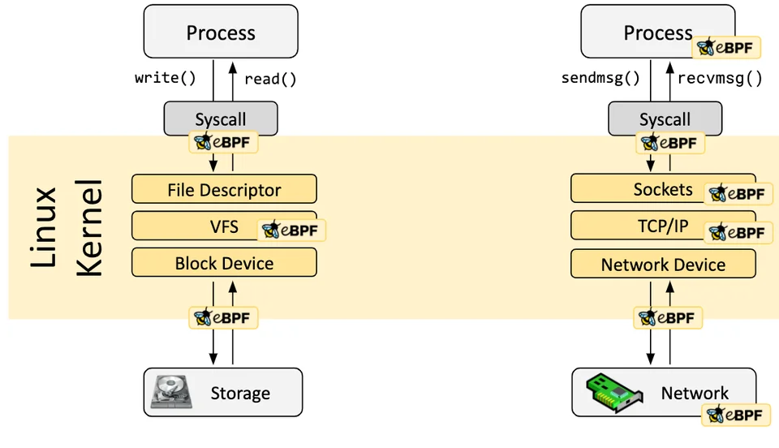
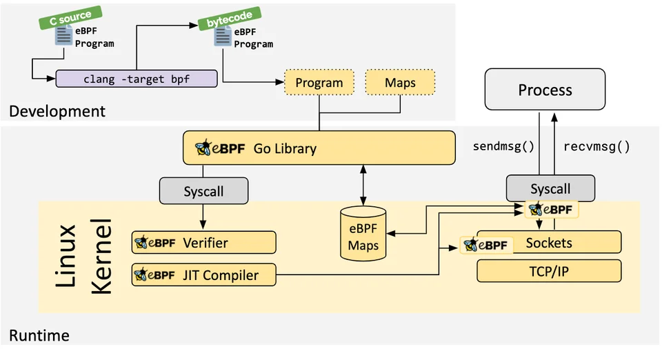
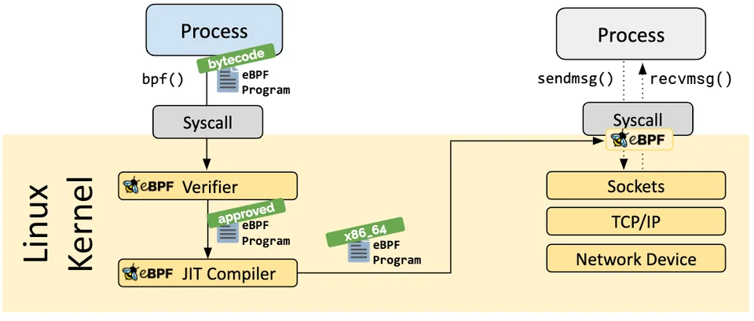
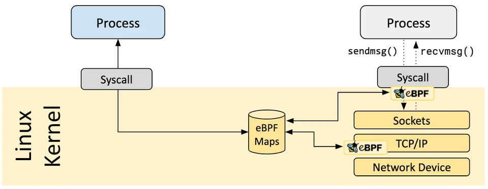
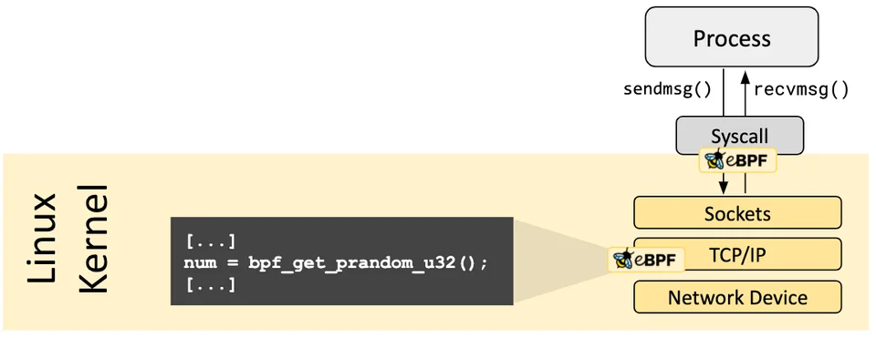
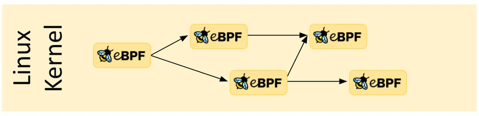

# eBPF : Unlocking the Kernel
## 1. eBPF là gì?
**eBPF (extended Berkeley Packet Filter)** là một công nghệ mạnh mẽ được tích hợp trong nhân Linux, cho phép chạy các chương trình nhỏ trong không gian kernel một cách an toàn và hiệu quả. 

Thông thường, các phần mềm được viết ở tầng User, và để có thể truy cập phần cứng hoặc các tài nguyên hệ thống, chúng phải thông qua các lời gọi hệ thống (`system calls`) để tương tác với kernel. Điều này có thể gây ra độ trễ và hạn chế về hiệu suất.

Tuy nhiên, với eBPF, các chương trình có thể được tải trực tiếp vào kernel và thực thi ngay tại đó, giúp giảm thiểu độ trễ và tăng hiệu suất.

___
### Lợi ích của eBPF:
- **Hiệu suất cao**: eBPF cho phép thực thi mã ngay trong kernel, giảm thiểu độ trễ so với việc gọi hệ thống truyền thống và giảm việc sao chép giữa tầng User và kernel.
- **An toàn**: eBPF sử dụng một trình xác minh để đảm bảo rằng các chương trình không thể gây hại cho hệ thống, ngăn chặn các lỗi bộ nhớ và các hành vi không mong muốn.
- **Linh hoạt**: eBPF có thể được sử dụng cho nhiều mục đích khác nhau, từ giám sát hệ thống, bảo mật, đến tối ưu hóa mạng. 
- **Không cần thay đổi kernel**: Các chương trình eBPF có thể được tải và gỡ bỏ mà không cần phải biên dịch lại hoặc khởi động lại kernel.
___
### Ứng dụng của eBPF:
- **Giám sát hệ thống**: eBPF có thể thu thập dữ liệu về hiệu suất hệ thống, theo dõi các sự kiện và phân tích hành vi của ứng dụng.
- **Bảo mật**: eBPF có thể được sử dụng để phát hiện và ngăn chặn các cuộc tấn công mạng, kiểm soát truy cập và bảo vệ hệ thống.
- **Tối ưu hóa mạng**: eBPF có thể cải thiện hiệu suất mạng bằng cách tối ưu hóa việc xử lý gói tin và quản lý lưu lượng mạng.
- **Phát triển các công cụ hỗ trợ kernel**: eBPF cung cấp một nền tảng để phát triển các ứng dụng mới tận dụng khả năng của kernel mà không cần thay đổi mã nguồn kernel.
___
## 2. Kiến trúc eBPF
### Tổng quan về Hook
Các chương trình eBPF hoạt động theo cơ chế hướng sự kiện (event-driven) và được chạy khi kernel hoặc một ứng dụng đi qua một điểm hook (điểm móc nối) nhất định. Các hook được định nghĩa trước bao gồm các lời gọi hệ thống (system calls), điểm vào/ra của hàm, kernel tracepoint (điểm theo dõi), sự kiện mạng và nhiều loại khác.

Nếu một hook định nghĩa trước không tồn tại cho một nhu cầu cụ thể, ta có thể tạo ra **kernel probe (kprobe)** hoặc **user probe (uprobe)** để gắn các chương trình eBPF vào hầu hết mọi nơi trong kernel hoặc các ứng dụng người dùng.
- **Kernel probe (kprobe)** hoạt động ở tầng kernel và cho phép gắn chương trình eBPF vào các điểm trong mã kernel. Ví dụ:
    - Khi ta gọi hàm `do_sys_open()` trong kernel để mở một tệp, ta có thể sử dụng kprobe để gắn một chương trình eBPF vào điểm này nhằm theo dõi hoặc ghi lại thông tin về các tệp được mở. 
    - Khi gọi tới hàm, máy tính sẽ tạo 1 ngắt (interrupt) để chuyển ngữ cảnh sang kernel, tại đây kprobe sẽ kích hoạt chương trình eBPF đã gắn vào `do_sys_open()`, cho phép ta thực hiện các hành động như ghi log tên tệp, người dùng mở tệp, thời gian mở tệp, v.v.
- **User probe (uprobe)** hoạt động ở tầng user và cho phép gắn chương trình eBPF vào các điểm trong mã của ứng dụng người dùng. Các hoạt động tương tự với kprobe nhưng áp dụng cho các ứng dụng người dùng.

___
### Các chương trình eBPF được viết như thế nào?
Trong nhiều trường hợp, eBPF không được sử dụng trực tiếp mà thông qua các dự án như **Cilium**, **bcc**, hoặc **bpftrace**. Các dự án này cung cấp một lớp trừu tượng bên trên eBPF và không yêu cầu viết chương trình trực tiếp; thay vào đó, chúng cho phép định nghĩa dựa trên mục đích (intent-based), sau đó các định nghĩa này được triển khai bằng eBPF.

Nếu không có lớp trừu tượng cấp cao nào phù hợp, chương trình cần được viết trực tiếp. Linux kernel yêu cầu các chương trình eBPF được tải dưới dạng bytecode. Mặc dù hoàn toàn có thể viết bytecode trực tiếp, nhưng quy trình phát triển phổ biến hơn là tận dụng một bộ biên dịch như **LLVM** để biên dịch mã nguồn "pseudo-C" (giả C) thành eBPF bytecode.

___
### Kiến trúc Trình tải (Loader) & Xác minh (Verification)
Khi hook mong muốn đã được xác định, chương trình eBPF có thể được tải vào Linux kernel bằng cách sử dụng system call `bpf`. Việc này thường được thực hiện thông qua một trong các thư viện eBPF có sẵn. Phần tiếp theo sẽ giới thiệu về các chuỗi công cụ (toolchains) phát triển hiện có.

Khi chương trình được tải vào Linux kernel, nó trải qua hai bước trước khi được gắn vào hook yêu cầu:

___
#### Xác minh (Verification)
Bước xác minh đảm bảo rằng chương trình eBPF an toàn để chạy. Nó kiểm tra xem chương trình có đáp ứng một số điều kiện hay không, ví dụ:

* Tiến trình (process) tải chương trình eBPF phải nắm giữ các quyền hạn (capabilities) cần thiết. Trừ khi tính năng "unprivileged eBPF" (eBPF không đặc quyền) được bật, chỉ các tiến trình có đặc quyền mới có thể tải chương trình eBPF.
* Chương trình không được gây crash hoặc làm hại hệ thống.
* Chương trình luôn phải chạy đến khi hoàn thành (tức là chương trình không được rơi vào vòng lặp vô hạn, làm ngưng trệ các xử lý khác).

___
#### Biên dịch JIT (Just-in-Time)
Bước biên dịch JIT dịch bytecode chung của chương trình thành tập lệnh máy cụ thể để tối ưu hóa tốc độ thực thi. Điều này giúp các chương trình eBPF chạy hiệu quả tương đương với mã kernel được biên dịch native hoặc mã được tải dưới dạng kernel module.

___
### Maps (Cấu trúc lưu trữ)
Một khía cạnh quan trọng của các chương trình eBPF là khả năng chia sẻ thông tin thu thập được và lưu trữ trạng thái. Cho mục đích này, các chương trình eBPF có thể tận dụng khái niệm **eBPF maps** để lưu và truy xuất dữ liệu trong nhiều loại cấu trúc dữ liệu khác nhau. eBPF maps có thể được truy cập từ các chương trình eBPF cũng như từ các ứng dụng trong user space thông qua system call.

Dưới đây là danh sách chưa đầy đủ các loại map được hỗ trợ để bạn hình dung về sự đa dạng của cấu trúc dữ liệu. Đối với nhiều loại map, có sẵn cả biến thể dùng chung (shared) và biến thể riêng cho từng CPU (per-CPU):
* Bảng băm (Hash tables), Mảng (Arrays)
* LRU (Least Recently Used - Ít được sử dụng gần đây nhất)
* Ring Buffer (Bộ đệm vòng)
* Stack Trace (Truy vết ngăn xếp)
* LPM (Longest Prefix match - Khớp tiền tố dài nhất)
* ...

___
### Các lời gọi hàm hỗ trợ (Helper Calls)
Chương trình eBPF không thể gọi vào các hàm kernel tùy ý. Việc cho phép điều này sẽ buộc các chương trình eBPF phải gắn chặt với các phiên bản kernel cụ thể và làm phức tạp khả năng tương thích của chương trình. Thay vào đó, các chương trình eBPF có thể thực hiện các lời gọi hàm tới **helper functions** (hàm hỗ trợ), một API ổn định và phổ biến được cung cấp bởi kernel.

Tập hợp các helper calls có sẵn liên tục được phát triển. Ví dụ về các helper calls hiện có:
* Tạo số ngẫu nhiên
* Lấy ngày & giờ hiện tại
* Truy cập eBPF map
* Lấy ngữ cảnh process/cgroup
* Thao tác gói tin mạng và logic chuyển tiếp (forwarding)

___
### Tail & Function Calls
Các chương trình eBPF có thể kết hợp với nhau thông qua khái niệm **tail calls** và **function calls**.
* **Function calls** cho phép định nghĩa và gọi các hàm trong cùng một chương trình eBPF.
* **Tail calls** có thể gọi và thực thi một chương trình eBPF khác và thay thế ngữ cảnh thực thi hiện tại, tương tự như cách system call `execve()` hoạt động đối với các tiến trình thông thường.

___
### An toàn trong eBPF (eBPF Safety)
*Sức mạnh càng lớn, trách nhiệm càng cao.*

eBPF là một công nghệ cực kỳ mạnh mẽ và hiện đang chạy ở trung tâm của nhiều thành phần hạ tầng phần mềm quan trọng. Trong quá trình phát triển eBPF, sự an toàn là khía cạnh quan trọng nhất được cân nhắc khi đưa eBPF vào Linux kernel. Sự an toàn của eBPF được đảm bảo qua nhiều lớp:

___
#### Đặc quyền bắt buộc (Required Privileges)
Trừ khi unprivileged eBPF được bật, tất cả các tiến trình có ý định tải chương trình eBPF vào Linux kernel phải chạy ở chế độ đặc quyền (root) hoặc yêu cầu capability `CAP_BPF`. Điều này có nghĩa là các chương trình không tin cậy không thể tải chương trình eBPF.
Nếu unprivileged eBPF được bật, các tiến trình không đặc quyền có thể tải một số chương trình eBPF nhất định nhưng bị giới hạn tính năng và quyền truy cập vào kernel.

___
#### Bộ xác minh (Verifier)
Nếu một tiến trình được phép tải chương trình eBPF, tất cả các chương trình vẫn phải đi qua eBPF verifier. Verifier đảm bảo sự an toàn của chính chương trình đó. Điều này có nghĩa là, ví dụ:
* Các chương trình được kiểm tra để đảm bảo chúng luôn chạy đến khi hoàn thành (ví dụ: chương trình eBPF không bao giờ được chặn/block hoặc lặp vô hạn). Các chương trình eBPF có thể chứa các "vòng lặp giới hạn" (bounded loops) nhưng chỉ được chấp nhận nếu verifier có thể đảm bảo rằng vòng lặp có điều kiện thoát chắc chắn sẽ xảy ra.
* Chương trình không được sử dụng bất kỳ biến nào chưa được khởi tạo hoặc truy cập bộ nhớ ngoài phạm vi cho phép.
* Chương trình phải nằm trong yêu cầu kích thước của hệ thống. Không thể tải các chương trình eBPF lớn tùy ý.
* Chương trình phải có độ phức tạp hữu hạn. Verifier sẽ đánh giá tất cả các đường dẫn thực thi có thể và phải có khả năng hoàn thành việc phân tích trong giới hạn độ phức tạp cấu hình trên.

Verifier được xem là một công cụ an toàn (safety tool), kiểm tra xem chương trình có an toàn để chạy hay không. Nó không phải là một công cụ bảo mật (security tool) để kiểm tra xem chương trình đang thực hiện nghiệp vụ gì.

___
#### Gia cố (Hardening)
Sau khi hoàn tất xác minh thành công, chương trình eBPF trải qua quy trình gia cố tùy thuộc vào việc chương trình được tải từ tiến trình có đặc quyền hay không đặc quyền. Bước này bao gồm:
* **Bảo vệ thực thi chương trình:** Bộ nhớ kernel chứa chương trình eBPF được bảo vệ và chuyển sang chế độ chỉ đọc (read-only). Nếu vì lý do nào đó (bug của kernel hay thao tác ác ý) mà chương trình eBPF bị sửa đổi, kernel sẽ crash thay vì cho phép tiếp tục thực thi chương trình đã bị hỏng/thao túng.
* **Giảm thiểu Spectre:** Dưới cơ chế suy đoán (speculation), CPU có thể dự đoán sai các nhánh và để lại các tác dụng phụ có thể quan sát được qua các kênh bên (side channel). Ví dụ: các chương trình eBPF che giấu truy cập bộ nhớ để chuyển hướng truy cập dưới các lệnh tạm thời sang các vùng được kiểm soát; verifier cũng theo dõi các đường dẫn chương trình chỉ có thể truy cập dưới thực thi suy đoán; và trình biên dịch JIT phát ra Retpolines trong trường hợp tail calls không thể chuyển đổi thành các lệnh gọi trực tiếp.
* **Làm mù hằng số (Constant blinding):** Tất cả các hằng số trong mã đều bị làm mù để ngăn chặn các cuộc tấn công JIT spraying. Điều này ngăn kẻ tấn công tiêm mã thực thi dưới dạng các hằng số, mà nếu kết hợp với một lỗi kernel khác, có thể cho phép kẻ tấn công nhảy vào vùng nhớ của chương trình eBPF để thực thi mã đó.

___
#### Ngữ cảnh Runtime được trừu tượng hóa (Abstracted Runtime Context)
Các chương trình eBPF không thể truy cập trực tiếp bộ nhớ kernel tùy ý. Dữ liệu và cấu trúc dữ liệu nằm ngoài ngữ cảnh của chương trình phải được truy cập thông qua các eBPF helpers. Điều này đảm bảo truy cập dữ liệu nhất quán và làm cho mọi truy cập như vậy phải tuân theo các đặc quyền của chương trình eBPF (ví dụ: chỉ các cấu trúc dữ liệu liên quan đến loại chương trình mới được đọc hoặc đôi khi sửa đổi, miễn là verifier có thể đảm bảo tại thời điểm tải rằng việc truy cập ngoài giới hạn sẽ không bao giờ xảy ra; hoặc một chương trình eBPF đang chạy chỉ được phép sửa đổi dữ liệu của một số cấu trúc nhất định nếu việc sửa đổi đó được đảm bảo là an toàn). Một chương trình eBPF không thể sửa đổi ngẫu nhiên các cấu trúc dữ liệu trong kernel.
___
## 3. Cơ chế hoạt động

- 