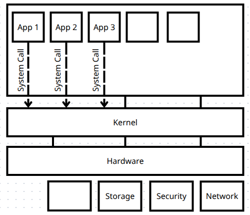
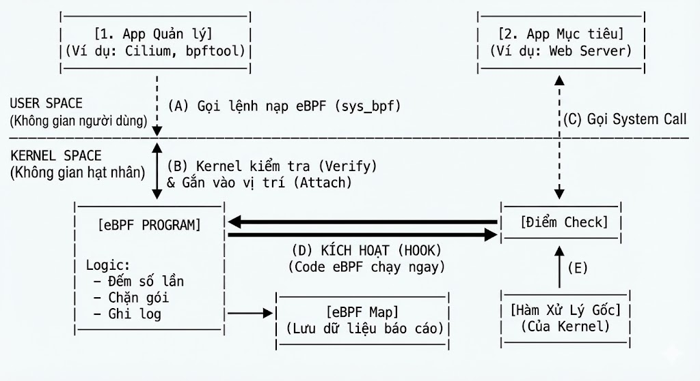

# eBPF : Unlocking the Kernel
## 1. eBPF là gì?
**eBPF (extended Berkeley Packet Filter)** là một công nghệ mạnh mẽ được tích hợp trong nhân Linux, cho phép chạy các chương trình nhỏ trong không gian kernel một cách an toàn và hiệu quả. 

Thông thường, các phần mềm được viết ở tầng User, và để có thể truy cập phần cứng hoặc các tài nguyên hệ thống, chúng phải thông qua các lời gọi hệ thống (`system calls`) để tương tác với kernel. Điều này có thể gây ra độ trễ và hạn chế về hiệu suất.

Tuy nhiên, với eBPF, các chương trình có thể được tải trực tiếp vào kernel và thực thi ngay tại đó, giúp giảm thiểu độ trễ và tăng hiệu suất.

___
### Lợi ích của eBPF:
- **Hiệu suất cao**: eBPF cho phép thực thi mã ngay trong kernel, giảm thiểu độ trễ so với việc gọi hệ thống truyền thống và giảm việc sao chép giữa tầng User và kernel.
- **An toàn**: eBPF sử dụng một trình xác minh để đảm bảo rằng các chương trình không thể gây hại cho hệ thống, ngăn chặn các lỗi bộ nhớ và các hành vi không mong muốn.
- **Linh hoạt**: eBPF có thể được sử dụng cho nhiều mục đích khác nhau, từ giám sát hệ thống, bảo mật, đến tối ưu hóa mạng. 
- **Không cần thay đổi kernel**: Các chương trình eBPF có thể được tải và gỡ bỏ mà không cần phải biên dịch lại hoặc khởi động lại kernel.
___
### Ứng dụng của eBPF:
- **Giám sát hệ thống**: eBPF có thể thu thập dữ liệu về hiệu suất hệ thống, theo dõi các sự kiện và phân tích hành vi của ứng dụng.
- **Bảo mật**: eBPF có thể được sử dụng để phát hiện và ngăn chặn các cuộc tấn công mạng, kiểm soát truy cập và bảo vệ hệ thống.
- **Tối ưu hóa mạng**: eBPF có thể cải thiện hiệu suất mạng bằng cách tối ưu hóa việc xử lý gói tin và quản lý lưu lượng mạng.
- **Phát triển các công cụ hỗ trợ kernel**: eBPF cung cấp một nền tảng để phát triển các ứng dụng mới tận dụng khả năng của kernel mà không cần thay đổi mã nguồn kernel.
___
## 2. Kiến trúc eBPF
### a. 
___
## 3. Cơ chế hoạt động

- 