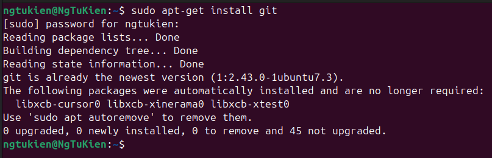
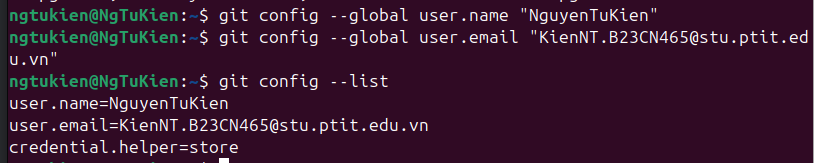
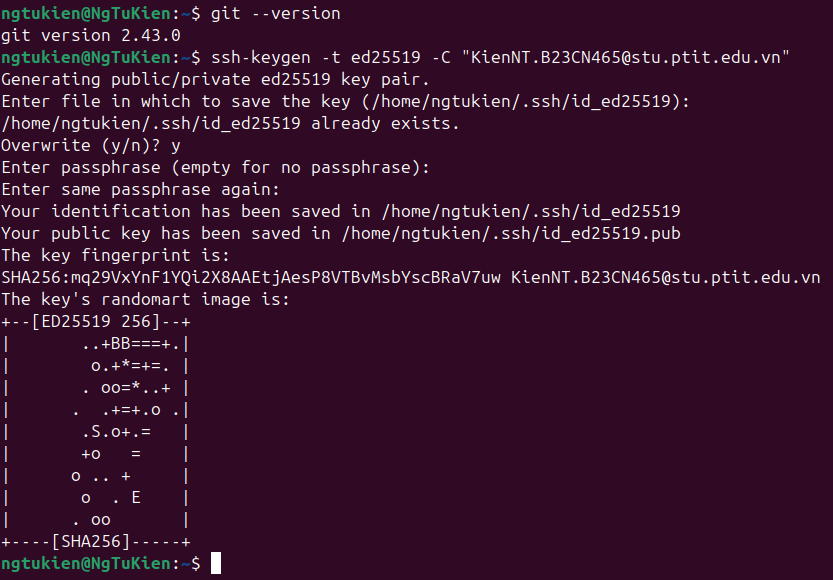
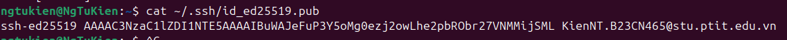
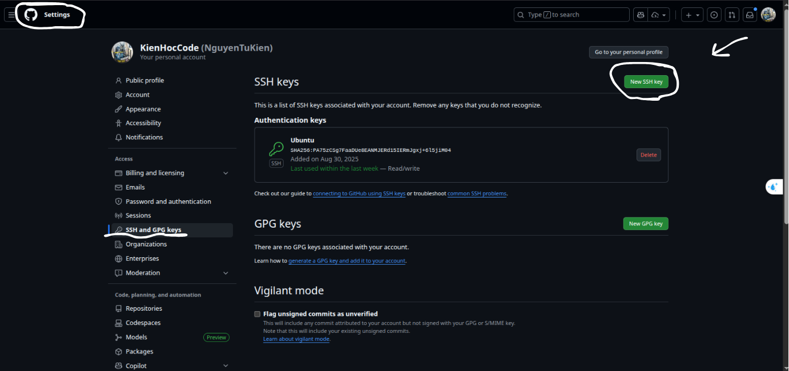
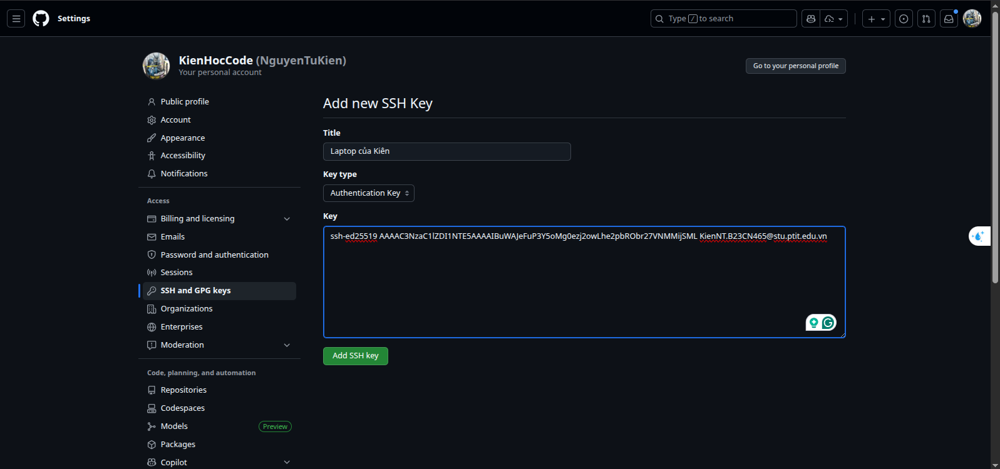
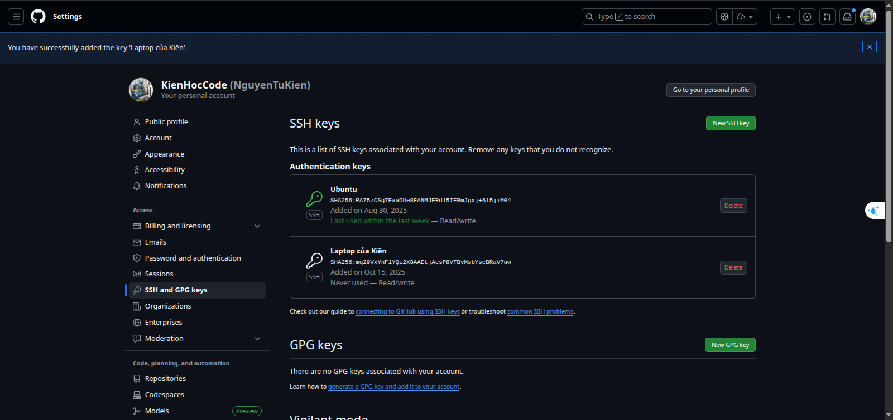
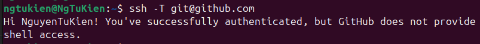

# Phần 1 : Giới thiệu tổng quan về Git
## 1. **Git là gì?**
* Version Control System (VCS) là một công cụ giúp quản lý các thay đổi trong mã nguồn, tài liệu và các tệp tin khác theo thời gian, hỗ trợ phục hồi phiên bản cũ và cho phép nhiều người làm việc cùng nhau trên cùng một dự án mà không lo lắng về việc ghi đè lên công việc của nhau.
* Git là một hệ thống quản lý phiên bản phân tán (Distributed Version Control System - DVCS) mã nguồn mở được sử dụng để theo dõi các thay đổi trong mã nguồn và phối hợp công việc giữa các nhà phát triển phần mềm.
* DCVS : 
    - Mỗi nhà phát triển có một bản sao đầy đủ của toàn bộ kho lưu trữ (repository) trên máy tính của họ.
    - Các thay đổi có thể được thực hiện và lưu trữ cục bộ trước khi được đẩy lên kho lưu trữ trung tâm.
    - Giúp làm việc ngoại tuyến và tăng tốc độ thao tác với kho lưu trữ.
    - Hỗ trợ làm việc nhóm hiệu quả hơn, giảm thiểu xung đột khi nhiều người cùng làm việc trên cùng một dự án.
* Git được phát triển bởi Linus Torvalds vào năm 2005 để hỗ trợ phát triển nhân Linux kernel.
* Git nổi bật với khả năng quản lý các dự án lớn, hiệu suất cao và tính linh hoạt trong việc làm việc nhóm.
## 2. **Lịch sử phát triển của Git**
* Năm 2005, Linus Torvalds phát triển Git để hỗ trợ việc phát triển nhân Linux kernel.
* Trước Git, các hệ thống quản lý phiên bản như CVS và Subversion (SVN) đã được sử dụng rộng rãi, nhưng chúng có những hạn chế về hiệu suất và khả năng làm việc nhóm.
* Git được thiết kế để khắc phục những hạn chế này, với mục tiêu cung cấp một hệ thống quản lý phiên bản nhanh, linh hoạt và mạnh mẽ.
* Git nhanh chóng trở nên phổ biến trong cộng đồng phát triển phần mềm và hiện nay được sử dụng rộng rãi trong các dự án mã nguồn mở và các công ty công nghệ lớn.
## 3. **So sánh Git với các VCS khác**
* CVS (Concurrent Versions System):
    - Hệ thống quản lý phiên bản tập trung.
    - Mỗi nhà phát triển làm việc trên một bản sao cục bộ và phải kết nối với máy chủ để đồng bộ các thay đổi.
    - Hiệu suất thấp hơn so với Git, đặc biệt với các dự án lớn.
* SVN (Subversion):
    - Hệ thống quản lý phiên bản tập trung.
    - Cải thiện hiệu suất so với CVS nhưng vẫn không linh hoạt như Git.
    - Hỗ trợ làm việc nhóm tốt hơn nhưng vẫn gặp khó khăn khi làm việc ngoại tuyến.
* Mercurial:
    - Hệ thống quản lý phiên bản phân tán tương tự như Git.
    - Dễ sử dụng hơn Git nhưng không phổ biến bằng.
    - Hiệu suất và tính năng tương đương với Git trong nhiều trường hợp.
* Tổng kết:
    - Git nổi bật với hiệu suất cao, linh hoạt và khả năng làm việc nhóm tốt hơn so với các hệ thống quản lý phiên bản khác.
    - Git là lựa chọn phổ biến nhất trong cộng đồng phát triển phần mềm hiện nay.
## 4. **GitHub, GitLab và GitBucket**
* GitHub:
    - Là một dịch vụ lưu trữ mã nguồn trực tuyến phổ biến, cung cấp giao diện web để quản lý repository Git.
    - Hỗ trợ các tính năng như pull requests, issues, project management và tích hợp CI/CD.
    - Được sử dụng rộng rãi trong cộng đồng mã nguồn mở và các công ty công nghệ lớn.
* GitLab:
    - Là một nền tảng quản lý mã nguồn và DevOps toàn diện, cung cấp cả dịch vụ lưu trữ mã nguồn và các công cụ quản lý dự án.
    - Hỗ trợ CI/CD tích hợp, quản lý issues, và các tính năng bảo mật nâng cao.
    - Có thể được cài đặt trên máy chủ riêng hoặc sử dụng dịch vụ đám mây của GitLab.
* GitBucket:
    - Là một nền tảng quản lý mã nguồn mã nguồn mở, tương tự như Git nằm trong hệ sinh thái Atlassian.
    - Cung cấp giao diện web để quản lý repository Git và hỗ trợ các tính năng như pull requests, issues và wiki.
    - Có thể được cài đặt trên máy chủ riêng, phù hợp cho các tổ chức muốn kiểm soát hoàn toàn dữ liệu của mình.
## 5. **Cài đặt Git & cấu hình ban đầu**
* Cài đặt Git:
    - Trên Windows: Tải trình cài đặt từ trang chính thức của Git (https://git-scm.com/downloads/win) và làm theo hướng dẫn cài đặt.
    - Trên macOS: Sử dụng Homebrew với lệnh `brew install git` hoặc tải trình cài đặt từ trang chính thức của Git (https://git-scm.com/downloads/mac).
    - Trên Linux: Sử dụng trình quản lý gói của hệ điều hành, ví dụ trên Ubuntu/Debian sử dụng lệnh `sudo apt-get install git`, trên Fedora sử dụng lệnh `sudo dnf install git`.
  
* Cấu hình ban đầu:
    - Mở terminal hoặc command prompt.
    - Chạy lệnh `git config --global user.name "Your Name"` để thiết lập tên người dùng.
    - Chạy lệnh `git config --global user.email "Your Email"` để thiết lập email người dùng.
    - Kiểm tra cấu hình bằng lệnh 'git config --list'.
  
  * Kiểm tra version và thiết lập ssh key
    - Kiểm tra version: `git --version`
    - Tạo SSH key: `ssh-keygen -t ed25519 -C "Your Email"`
      + `"Enter file in which to save the key"` chọn vị trí lưu key (mặc định là ~/.ssh/id_ed25519) -> Enter
      + `"Enter passphrase (empty for no passphrase)"` nhập passphrase (nếu muốn) -> Enter
    
    - Lấy SSH key: `cat ~/.ssh/id_ed25519.pub`
    
    - Thêm SSH key vào GitHub:
      + Vào trang GitHub, chọn Settings -> SSH and GPG keys -> New SSH key
      
      + Dán SSH key vào ô "Key" và đặt tên cho key ở ô "Title"
      + Nhấn "Add SSH key" để lưu
      
      
    - Kiểm tra kết nối SSH với GitHub: `ssh -T git@github.com`
    
    
