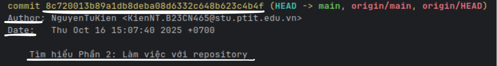
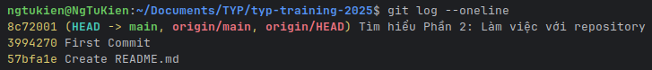
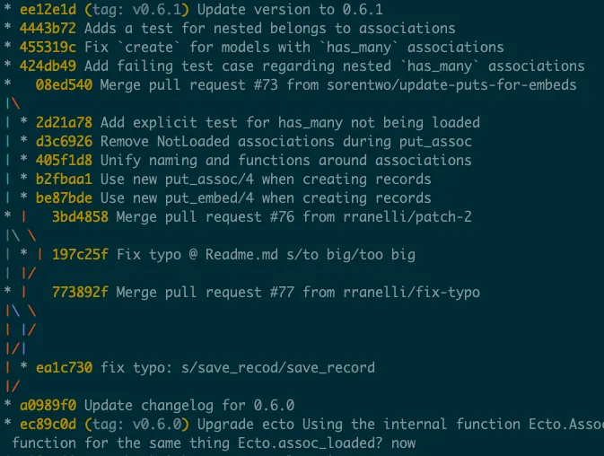
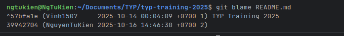

# Phần 3: Làm việc với lịch sử và phiên bản    
## 1. **Cách xem lịch sử và phiên bản commit.**
* Xem lịch sử commit:
   - `git log`: Hiển thị danh sách các commit trong repository, bao gồm mã hash, tác giả, ngày tháng và thông điệp commit.
  
   - `git log --oneline`: Hiển thị lịch sử commit dưới dạng một dòng cho mỗi commit, giúp dễ dàng xem tổng quan.
  
   - `git log --graph --oneline --all`: Hiển thị lịch sử commit dưới dạng đồ thị, giúp hình dung các nhánh và merge.
  
* Xem chi tiết một commit cụ thể:
    - `git show <commit-hash>`: Hiển thị chi tiết về một commit
    - Nếu không có mã hash, `git show` sẽ hiển thị chi tiết của commit gần nhất.
    - 
    - `git diff <commit-hash1> <commit-hash2>`: So sánh sự khác biệt giữa hai commit cụ thể.
* Tìm người thay đổi một file cụ thể:
    - `git blame <file>`: Hiển thị thông tin về từng dòng trong file, bao gồm người đã thay đổi và commit liên quan.
  
## 2. **Giải thích commit ID (SHA-1 hash).**
* Commit ID (SHA-1 hash) là một chuỗi ký tự duy nhất được tạo ra bởi Git để xác định mỗi commit trong repository.
* SHA-1 (Secure Hash Algorithm 1) là một thuật toán băm (hashing algorithm) tạo ra một chuỗi 40 ký tự hex từ dữ liệu đầu vào (trong trường hợp này là nội dung của commit).
* Commit ID được tạo dựa trên các yếu tố sau:
   - Nội dung của commit (thay đổi mã nguồn, tài liệu, v.v.)
   - Thông tin về tác giả và người committer (tên, email)
   - Thời gian tạo commit
   - Mã hash của commit cha (nếu có)
* Chi tiết hơn :
   - [Phần 3.2 : Thuật toán SHA1.md](Thuat_toan_SHA1.md)
   - [Phần 3.2 : Cách SHA1 tạo ra commit ID.md](Cach_SHA1_tao_ra_commitID.md)
## 3. **Undo / Revert / Reset thay đổi**
- Undo thay đổi
   - `git checkout -- <file>`: Hoàn tác các thay đổi trong Working Directory, đưa file trở về trạng thái của lần commit gần nhất.
   - `git restore <file>`: Tương tự như lệnh trên, nhưng là lệnh mới hơn và được khuyến nghị sử dụng (vì `git checkout` có nhiều chức năng khác nhau).
   - `git restore --staged <file>`: Gỡ file khỏi Staging Area (nếu đã `git add`).
- Revert thay đổi
   - `git revert <commit-hash>`: Tạo một commit mới để đảo ngược các thay đổi của commit đã chỉ định, giữ nguyên lịch sử commit.
- Reset thay đổi
   - `git reset --soft <commit-hash>`: Đưa HEAD về commit đã chỉ định, giữ nguyên các thay đổi trong Staging Area và Working Directory.
   - `git reset --mixed <commit-hash>`: Đưa HEAD về commit đã chỉ định, giữ nguyên các thay đổi trong Working Directory nhưng xóa Staging Area.
   - `git reset --hard <commit-hash>`: Đưa HEAD về commit đã chỉ định và xóa tất cả các thay đổi trong Staging Area và Working Directory (cẩn thận khi sử dụng lệnh này).
- Lưu ý: Trước khi sử dụng các lệnh này, đặc biệt là `git reset --hard`, hãy chắc chắn rằng bạn hiểu rõ về tác động của chúng để tránh mất dữ liệu không mong muốn.
## 4. Khi nào sử dụng Revert và khi nào sử dụng Reset
* Sử dụng `git revert` khi:
    - Bạn muốn giữ lại lịch sử commit và chỉ muốn đảo ngược một commit cụ thể
    - Bạn đang làm việc trong một repository chia sẻ với nhiều người và không muốn làm thay đổi lịch sử commit chung.
* Sử dụng `git reset` khi:
    - Bạn muốn thay đổi lịch sử commit của riêng mình và không cần giữ lại các commit
    - Bạn đang làm việc trên một nhánh riêng và muốn loại bỏ các commit không cần thiết trước khi hợp nhất với nhánh chính.
    - Bạn cần hoàn tác các thay đổi trong Staging Area hoặc Working Directory một cách nhanh chóng.
* Lưu ý: `git reset` có thể làm mất dữ liệu nếu không được sử dụng cẩn thận, đặc biệt là với tùy chọn `--hard`. Hãy đảm bảo rằng bạn hiểu rõ về tác động của lệnh này trước khi sử dụng nó.
## 5. Làm việc với .gitignore
* Tệp `.gitignore` là một tệp văn bản đặc biệt trong Git, được sử dụng để xác định các tệp và thư mục mà bạn muốn Git bỏ qua (không theo dõi) khi thực hiện các thao tác như `git add` và `git commit`.
* Cách tạo và sử dụng `.gitignore`:
   - Tạo tệp `.gitignore` trong thư mục gốc của repository (nếu chưa có).
   - Mở tệp `.gitignore` bằng trình soạn thảo văn bản và thêm các mẫu (patterns) để chỉ định các tệp hoặc thư mục cần bỏ qua.
   - Ví dụ về nội dung của tệp `.gitignore`:
```
# Bỏ qua các file log
*.log
npm-debug.log*

# Bỏ qua các thư mục chứa các gói phụ thuộc và file build
node_modules/
dist/
build/

# Bỏ qua các file hệ điều hành
.DS_Store
Thumbs.db

# Bỏ qua các file chứa biến môi trường và thông tin nhạy cảm
.env
.env.local
.env.development.local
.env.test.local
.env.production.local
# Không bỏ qua tệp README.md
!README.md
```
   - Lưu ý rằng các mẫu trong `.gitignore` có thể sử dụng ký tự đại diện như `*` (đại diện cho bất kỳ chuỗi ký tự nào) và `/` (để chỉ định thư mục).
* Các quy tắc quan trọng khi sử dụng `.gitignore`:
   - `.gitignore` chỉ ảnh hưởng đến các tệp chưa được theo dõi (untracked files). Nếu một tệp đã được theo dõi bởi Git, việc thêm nó vào `.gitignore` sẽ không loại bỏ nó khỏi repository.
   - Bạn có thể tạo nhiều tệp `.gitignore` trong các thư mục con để áp dụng các quy tắc bỏ qua cụ thể cho từng thư mục.
   - Để loại bỏ một tệp đã được theo dõi khỏi repository sau khi đã thêm nó vào `.gitignore`, bạn cần sử dụng lệnh `git rm --cached <file>`.
* Kiểm tra trạng thái của tệp `.gitignore`:
   - Sử dụng lệnh `git status` để xem các tệp bị bỏ qua bởi `.gitignore`.
* Mẹo: 
   - Tạo `.gitignore` ngay từ đầu khi khởi tạo một repository để tránh việc thêm các tệp không mong muốn vào lịch sử commit.
   - Tham khảo các mẫu `.gitignore` phổ biến cho các ngôn ngữ lập trình và framework cụ thể trên trang [gitignore.io](https://www.toptal.com/developers/gitignore).
* Ví dụ với Node.js:
   - Khi làm việc với dự án Node.js, bạn thường muốn bỏ qua thư mục `node_modules/` vì nó chứa các gói phụ thuộc được cài đặt và không cần thiết để theo dõi trong Git.
   - Bạn cũng có thể muốn bỏ qua các tệp log và tệp cấu hình môi trường như `.env`.
* Ví dụ về nội dung `.gitignore`:
```
# Bỏ qua các gói phụ thuộc
/node_modules

# Bỏ qua thư mục build
/build

# Bỏ qua các file chứa biến môi trường và thông tin nhạy cảm
.env
```
