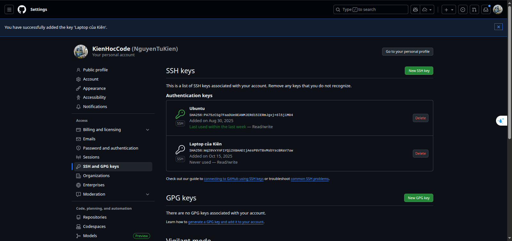
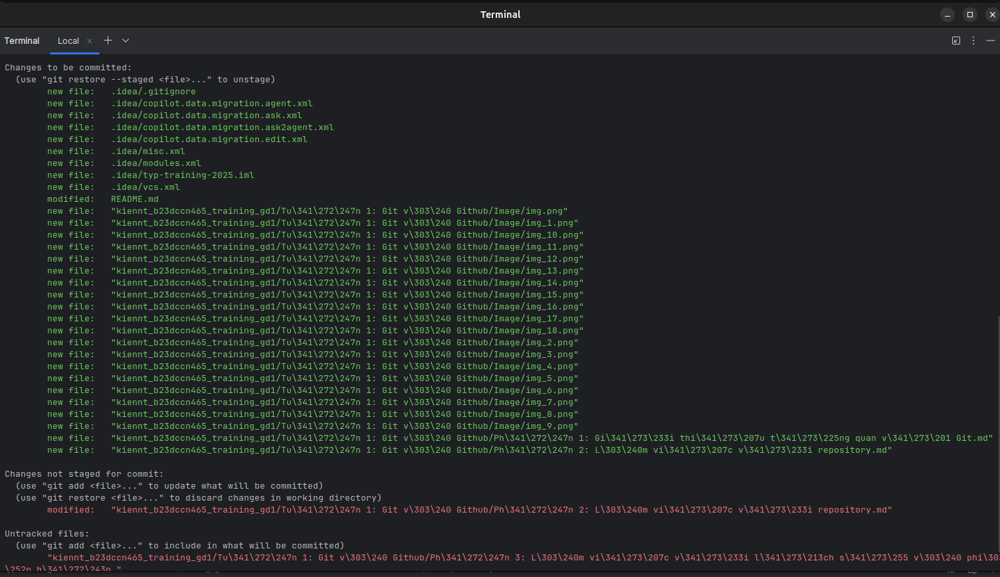
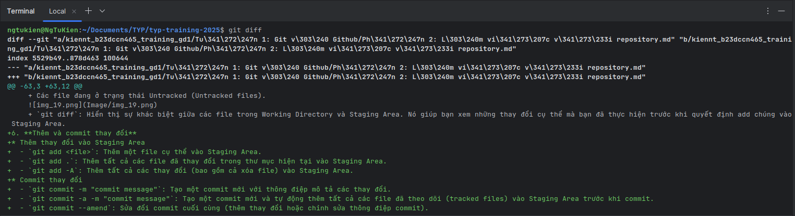

# Phần 1: Giới thiệu tổng quan về Git
## 1. **Git là gì?**
* Version Control System (VCS) là một công cụ giúp quản lý các thay đổi trong mã nguồn, tài liệu và các tệp tin khác theo thời gian, hỗ trợ phục hồi phiên bản cũ và cho phép nhiều người làm việc cùng nhau trên cùng một dự án mà không lo lắng về việc ghi đè lên công việc của nhau.
* Git là một hệ thống quản lý phiên bản phân tán (Distributed Version Control System - DVCS) mã nguồn mở được sử dụng để theo dõi các thay đổi trong mã nguồn và phối hợp công việc giữa các nhà phát triển phần mềm.
* DCVS : 
    - Mỗi nhà phát triển có một bản sao đầy đủ của toàn bộ kho lưu trữ (repository) trên máy tính của họ.
    - Các thay đổi có thể được thực hiện và lưu trữ cục bộ trước khi được đẩy lên kho lưu trữ trung tâm.
    - Giúp làm việc ngoại tuyến và tăng tốc độ thao tác với kho lưu trữ.
    - Hỗ trợ làm việc nhóm hiệu quả hơn, giảm thiểu xung đột khi nhiều người cùng làm việc trên cùng một dự án.
* Git được phát triển bởi Linus Torvalds vào năm 2005 để hỗ trợ phát triển nhân Linux kernel.
* Git nổi bật với khả năng quản lý các dự án lớn, hiệu suất cao và tính linh hoạt trong việc làm việc nhóm.
## 2. **Lịch sử phát triển của Git**
* Năm 2005, Linus Torvalds phát triển Git để hỗ trợ việc phát triển nhân Linux kernel.
* Trước Git, các hệ thống quản lý phiên bản như CVS và Subversion (SVN) đã được sử dụng rộng rãi, nhưng chúng có những hạn chế về hiệu suất và khả năng làm việc nhóm.
* Git được thiết kế để khắc phục những hạn chế này, với mục tiêu cung cấp một hệ thống quản lý phiên bản nhanh, linh hoạt và mạnh mẽ.
* Git nhanh chóng trở nên phổ biến trong cộng đồng phát triển phần mềm và hiện nay được sử dụng rộng rãi trong các dự án mã nguồn mở và các công ty công nghệ lớn.
## 3. **So sánh Git với các VCS khác**
* CVS (Concurrent Versions System):
    - Hệ thống quản lý phiên bản tập trung.
    - Mỗi nhà phát triển làm việc trên một bản sao cục bộ và phải kết nối với máy chủ để đồng bộ các thay đổi.
    - Hiệu suất thấp hơn so với Git, đặc biệt với các dự án lớn.
* SVN (Subversion):
    - Hệ thống quản lý phiên bản tập trung.
    - Cải thiện hiệu suất so với CVS nhưng vẫn không linh hoạt như Git.
    - Hỗ trợ làm việc nhóm tốt hơn nhưng vẫn gặp khó khăn khi làm việc ngoại tuyến.
* Mercurial:
    - Hệ thống quản lý phiên bản phân tán tương tự như Git.
    - Dễ sử dụng hơn Git nhưng không phổ biến bằng.
    - Hiệu suất và tính năng tương đương với Git trong nhiều trường hợp.
* Tổng kết:
    - Git nổi bật với hiệu suất cao, linh hoạt và khả năng làm việc nhóm tốt hơn so với các hệ thống quản lý phiên bản khác.
    - Git là lựa chọn phổ biến nhất trong cộng đồng phát triển phần mềm hiện nay.
## 4. **GitHub, GitLab và GitBucket**
* GitHub:
    - Là một dịch vụ lưu trữ mã nguồn trực tuyến phổ biến, cung cấp giao diện web để quản lý repository Git.
    - Hỗ trợ các tính năng như pull requests, issues, project management và tích hợp CI/CD.
    - Được sử dụng rộng rãi trong cộng đồng mã nguồn mở và các công ty công nghệ lớn.
* GitLab:
    - Là một nền tảng quản lý mã nguồn và DevOps toàn diện, cung cấp cả dịch vụ lưu trữ mã nguồn và các công cụ quản lý dự án.
    - Hỗ trợ CI/CD tích hợp, quản lý issues, và các tính năng bảo mật nâng cao.
    - Có thể được cài đặt trên máy chủ riêng hoặc sử dụng dịch vụ đám mây của GitLab.
* GitBucket:
    - Là một nền tảng quản lý mã nguồn mã nguồn mở, tương tự như Git nằm trong hệ sinh thái Atlassian.
    - Cung cấp giao diện web để quản lý repository Git và hỗ trợ các tính năng như pull requests, issues và wiki.
    - Có thể được cài đặt trên máy chủ riêng, phù hợp cho các tổ chức muốn kiểm soát hoàn toàn dữ liệu của mình.
## 5. **Cài đặt Git & cấu hình ban đầu**
* Cài đặt Git:
    - Trên Windows: Tải trình cài đặt từ trang chính thức của Git (https://git-scm.com/downloads/win) và làm theo hướng dẫn cài đặt.
    - Trên macOS: Sử dụng Homebrew với lệnh `brew install git` hoặc tải trình cài đặt từ trang chính thức của Git (https://git-scm.com/downloads/mac).
    - Trên Linux: Sử dụng trình quản lý gói của hệ điều hành, ví dụ trên Ubuntu/Debian sử dụng lệnh `sudo apt-get install git`, trên Fedora sử dụng lệnh `sudo dnf install git`.
  
* Cấu hình ban đầu:
    - Mở terminal hoặc command prompt.
    - Chạy lệnh `git config --global user.name "Your Name"` để thiết lập tên người dùng.
    - Chạy lệnh `git config --global user.email "Your Email"` để thiết lập email người dùng.
    - Kiểm tra cấu hình bằng lệnh 'git config --list'.
  
* Kiểm tra version và thiết lập ssh key
  - Kiểm tra version: `git --version`
  - Tạo SSH key: `ssh-keygen -t ed25519 -C "Your Email"`
    + `"Enter file in which to save the key"` chọn vị trí lưu key (mặc định là ~/.ssh/id_ed25519) -> Enter
    + `"Enter passphrase (empty for no passphrase)"` nhập passphrase (nếu muốn) -> Enter
  
  - Lấy SSH key: `cat ~/.ssh/id_ed25519.pub`
  
  - Thêm SSH key vào GitHub:
    + Vào trang GitHub, chọn Settings -> SSH and GPG keys -> New SSH key
    
    + Dán SSH key vào ô "Key" và đặt tên cho key ở ô "Title"
    + Nhấn "Add SSH key" để lưu
    
    
  - Kiểm tra kết nối SSH với GitHub: `ssh -T git@github.com`
  

# Phần 2: Làm việc với repository
## 1. **Repository là gì?**
* Repository (repo) là một kho lưu trữ chứa mã nguồn, tài liệu và các tệp tin khác của một dự án phần mềm.
* Repo có thể kiểm tra lịch sử thay đổi, theo dõi các phiên bản khác nhau và hỗ trợ làm việc nhóm.
* Repo có thể được lưu trữ cục bộ trên máy tính của bạn hoặc trên các dịch vụ lưu trữ mã nguồn trực tuyến như GitHub, GitLab hoặc Bitbucket.
## 2. **Tạo mới một repository**
* Trên GitHub:
    - Nhấp vào biểu tượng "+" ở góc trên bên phải và chọn "New repository".
      
    - Nhập tên repository, mô tả (tùy chọn), chọn chế độ công khai (public) hoặc riêng tư (private).
    - Chọn khởi tạo với README (tùy chọn), .gitignore và giấy phép (license) nếu cần.
      
    - Nhấp vào "Create repository" để tạo mới.
      
      
* Trên máy tính cục bộ:
    - Mở terminal hoặc command prompt.
    - Điều hướng đến thư mục bạn muốn tạo repository mới.
    - Chạy lệnh `git init` để khởi tạo một repository Git mới trong thư mục hiện tại.
      
## 3. **Clone một repository từ GitHub về máy tính**
* Trên GitHub:
    - Điều hướng đến trang repository bạn muốn clone.
    - Nhấp vào nút "Code" và sao chép URL SSH hoặc HTTPS của repository.
      
* Trên máy tính cục bộ:
  - Mở terminal hoặc command prompt.
  - Điều hướng đến thư mục bạn muốn lưu trữ repository.
  - Chạy lệnh `git clone <repository-url>` (thay `<repository-url>` bằng URL bạn đã sao chép).
  
## 4. **Cấu trúc thư mục .git**
- Thư mục `.git` là một thư mục ẩn nằm trong thư mục gốc của một repository Git, chứa tất cả các dữ liệu và cấu hình cần thiết để quản lý phiên bản của dự án.
  
- Các thành phần chính trong thư mục `.git` bao gồm:
    - `HEAD`: Tệp này chứa tham chiếu đến nhánh hiện tại mà bạn đang làm việc.
    - `config`: Tệp cấu hình của repository, chứa các thiết lập như remote repository, user information, và các tùy chọn khác.
    - `objects/`: Thư mục này chứa tất cả các đối tượng Git, bao gồm các commit, tree, và blob (nội dung tệp).
    - `refs/`: Thư mục này chứa các tham chiếu đến các nhánh và tag trong repository.
    - `branches/`: Chứa các tham chiếu đến các nhánh trong repository.
    - `descriptions`: Chứa mô tả của repository (chủ yếu dùng trong các repository bare).
    - `logs/`: Chứa lịch sử các thay đổi của các tham chiếu (như nhánh và HEAD).
    - `info/`: Chứa các tệp thông tin bổ sung về repository.
    - `hooks/`: Chứa các script hook mà bạn có thể sử dụng để tự động hóa các tác vụ khi xảy ra các sự kiện Git (như commit, push, v.v.).
    - `index`: Tệp này chứa thông tin về trạng thái hiện tại của các tệp trong khu vực staging (chưa được commit). -> Staging Area
    - `COMMIT_EDITMSG`: Tệp này chứa thông điệp commit gần nhất.
      
## 5. **Các trạng thái trong file**
* Git có 3 khu vực chính :
    - Working Directory (Thư mục làm việc): Là thư mục chứa các file dự án của bạn. Đây là nơi bạn chỉnh sửa, thêm, xóa file.
    - Staging Area (Khu vực trung gian): Giống như một bản nháp cho lần commit tiếp theo. Bạn chọn những thay đổi nào trong Working Directory để đưa vào đây bằng lệnh `git add`.
    - Repository (.git directory - Kho chứa): Nơi Git lưu trữ vĩnh viễn lịch sử các thay đổi của dự án. Khi bạn `commit`, Git sẽ lấy snapshot của Staging Area và lưu vào đây.
      
* Các trạng thái file
    - Untracked(Chưa được theo dõi): Là trạng thái của file hoàn toàn mới trong Working Directory mà git chưa từng biết đến (chưa được `add`)
    - Modified(Chưa thay đổi): Là trạng thái của file đã được theo dõi, nhưng nội dung của nó trong working directory bị thay đổi so với phiên bản gần nhất của nó trong stagging area.
    - Stagging(Đã lưu vào khu vực trung gian): Là trạng thái của file đã được đánh dấu để đưa vào lần commit tiếp theo. Trạng thái này có nghĩa là phiên bản hiện tại của file đã nằm trong Staging Area. Một file có thể vừa _staged_ vừa _modified_ cùng lúc.
    - Commited(Đã được commit): Là trạng thái của những file mà các thay đổi đã được lưu vào repo. Trạng thái này thường được gọi là "clean" hoặc "unmodified".
      
* Các cách kiểm tra trạng thái
    - `git status`: Đây là lệnh để bạn biết "chuyện gì đang xảy ra". Nó sẽ cho bạn biết:
        + Các file đang ở trạng thái Modified nhưng chưa được add (Changes not staged for commit).
        + Các file đang ở trạng thái Staged và sẵn sàng để commit (Changes to be committed).
        + Các file đang ở trạng thái Untracked (Untracked files).
          
        + `git diff`: Hiển thị sự khác biệt giữa các file trong Working Directory và Staging Area. Nó giúp bạn xem những thay đổi cụ thể mà bạn đã thực hiện trước khi quyết định add chúng vào Staging Area.
          
## 6. **Thêm và commit thay đổi**
* Thêm thay đổi vào Staging Area
    - `git add <file>`: Thêm một file cụ thể vào Staging Area.
    - `git add .`: Thêm tất cả các file đã thay đổi trong thư mục hiện tại vào Staging Area.
    - `git add -A`: Thêm tất cả các thay đổi (bao gồm cả xóa file) ở Repo vào Staging Area.
* Commit thay đổi
    - `git commit -m "commit message"`: Tạo một commit mới với thông điệp mô tả các thay đổi.
    - `git commit -a -m "commit message"`: Tạo một commit mới và tự động thêm tất cả các file đã theo dõi (tracked files) vào Staging Area trước khi commit (giống như chạy `git add` cho tất cả các file đã theo dõi trước).
    - `git commit --amend`: Sửa đổi commit cuối cùng (thêm thay đổi hoặc chỉnh sửa thông điệp commit).
## 7. **Cấu trúc nên có cho 1 commit**
- 1 commit nên bao gồm:
    - Một tiêu đề ngắn gọn tóm tắt các thay đổi.
    - Phần mô tả chi tiết (nếu cần) giải thích lý do và bối cảnh của các thay đổi.
    - Phần tham chiếu (nếu cần) liên kết đến các issue hoặc pull request liên quan.
    - Giữa các phần nên có dòng trắng để tách biệt.
    - **7 quy tắc viết commit message:**
        + _Sử dụng dòng trắng để tách tiêu đề, mô tả và phần tham chiếu._
        + _Nên giới hạn tiêu đề commit trong khoảng 50 ký tự._
        +  _Viết hoa dòng tiêu đề commit._
        +  _Không sử dụng dấu câu để kết thúc dòng tiêu đề commit._
        +  _Viết tiêu đề có dạng mệnh lệnh (imperative mood)._
        +  _Trình bày mô tả commit bằng những dòng không quá 72 ký tự._
        +  _Sử dụng phần mô tả của commit để trả lời câu hỏi "Cái gì", "Tại sao" và "Như thế nào"._
- Ví dụ về commit message tốt:
```
commit eb0b56b19017ab5c16c745e6da39c53126924ed6
Author: Pieter Wuille <pieter.wuille@gmail.com>
Date:   Fri Aug 1 22:57:55 2014 +0200

   Simplify serialize.h's exception handling

   Remove the 'state' and 'exceptmask' from serialize.h's stream
   implementations, as well as related methods.

   As exceptmask always included 'failbit', and setstate was always
   called with bits = failbit, all it did was immediately raise an
   exception. Get rid of those variables, and replace the setstate
   with direct exception throwing (which also removes some dead
   code).

   As a result, good() is never reached after a failure (there are
   only 2 calls, one of which is in tests), and can just be replaced
   by !eof().

   fail(), clear(n) and exceptions() are just never called. Delete
   them.
```
# Phần 3: Làm việc với lịch sử và phiên bản
## 1. **Cách xem lịch sử và phiên bản commit.**
* Xem lịch sử commit:
    - `git log`: Hiển thị danh sách các commit trong repository, bao gồm mã hash, tác giả, ngày tháng và thông điệp commit.
      
    - `git log --oneline`: Hiển thị lịch sử commit dưới dạng một dòng cho mỗi commit, giúp dễ dàng xem tổng quan.
      
    - `git log --graph --oneline --all`: Hiển thị lịch sử commit dưới dạng đồ thị, giúp hình dung các nhánh và merge.
      
* Xem chi tiết một commit cụ thể:
    - `git show <commit-hash>`: Hiển thị chi tiết về một commit
    - Nếu không có mã hash, `git show` sẽ hiển thị chi tiết của commit gần nhất.
    - 
    - `git diff <commit-hash1> <commit-hash2>`: So sánh sự khác biệt giữa hai commit cụ thể.
* Tìm người thay đổi một file cụ thể:
    - `git blame <file>`: Hiển thị thông tin về từng dòng trong file, bao gồm người đã thay đổi và commit liên quan.
      
## 2. **Giải thích commit ID (SHA-1 hash).**
* Commit ID (SHA-1 hash) là một chuỗi ký tự duy nhất được tạo ra bởi Git để xác định mỗi commit trong repository.
* SHA-1 (Secure Hash Algorithm 1) là một thuật toán băm (hashing algorithm) tạo ra một chuỗi 40 ký tự hex từ dữ liệu đầu vào (trong trường hợp này là nội dung của commit).
* Commit ID được tạo dựa trên các yếu tố sau:
    - Nội dung của commit (thay đổi mã nguồn, tài liệu, v.v.)
    - Thông tin về tác giả và người committer (tên, email)
    - Thời gian tạo commit
    - Mã hash của commit cha (nếu có)
* Chi tiết hơn :
    - [Phần 3.2 : Thuật toán SHA1.md](Thuat_toan_SHA1.md)
    - [Phần 3.2 : Cách SHA1 tạo ra commit ID.md](Cach_SHA1_tao_ra_commitID.md)
## 3. **Undo / Revert / Reset thay đổi**
- Undo thay đổi
    - `git checkout -- <file>`: Hoàn tác các thay đổi trong Working Directory, đưa file trở về trạng thái của lần commit gần nhất.
    - `git restore <file>`: Tương tự như lệnh trên, nhưng là lệnh mới hơn và được khuyến nghị sử dụng (vì `git checkout` có nhiều chức năng khác nhau).
    - `git restore --staged <file>`: Gỡ file khỏi Staging Area (nếu đã `git add`).
- Revert thay đổi
    - `git revert <commit-hash>`: Tạo một commit mới để đảo ngược các thay đổi của commit đã chỉ định, giữ nguyên lịch sử commit.
- Reset thay đổi
    - `git reset --soft <commit-hash>`: Đưa HEAD về commit đã chỉ định, giữ nguyên các thay đổi trong Staging Area và Working Directory.
    - `git reset --mixed <commit-hash>`: Đưa HEAD về commit đã chỉ định, giữ nguyên các thay đổi trong Working Directory nhưng xóa Staging Area.
    - `git reset --hard <commit-hash>`: Đưa HEAD về commit đã chỉ định và xóa tất cả các thay đổi trong Staging Area và Working Directory (cẩn thận khi sử dụng lệnh này).
- Lưu ý: Trước khi sử dụng các lệnh này, đặc biệt là `git reset --hard`, hãy chắc chắn rằng bạn hiểu rõ về tác động của chúng để tránh mất dữ liệu không mong muốn.
## 4. Khi nào sử dụng Revert và khi nào sử dụng Reset
* Sử dụng `git revert` khi:
    - Bạn muốn giữ lại lịch sử commit và chỉ muốn đảo ngược một commit cụ thể
    - Bạn đang làm việc trong một repository chia sẻ với nhiều người và không muốn làm thay đổi lịch sử commit chung.
* Sử dụng `git reset` khi:
    - Bạn muốn thay đổi lịch sử commit của riêng mình và không cần giữ lại các commit
    - Bạn đang làm việc trên một nhánh riêng và muốn loại bỏ các commit không cần thiết trước khi hợp nhất với nhánh chính.
    - Bạn cần hoàn tác các thay đổi trong Staging Area hoặc Working Directory một cách nhanh chóng.
* Lưu ý: `git reset` có thể làm mất dữ liệu nếu không được sử dụng cẩn thận, đặc biệt là với tùy chọn `--hard`. Hãy đảm bảo rằng bạn hiểu rõ về tác động của lệnh này trước khi sử dụng nó.
## 5. Làm việc với .gitignore
* Tệp `.gitignore` là một tệp văn bản đặc biệt trong Git, được sử dụng để xác định các tệp và thư mục mà bạn muốn Git bỏ qua (không theo dõi) khi thực hiện các thao tác như `git add` và `git commit`.
* Cách tạo và sử dụng `.gitignore`:
    - Tạo tệp `.gitignore` trong thư mục gốc của repository (nếu chưa có).
    - Mở tệp `.gitignore` bằng trình soạn thảo văn bản và thêm các mẫu (patterns) để chỉ định các tệp hoặc thư mục cần bỏ qua.
    - Ví dụ về nội dung của tệp `.gitignore`:
```
# Bỏ qua các file log
*.log
npm-debug.log*

# Bỏ qua các thư mục chứa các gói phụ thuộc và file build
node_modules/
dist/
build/

# Bỏ qua các file hệ điều hành
.DS_Store
Thumbs.db

# Bỏ qua các file chứa biến môi trường và thông tin nhạy cảm
.env
.env.local
.env.development.local
.env.test.local
.env.production.local
# Không bỏ qua tệp README.md
!README.md
```
- Lưu ý rằng các mẫu trong `.gitignore` có thể sử dụng ký tự đại diện như `*` (đại diện cho bất kỳ chuỗi ký tự nào) và `/` (để chỉ định thư mục).
* Các quy tắc quan trọng khi sử dụng `.gitignore`:
    - `.gitignore` chỉ ảnh hưởng đến các tệp chưa được theo dõi (untracked files). Nếu một tệp đã được theo dõi bởi Git, việc thêm nó vào `.gitignore` sẽ không loại bỏ nó khỏi repository.
    - Bạn có thể tạo nhiều tệp `.gitignore` trong các thư mục con để áp dụng các quy tắc bỏ qua cụ thể cho từng thư mục.
    - Để loại bỏ một tệp đã được theo dõi khỏi repository sau khi đã thêm nó vào `.gitignore`, bạn cần sử dụng lệnh `git rm --cached <file>`.
* Kiểm tra trạng thái của tệp `.gitignore`:
    - Sử dụng lệnh `git status` để xem các tệp bị bỏ qua bởi `.gitignore`.
* Mẹo:
    - Tạo `.gitignore` ngay từ đầu khi khởi tạo một repository để tránh việc thêm các tệp không mong muốn vào lịch sử commit.
    - Tham khảo các mẫu `.gitignore` phổ biến cho các ngôn ngữ lập trình và framework cụ thể trên trang [gitignore.io](https://www.toptal.com/developers/gitignore).
* Ví dụ với Node.js:
    - Khi làm việc với dự án Node.js, bạn thường muốn bỏ qua thư mục `node_modules/` vì nó chứa các gói phụ thuộc được cài đặt và không cần thiết để theo dõi trong Git.
    - Bạn cũng có thể muốn bỏ qua các tệp log và tệp cấu hình môi trường như `.env`.
* Ví dụ về nội dung `.gitignore`:
```
# Bỏ qua các gói phụ thuộc
/node_modules

# Bỏ qua thư mục build
/build

# Bỏ qua các file chứa biến môi trường và thông tin nhạy cảm
.env
```
# Phần 4: Nhánh (Branching) & hợp nhất (Merging)
## 1. Nhánh là gì và tại sao cần nhánh?
* **Nhánh (Branch)** là một phiên bản độc lập của mã nguồn trong hệ thống quản lý phiên bản Git. Mỗi nhánh cho phép bạn phát triển các tính năng mới, sửa lỗi hoặc thử nghiệm mà **không ảnh hưởng** đến mã nguồn chính (thường là nhánh "main" hoặc "master").
* Lý do cần sử dụng nhánh:
    - **Đảm bảo sự ổn đinh của mã nguồn chính:** Nhánh `main` (hoặc `master`) luôn được coi là 'sự thật'. Nó chứa mã nguồn đã được kiểm tra, ổn định và có thể đang chạy cho hàng ngàn người. Bằng cách phát triển trên các nhánh riêng biệt, bạn tránh làm hỏng mã nguồn chính.
    - **Phát triến song song:** Trong một dự án, có thể có nhiều người cùng làm các tính năng khác nhau. Nhánh cho phép mỗi người làm việc trên các tính năng riêng biệt mà không gây xung đột với nhau.
    - **Dễ dàng thử nghiệm:** Bạn có thể tạo nhánh để thử nghiệm các ý tưởng mới mà không lo lắng về việc làm hỏng mã nguồn chính. Nếu ý tưởng không thành công, bạn chỉ cần xóa nhánh đó mà không ảnh hưởng đến phần còn lại của dự án.
    - **Quản lý quy trình phát triển:** Nhánh giúp tổ chức và quản lý quá trình phát triển phần mềm, từ việc phát triển tính năng mới, sửa lỗi đến việc chuẩn bị các bản phát hành.
## 2. Tạo và chuyển đổi giữa các nhánh
* Tạo nhánh mới:
    - Sử dụng lệnh `git branch <tên-nhánh>` để tạo một nhánh mới.
    - Ví dụ: `git branch feature-report` sẽ tạo một nhánh mới tên là `feature-report`.
* Chuyển đổi giữa các nhánh:
    - Sử dụng lệnh `git checkout <tên-nhánh>` để chuyển đổi sang nhánh khác.
    - Ví dụ: `git checkout feature-report` sẽ chuyển bạn sang nhánh `feature-report`.
```shell
ngtukien@NgTuKien:~/Documents/TYP/typ-training-2025$ git branch feature-report
ngtukien@NgTuKien:~/Documents/TYP/typ-training-2025$ git checkout feature-report
Switched to branch 'feature-report'
```
- Nhưng vì `git checkout` có thể dùng cho nhiều mục đích khác nhau, nên từ Git phiên bản 2.23 trở đi, bạn có thể sử dụng lệnh `git switch <tên-nhánh>` để chuyển đổi giữa các nhánh, giúp làm rõ ý định của bạn hơn.
- Ví dụ: `git switch main` sẽ chuyển bạn sang nhánh `main`.
```shell
ngtukien@NgTuKien:~/Documents/TYP/typ-training-2025$ git switch main
M       "kiennt_b23dccn465_training_gd1/Tu\341\272\247n 1: Git v\303\240 Github/Ph\341\272\247n 4 : Nh\303\241nh (Branching) & h\341\273\243p nh\341\272\245t (Merging).md"
Switched to branch 'main'
Your branch and 'origin/main' have diverged,
and have 1 and 10 different commits each, respectively.
  (use "git pull" if you want to integrate the remote branch with yours)
```
* Tạo và chuyển đổi nhánh trong một lệnh:
    - Sử dụng lệnh `git checkout -b <tên-nhánh>` để tạo và chuyển đổi sang nhánh mới trong cùng một lệnh.
    - Ví dụ: `git checkout -b feature-login` sẽ tạo và chuyển bạn sang nhánh `feature-login`.
```shell
ngtukien@NgTuKien:~/Documents/TYP/typ-training-2025$ git checkout -b feature-login
Switched to a new branch 'feature-login'
```
- Hoặc sử dụng lệnh `git switch -c <tên-nhánh>` để tạo và chuyển đổi sang nhánh mới.
- Ví dụ: `git switch -c feature-signup` sẽ tạo và chuyển bạn sang nhánh `feature-signup`.
```shell
ngtukien@NgTuKien:~/Documents/TYP/typ-training-2025$ git switch -c feature-signup
Switched to a new branch 'feature-signup'
```
* Xóa một nhánh:
    - Sử dụng lệnh `git branch -d <tên-nhánh>` để xóa một nhánh đã được hợp nhất.
    - Ví dụ: `git branch -d feature-report` sẽ xóa nhánh `feature-report`.
```shell
ngtukien@NgTuKien:~/Documents/TYP/typ-training-2025$ git branch -d feature-report
Deleted branch feature-report (was 9fceb02).
```
- Sử dụng lệnh `git branch -D <tên-nhánh>` để xóa một nhánh bất kể nó đã được hợp nhất hay chưa.
- Ví dụ: `git branch -D feature-login` sẽ xóa nhánh `feature-login`.
```shell
ngtukien@NgTuKien:~/Documents/TYP/typ-training-2025$ git branch -D feature-login
Deleted branch feature-login (was 9fceb02).
```
* Liệt kê tất cả các nhánh:
    - Sử dụng lệnh `git branch` để liệt kê tất cả các nhánh trong repository.
    - Nhánh hiện tại sẽ được đánh dấu bằng dấu `*`.
```shell
ngtukien@NgTuKien:~/Documents/TYP/typ-training-2025$ git branch
* main
  feature-report
  feature-login
  feature-signup
```
* Kiểm tra nhánh hiện tại:
    - Sử dụng lệnh `git branch --show-current` để hiển thị tên của nhánh hiện tại.
```shell
ngtukien@NgTuKien:~/Documents/TYP/typ-training-2025$ git branch --show-current
main
```
* **Lưu ý:** Trước khi chuyển đổi nhánh, hãy đảm bảo rằng bạn đã commit hoặc stash tất cả các thay đổi hiện tại để tránh mất dữ liệu.
## 3. Hợp nhất nhánh (Merging)
* Hợp nhất nhánh là quá trình kết hợp các thay đổi từ một nhánh khác vào nhánh hiện tại. Điều này thường được thực hiện khi một tính năng hoặc sửa lỗi đã hoàn thành và cần được tích hợp vào nhánh chính (main hoặc master).
* Các bước để hợp nhất nhánh:
    - Chuyển sang nhánh mà bạn muốn hợp nhất các thay đổi vào.
    - Cập nhật nhanh hiện tại với các thay đổi mới nhất từ remote (đảm bảo bạn đang làm việc trên phiên bản mới nhất).
    - Sử dụng lệnh `git merge <tên-nhánh>` để hợp nhất nhánh.
* Ví dụ:
    - Giả sử bạn đang ở nhánh `main` và muốn hợp nhất các thay đổi từ nhánh `feature-report` vào `main`.
```shell
ngtukien@NgTuKien:~/Documents/TYP/typ-training-2025$ git switch main
Switched to branch 'main'
Your branch and 'origin/main' have diverged,
and have 1 and 10 different commits each, respectively.
  (use "git pull" if you want to integrate the remote branch with yours)
ngtukien@NgTuKien:~/Documents/TYP/typ-training-2025$ git pull origin main
ngtukien@NgTuKien:~/Documents/TYP/typ-training-2025$ git merge feature-report
Updating 9fceb02..d958a6b
Fast-forward
 Phần 4 : Nhánh (Branching) & hợp nhất (Merging).md | 2 ++
 1 file changed, 2 insertions(+)
```
* Giải thích:
    - `git switch main`: Chuyển sang nhánh `main`.
    - `git pull origin main`: Cập nhật nhánh `main` với các thay đổi mới nhất từ remote.
    - `git merge feature-report`: Hợp nhất các thay đổi từ nhánh `feature-report` vào nhánh `main`.
* Xử lý xung đột khi hợp nhất:
    - Đôi khi, khi hợp nhất nhánh, có thể xảy ra xung đột nếu cùng một phần của mã nguồn đã được thay đổi trong cả hai nhánh.
    - Khi đó, Git sẽ thông báo về xung đột và yêu cầu bạn giải quyết chúng.
    - Để giải quyết xung đột:
        + Mở các tệp bị xung đột và tìm kiếm các dấu hiệu xung đột (thường được đánh dấu bằng `<<<<<<<`, `=======`, và `>>>>>>>`).
        + Chỉnh sửa mã nguồn để giữ lại những thay đổi bạn muốn và loại bỏ các dấu hiệu xung đột.
        + Sau khi giải quyết xung đột, sử dụng lệnh `git add <tệp>` để đánh dấu các tệp đã được giải quyết.
        + Cuối cùng, sử dụng lệnh `git commit` để hoàn tất quá trình hợp nhất.
* Ví dụ về xung đột:
* Giả sử bạn đang hợp nhất nhánh `feature-report` vào `main`, và có xung đột trong tệp `kiennt_b23dccn465_training_gd1/Tuần 1: Git và Github/Phần 1: Giới thiệu tổng quan về Git.md`.
```shell
ngtukien@NgTuKien:~/Documents/TYP/typ-training-2025$ git switch main
Switched to branch 'main'
ngtukien@NgTuKien:~/Documents/TYP/typ-training-2025$ git pull origin main
ngtukien@NgTuKien:~/Documents/TYP/typ-training-2025$ git merge feature-report
Auto-merging kiennt_b23dccn465_training_gd1/Tuần 1: Git và Github/Phần 1: Giới thiệu tổng quan về Git.md
CONFLICT (content): Merge conflict in kiennt_b23dccn465_training_gd1/Tuần 1: Git và Github/Phần 1: Giới thiệu tổng quan về Git.md
Automatic merge failed; fix conflicts and then commit the result.
```
* Giải quyết xung đột:
    - Mở tệp `kiennt_b23dccn465_training_gd1/Tuần 1: Git và Github/Phần 1: Giới thiệu tổng quan về Git.md`, tìm và chỉnh sửa các phần bị xung đột.
      
    - Sau khi chỉnh sửa, sử dụng lệnh `git add` để đánh dấu tệp đã được giải quyết.
    - Cuối cùng, sử dụng lệnh `git commit` để hoàn tất quá trình hợp nhất.
```shell
ngtukien@NgTuKien:~/Documents/TYP/typ-training-2025$ git add "kiennt_b23dccn465_training_gd1/Tuần 1: Git và Github/Phần 1: Giới thiệu tổng quan về Git.md"
ngtukien@NgTuKien:~/Documents/TYP/typ-training-2025$ git commit -m "Resolved merge conflict between main and feature-report"
[main d958a6b] Resolved merge conflict between main and feature-report
```
* Nếu không muốn hợp nhất nữa, bạn có thể hủy bỏ quá trình hợp nhất bằng lệnh `git merge --abort`.
## 4. Chiến lược branching phổ biến
* **Git Flow:**
    - Git Flow là một chiến lược quản lý nhánh phổ biến, đặc biệt trong các dự án có quy trình phát triển phức tạp.
    - Các nhánh chính trong Git Flow bao gồm:
        + `main` (hoặc `master`): Chứa mã nguồn ổn định và sẵn sàng để phát hành.
        + `develop`: Nhánh chính để phát triển, nơi các tính năng mới được tích hợp.
        + `feature/*`: Nhánh để phát triển các tính năng mới.
        + `release/*`: Nhánh để chuẩn bị phát hành.
        + `hotfix/*`: Nhánh để sửa lỗi khẩn cấp trên nhánh `main`.
          
* Quy trình làm việc:
    - Tạo nhánh `main` hoặc `master` để chứa mã nguồn ổn định.
    - Tạo nhánh `develop` từ `main` để phát triển các tính năng mới.
    - Tạo nhánh `feature/*` từ `develop` để phát triển từng tính năng riêng biệt. Ví dụ `feature/login`, `feature/signup`.
    - Khi tính năng hoàn thành, hợp nhất nhánh `feature/*` vào `develop` và xóa nhánh `feature/*`.
    - Khi chuẩn bị phát hành, tạo nhánh `release/*` từ `develop`, thực hiện các kiểm tra và sửa lỗi cần thiết, sau đó hợp nhất vào `main` và `develop`.
    - Nếu có lỗi khẩn cấp trên `main`, tạo nhánh `hotfix/*` từ `main`. Nếu lỗi dễ, có thể sửa trực tiếp tại `hotfix` sau đó hợp nhất vào `main`. Nếu lỗi phức tạp, đưa xuống `develop` để xử lý.
* Các đặt tên nhánh:
    - Trong Github, có mục `issue` là nơi để leader/manager tạo các công việc (task) cho các thành viên trong team. Mỗi issue sẽ có một mã số riêng (issue number).
      
    - Khi tạo nhánh để làm việc trên một issue cụ thể, nên đặt tên nhánh theo định dạng sau để dễ dàng theo dõi:`feature/<mã số-issue>-<mô-tả-ngắn-về-tính-năng>`. Ví dụ : `feature/2-config-R2`.
    - Sau khi hoàn thành công việc trên nhánh, chúng ta commit theo định dạng: `#<mã số-issue> <thông điệp-commit>`. Ví dụ: `#1 Config R2`.
    - Sau đó, khi lên github, chúng ta sẽ thấy issue tự động được liên kết với commit và pull request, giúp dễ dàng theo dõi tiến độ công việc.
    - Tiếp tục ví dụ trên, khi tạo pull request để hợp nhất nhánh `feature/1-config-R2` vào `main`, chúng ta cũng nên đặt tên pull request theo định dạng: `#<mã số-issue> <tiêu đề-pull-request>` để issue tự động cập nhật trạng thái. Ví dụ: `#1 Config R2`.
      
    - Khi pull request được chấp nhận và hợp nhất, issue sẽ tự động chuyển sang trạng thái "Closed", giúp quản lý công việc hiệu quả hơn.
    - Lưu ý: Đặt tên nhánh, commit và pull request theo định dạng này giúp tạo sự liên kết chặt chẽ giữa mã nguồn và công việc quản lý trên GitHub, làm cho quá trình phát triển trở nên minh bạch và dễ dàng theo dõi.
    - Tiếp tục từ nhánh `develop`, khi chuẩn bị phát hành, tạo nhánh `release/*` từ `develop`. Ví dụ: `release/v1.0.0`.
    - Thực hiện các kiểm tra và sửa lỗi cần thiết trên nhánh `release/*`, gắn tag phiên bản (version tag) nếu cần rồi hợp nhất vào `main` và `develop`.
    - Nếu đã xong, xóa nhánh `feature/*` và `release/*` mà đã hợp nhất.

# Phần 5: Remote repository (GitHub or GitLab)
## 1. Giới thiệu về Remote repository
* Remote repository là kho lưu trữ mã nguồn từ xa, cho phép nhiều người cùng làm việc trên cùng một dự án thông qua mạng internet.
* Hai dịch vụ phổ biến để quản lý remote repository là GitHub và GitLab.
* Remote repository giúp đồng bộ hóa mã nguồn giữa các thành viên trong nhóm, theo dõi thay đổi và quản lý phiên bản hiệu quả.
## 2. Thêm remote và đẩy code
* Để thêm 1 remote repository, sử dụng lệnh: `git remote add <tên-remote> <url-repo>`
```shell
ngtukien@NgTuKien:~/Documents/TYP/typ-training-2025/kiennt_b23dccn465_training_gd1/Tuần 1: Git và Github$ git add remote origin git@github.com:NguyenTuKien/typ-training-2025.git
```
* Để đẩy code từ local lên remote repository, sử dụng lệnh: `git push <tên-remote> <tên-nhánh>`
```shell
ngtukien@NgTuKien:~/Documents/TYP/typ-training-2025/kiennt_b23dccn465_training_gd1/Tuần 1: Git và Github$ git push -u origin main
```
- `-u`: Thiết lập nhánh upstream, giúp bạn có thể sử dụng lệnh `git push` và `git pull` mà không cần chỉ định tên remote và nhánh trong các lần sau.
* Để tải tất cả thông tin mới từ remote mà không tự động hợp nhất vào nhánh hiện tại, sử dụng lệnh: `git fetch <tên-remote>`
```shell
ngtukien@NgTuKien:~/Documents/TYP/typ-training-2025/kiennt_b23dccn465_training_gd1/Tuần 1: Git và Github$ git fetch origin
```
- Lệnh này sẽ tải về tất cả các thay đổi từ remote repository nhưng không áp dụng chúng vào nhánh hiện tại.
- Những thay đổi (file, commit, ...) đó sẽ được lưu trữ trong `.git\objects` và tham chiếu được lưu trong `.git/FETCH_HEAD` , bạn có thể xem chúng hoặc hợp nhất chúng vào nhánh hiện tại sau.
```shell
ngtukien@NgTuKien:~/Documents/TYP/typ-training-2025/kiennt_b23dccn465_training_gd1/Tuần
 1: Git và Github$ git fetch
remote: Enumerating objects: 14, done.
remote: Counting objects: 100% (14/14), done.
remote: Compressing objects: 100% (10/10), done.
remote: Total 10 (delta 6), reused 0 (delta 0), pack-reused 0 (from 0)
Unpacking objects: 100% (10/10), 2.16 KiB | 315.00 KiB/s, done.
From https://github.com/NguyenTuKien/typ-training-2025
   00def68..0cfdb2e  main       -> origin/main
ngtukien@NgTuKien:~/Documents/TYP/typ-training-2025/kiennt_b23dccn465_training_gd1/Tuần
 1: Git và Github$ ls .git
ls: cannot access '.git': No such file or directory
ngtukien@NgTuKien:~/Documents/TYP/typ-training-2025/kiennt_b23dccn465_training_gd1/Tuần
 1: Git và Github$ cd ..                                                               
ngtukien@NgTuKien:~/Documents/TYP/typ-training-2025/kiennt_b23dccn465_training_gd1$ cd ..
ngtukien@NgTuKien:~/Documents/TYP/typ-training-2025$ ls .git
AUTO_MERGE  COMMIT_EDITMSG  description  HEAD   index  logs     ORIG_HEAD    refs
branches    config          FETCH_HEAD   hooks  info   objects  packed-refs
```
* Để tải và hợp nhất các thay đổi từ remote repository vào nhánh hiện tại, sử dụng lệnh: `git pull <tên-remote> <tên-nhánh>`
```shell
ngtukien@NgTuKien:~/Documents/TYP/typ-training-2025$ git pull origin main
From https://github.com/NguyenTuKien/typ-training-2025
 * branch            main       -> FETCH_HEAD
Updating 00def68..0cfdb2e
Fast-forward
 ...Nh\303\241nh (Branching) & h\341\273\243p nh\341\272\245t (Merging).md" | 6 +++---
 1 file changed, 3 insertions(+), 3 deletions(-)
```
- Nếu có thay đổi local chưa commit, `git pull` sẽ thất bại. Khi đó ta cần `--no-rebase` hoặc `--rebase` để pull kiểu merge.
## 3. Mô hình làm việc nhóm (GitHub Flow)
* GitHub Flow là một mô hình làm việc nhóm đơn giản và hiệu quả, bao gồm các bước chính sau:
    - **Bước 1:** Sao chép repository gốc về tài khoản cá nhân (`fork`).
    - **Bước 2:** Tải repo vừa `fork` về máy tính cá nhân (`clone`).
    - **Bước 3:** Tạo nhánh mới để làm việc trên tính năng hoặc sửa lỗi (`branch`).
    - **Bước 4:** Thực hiện các thay đổi và lưu lại (`commit`).
    - **Bước 5:** Đẩy nhánh lên repository cá nhân trên GitHub (`push`).
    - **Bước 6:** Tạo yêu cầu hợp nhất (`pull request`) để đề xuất thay đổi vào repository gốc.
    - **Bước 7:** Thảo luận và xem xét thay đổi, sau đó hợp nhất (`merge`) nếu được chấp nhận.
    - **Bước 8:** Cập nhật nhánh chính từ repository gốc để giữ cho nó luôn mới nhất (`pull`).
    - **Bước 9:** Xóa nhánh đã hoàn thành để giữ repository sạch sẽ (`delete branch`).
* Mô hình này giúp quản lý mã nguồn hiệu quả, giảm thiểu xung đột và tăng cường hợp tác trong nhóm phát triển.
# Phần 6: Công cụ và kỹ năng nâng cao
## 1. Tag và versioning
- Tag trong Git là một cách để đánh dấu các điểm quan trọng trong lịch sử commit, thường được sử dụng để đánh dấu các phiên bản phát hành (releases) của phần mềm.
- Có hai loại tag chính trong Git:
    - **Lightweight Tag**: Là một tham chiếu đơn giản đến một commit cụ thể, không có thông tin bổ sung như tác giả hay ngày tạo. Lightweight tag giống như một nhánh không thay đổi.
    - **Annotated Tag**: Là một đối tượng Git đầy đủ, chứa thông tin bổ sung như tác giả, ngày tạo và thông điệp mô tả. Annotated tag được lưu trữ trong cơ sở dữ liệu Git và có thể được ký số để đảm bảo tính toàn vẹn.
- Tạo tag:
    - **Lightweight Tag**: `git tag <tên-tag>`
    - **Annotated Tag**: `git tag -a <tên-tag> -m "thông điệp"`
- Xem danh sách tag: `git tag`
- Xem code hiện tại cách phiên bản gần nhất bao xa: `git describe --tags`
- Xem chi tiết một tag: `git show <tên-tag>`
- Đẩy tag lên remote repository: `git push origin <tên-tag>` hoặc `git push origin --tags` để đẩy tất cả các tag.
- Xóa tag: `git tag -d <tên-tag>` (xóa local), `git push origin --delete <tên-tag>` (xóa remote).
- Sử dụng tag giúp quản lý phiên bản hiệu quả, dễ dàng quay lại các phiên bản trước và theo dõi các điểm phát hành quan rọng trong lịch sử phát triển phần mềm.
- Ví dụ :
```shell
PS C:\Users\Admin\OneDrive\Documents\typ-training-2025> git tag v0.0.1 #Tạo tag v0.0.1
PS C:\Users\Admin\OneDrive\Documents\typ-training-2025> git tag #Xem tất cả tag
v0.0.1
PS C:\Users\Admin\OneDrive\Documents\typ-training-2025> git add . 
warning: in the working copy of '.idea/misc.xml', LF will be replaced by CRLF the next time Git touches it
PS C:\Users\Admin\OneDrive\Documents\typ-training-2025> git commit -m"Save"
[main 9911024] Save
 50 files changed, 28 insertions(+), 14 deletions(-)
 delete mode 100644 README.md
 ...
 rename kiennt_b23dccn465_training_gd1/{Tuan_1_Git&Github => Tuan_1_Git_&_Github}/Thuat_toan_SHA1.md (100%)
PS C:\Users\Admin\OneDrive\Documents\typ-training-2025> git push 
info: please complete authentication in your browser...
Enumerating objects: 52, done.
Counting objects: 100% (52/52), done.
Delta compression using up to 12 threads
Compressing objects: 100% (47/47), done.
Writing objects: 100% (48/48), 2.72 MiB | 436.00 KiB/s, done.
Total 48 (delta 2), reused 33 (delta 0), pack-reused 0 (from 0)
remote: Resolving deltas: 100% (2/2), completed with 2 local objects.
To https://github.com/NguyenTuKien/typ-training-2025.git
   c36f2f1..9911024  main -> main
PS C:\Users\Admin\OneDrive\Documents\typ-training-2025> git tag -a v0.0.2 -m "Save" #Tạo tag v0.0.2 với thông điệp 
PS C:\Users\Admin\OneDrive\Documents\typ-training-2025> git tag       
v0.0.1
v0.0.2
PS C:\Users\Admin\OneDrive\Documents\typ-training-2025> git add .
PS C:\Users\Admin\OneDrive\Documents\typ-training-2025> git commit -m"Save"
[main 5d76bd8] Save
 1 file changed, 6 insertions(+), 1 deletion(-)
PS C:\Users\Admin\OneDrive\Documents\typ-training-2025> git describe #Xem code hiện tại các version gần nhất bao nhiêu commit
v0.0.2-1-g5d76bd8 #Commit ID hiện tại là g5d76bd8, cách phiên bản gần nhất 1 commit.
```
## 2. Git stash
- Git stash là một tính năng trong Git cho phép bạn tạm thời lưu trữ các thay đổi chưa được commit trong Working Directory và Staging Area, để bạn có thể chuyển sang làm việc trên một nhánh khác mà không cần phải commit hoặc bỏ qua các thay đổi hiện tại.
- Các lệnh cơ bản với `stash`:
    + `git stash` : Cất tất cả các thay đổi của những file được theo dõi (Tracked File)
    + `git stash -u` : Cất tất cả thay dổi của những file mới (Untracked File)
    + `git stash list` : Xem tất cả các gói đã cất. Mỗi gói có 1 ID, ví dự : `stash{0}`, `stash{1}`
    + `git stash pop` : Lấy gói mới nhất (`stash{0}`) ra khỏi danh sách và áp dụng các thay đổi trở lại Working Directory
    + `git stash apply <stash_id>` : Áp dụng các thay đổi từ gói có ID cụ thể trở lại Working Directory mà không xóa gói khỏi danh sách. Nếu không có `stash_id`, lệnh sẽ áp dụng gói mới nhất.
    + `git stash drop <stash_id>` : Xóa gói có ID cụ thể khỏi danh sách mà không áp dụng các thay đổi. Nếu không có `stash_id`, lệnh sẽ xóa gói mới nhất.
    + `git stash clear` : Xóa tất cả các gói đã cất khỏi danh sách.
- Lưu ý: Khi sử dụng `git stash pop` hoặc `git stash apply`, nếu có xung đột giữa các thay đổi trong gói stash và các thay đổi hiện tại trong Working Directory, bạn sẽ cần phải giải quyết xung đột đó giống như khi thực hiện merge.
- Ví dụ:
```shell
ngtukien@NgTuKien:~/Documents/TYP/typ-training-2025$ git status
On branch main
Your branch is up to date with 'origin/main'.
Changes not staged for commit:
  (use "git add <file>..." to update what will be committed)
  (use "git restore <file>..." to discard changes in working directory)
    modified:   kiennt_b23dccn465_training_gd1/Tuan_1_Git_&_Github/Thuat_toan_SHA1.md
    
no changes added to commit (use "git add" and/or "git commit -a")
ngtukien@NgTuKien:~/Documents/TYP/typ-training-2025$ git stash
Saved working directory and index state WIP on main: 9911024 Save
ngtukien@NgTuKien:~/Documents/TYP/typ-training-2025$ git switch dev
Switched to branch 'dev'
```
    + Sau khi chuyển nhánh, bạn có thể làm việc trên nhánh `dev` mà không bị ảnh hưởng bởi các thay đổi chưa commit trên nhánh `main`.
    + Bây giờ, nếu bạn muốn quay lại nhánh `main` và áp dụng các thay đổi đã stash, bạn có thể làm như sau:
```shell
ngtukien@NgTuKien:~/Documents/TYP/typ-training-2025$ git switch main
Switched to branch 'main'
ngtukien@NgTuKien:~/Documents/TYP/typ-training-2025$ git stash pop
On branch main
Your branch is up to date with 'origin/main'.
Changes not staged for commit:
  (use "git add <file>..." to update what will be committed)
  (use "git restore <file>..." to discard changes in working directory)
    modified:   kiennt_b23dccn465_training_gd1/Tuan_1_Git_&_Github/Thuat_toan_SHA1.md
    
no changes added to commit (use "git add" and/or "git commit -a")
```
## 3. Rebase và squash
- Git rebase là một kỹ thuật trong Git được sử dụng để di chuyển hoặc kết hợp một chuỗi các commit từ một nhánh này sang một nhánh khác. Rebase giúp giữ cho lịch sử commit sạch sẽ và tuyến tính hơn so với việc sử dụng merge.
- Cách sử dụng Git rebase:
    + `git checkout <nhánh-đích>`: Chuyển sang nhánh mà bạn muốn áp dụng các commit.
    + `git rebase <nhánh-nguồn>`: Áp dụng các commit từ nhánh nguồn lên nhánh đích.
- Khi sử dụng rebase, Git sẽ "chơi lại" các commit từ nhánh nguồn trên đỉnh của nhánh đích, tạo ra một lịch sử commit mới.
- Tuy nhiên, nếu có xung đột giữa các commit (thường là giữa commit cuối của nhánh rebase với commit đầu của nhánh được rebase), Git sẽ tạm dừng quá trình rebase và yêu cầu bạn giải quyết xung đột trước khi tiếp tục.
- Squash là một kỹ thuật trong Git được sử dụng để kết hợp nhiều commit thành một commit duy nhất. Điều này thường được sử dụng để làm sạch lịch sử commit trước khi hợp nhất (merge) một nhánh vào nhánh chính.
- Cách sử dụng Git squash:
    + Sử dụng lệnh `git rebase -i <commit-hash>` để bắt đầu một rebase tương tác, trong đó `<commit-hash>` là mã hash của commit trước commit đầu tiên mà bạn muốn squash.
    + Trong trình soạn thảo rebase, thay đổi từ `pick` thành `squash` (hoặc `s`) cho các commit mà bạn muốn kết hợp vào commit trước đó.
    + Lưu và đóng trình soạn thảo. Git sẽ yêu cầu bạn chỉnh sửa thông điệp commit cho commit mới được tạo ra từ việc squash.
    + Lưu và đóng trình soạn thảo để hoàn tất quá trình squash.
- Lưu ý: Khi sử dụng rebase và squash, đặc biệt là trên các nhánh đã được chia sẻ với người khác, hãy cẩn thận vì chúng có thể thay đổi lịch sử commit và gây ra xung đột nếu không được xử lý đúng cách.
## 4. Git alias & log formatting
- Git alias là một cách để tạo các tên ngắn gọn hoặc tùy chỉnh cho các lệnh Git dài hoặc phức tạp, giúp tiết kiệm thời gian và công sức khi làm việc với Git.
- Cách tạo Git alias:
    + Sử dụng lệnh `git config --global alias.<tên-alias> '<lệnh-git>'` để tạo alias toàn cục (áp dụng cho tất cả các repository trên máy tính của bạn).
    + Ví dụ:
```shell
PS C:\Users\Admin\OneDrive\Documents\typ-training-2025> git config --global alias.co checkout
PS C:\Users\Admin\OneDrive\Documents\typ-training-2025> git config --global alias.br branch
PS C:\Users\Admin\OneDrive\Documents\typ-training-2025> git config --global alias.ci commit
PS C:\Users\Admin\OneDrive\Documents\typ-training-2025> git config --global alias.st status
PS C:\Users\Admin\OneDrive\Documents\typ-training-2025> git co main
Switched to branch 'main'
PS C:\Users\Admin\OneDrive\Documents\typ-training-2025> git br
* main
PS C:\Users\Admin\OneDrive\Documents\typ-training-2025> git ci -m"Test alias"
[main 1f4e2b3] Test alias
 1 file changed, 1 insertion(+), 1 deletion(-)
PS C:\Users\Admin\OneDrive\Documents\typ-training-2025> git st
On branch main
Your branch is up to date with 'origin/main'. 
```
- Git log formatting là cách tùy chỉnh cách hiển thị lịch sử commit khi sử dụng lệnh `git log`, giúp bạn dễ dàng đọc và hiểu các commit trong repository.
- Cách sử dụng Git log formatting:
    + Sử dụng các tùy chọn của lệnh `git log` để thay đổi định dạng hiển thị.
    + Ví dụ:
```shell
PS C:\Users\Admin\OneDrive\Documents\typ-training-2025> git config --global alias.lg "log --oneline --graph --all --decorate"
PS C:\Users\Admin\OneDrive\Documents\typ-training-2025> git lg
* b1a2c3d (HEAD -> feature-A) Merge pull request #12
|\
| * 4e5f6g7 (origin/main, main) Add new feature
| |
* | d7e8f9g Fix bug login
|/
* a0b1c2d (v1.0) Initial commit
PS C:\Users\Admin\OneDrive\Documents\typ-training-2025> git log --graph --all --pretty="format:%C(yellow)%h%C(reset) - %C(cyan)(%ar)%C(reset) - %C(blue)%an%C(reset) - %s %C(auto,red)%d%C(reset)"
* b1a2c3d - (2 days ago) - NguyenTuKien - Merge pull request #12  (HEAD -> feature-A)
|\
| * 4e5f6g7 - (3 days ago) - Mot Nguoi Khac - Add new feature  (origin/main, main)
| |
* | d7e8f9g - (3 days ago) - NguyenTuKien - Fix bug login
|/
* a0b1c2d - (5 days ago) - NguyenTuKien - Initial commit  (tag: v1.0)
```
- Các placeholder hữu ích:
    * `%h`: Mã hash rút gọn (ví dụ: `b1a2c3d`)
    * `%H`: Mã hash đầy đủ
    * `%s`: Tiêu đề/thông điệp commit (Subject)
    * `%an`: Tên tác giả (Author Name)
    * `%ar`: Ngày của tác giả, tương đối (Author Date, Relative) (ví dụ: "2S days ago")
    * `%ad`: Ngày của tác giả, tuyệt đối (Author Date) (ví dụ: "2025-10-21")
    * `%d`: "Decorations" (tên nhánh, tên tag) (ví dụ: `(HEAD -> main, tag: v1.0)`)
    * `%C(...)`: Bắt đầu tô màu (ví dụ: `%C(yellow)`)
    * `%C(reset)`: Tắt tô màu
    * `%C(auto)`: Tự động tô màu (được khuyên dùng)
## 5. Git reflog và khôi phục commit bị mất
- `git reflog` là một lệnh trong Git cho phép bạn xem lịch sử các thay đổi của tham chiếu (references) trong repository, bao gồm cả các commit đã bị xóa hoặc thay đổi. Reflog ghi lại mọi thay đổi đối với HEAD và các tham chiếu khác, giúp bạn có thể khôi phục các commit bị mất hoặc quay lại trạng thái trước đó của repository.
- Nó ghi lại những `commit`, `checkout`, `reset`(kể cả `reset --hard` làm mất commit), `rebase`, `merge`... mà bạn đã thực hiện trong repository.
- Reflog chỉ theo dõi local repo, nên nó chỉ lưu ở local mà không được push lên remote.
- Bằng cách xem reflog, bạn có thể khôi phục lại những commit mà tưởng như đã bị xóa.
- Ví dụ:
```shell
PS C:\Users\Admin\OneDrive\Documents\typ-training-2025> git reflog
a1b2c3d (HEAD -> feature) HEAD@{0}: reset: moving to HEAD~3  <-- À HA! Đây là lúc bạn reset!
d4e5f6g HEAD@{1}: commit: Hoan thanh tinh nang C         <-- Đây là commit C
c7d8e9f HEAD@{2}: commit: Fix bug B
b0a1b2c HEAD@{3}: commit: Them tinh nang A
a1b2c3d HEAD@{4}: checkout: moving from main to feature
PS C:\Users\Admin\OneDrive\Documents\typ-training-2025> git reset --hard d4e5f6g
HEAD is now at d4e5f6g Add new feature
```


  
 

