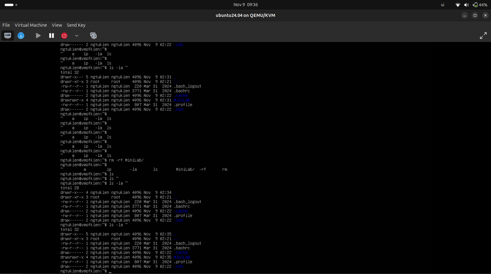
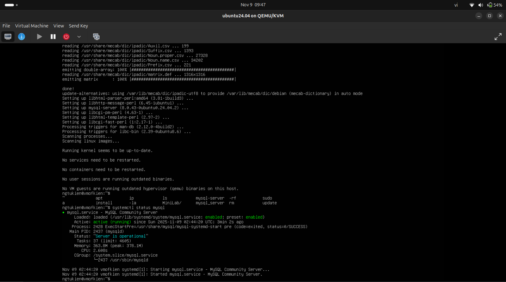
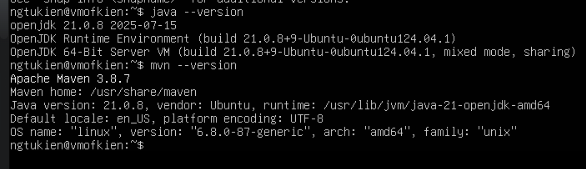
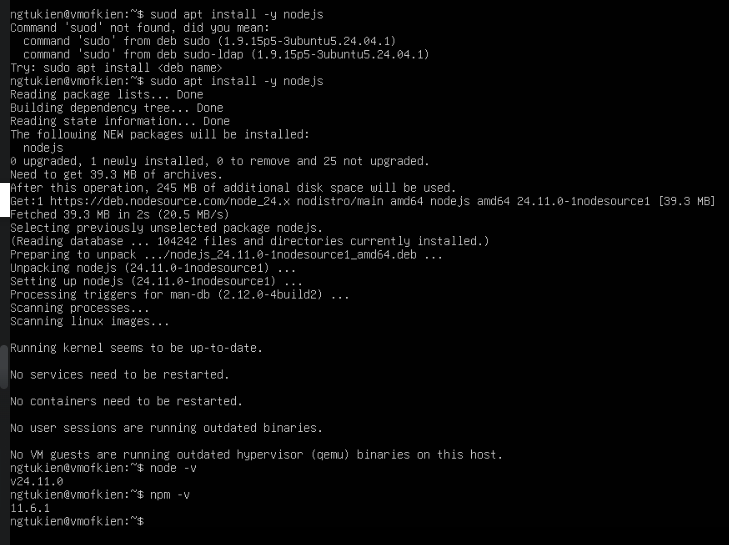
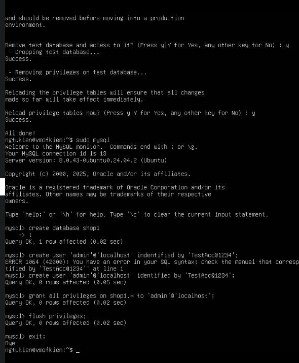
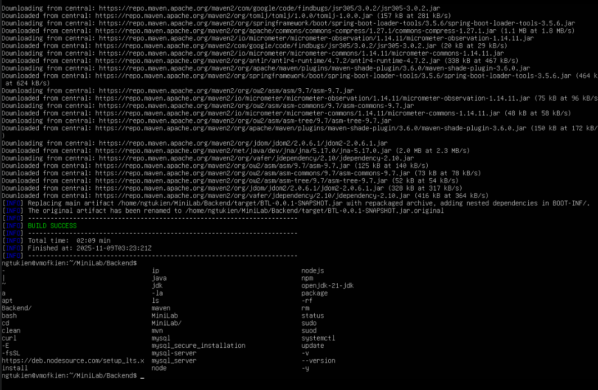
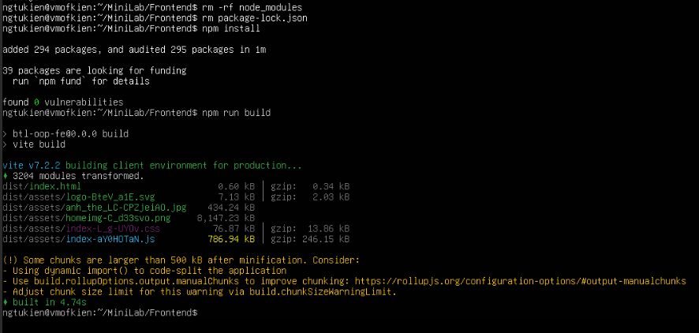
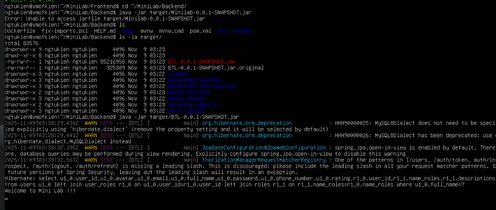
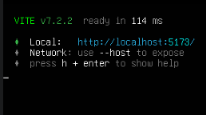

# Phần 1 : Chạy trên VM
## 1. Đẩy code lên VM
```shell
ngtukien@NgTuKien:~/Documents/TYP/typ-training-2025/kiennt_b23dccn465_training_gd1/Tuan_3_Docker/MiniLab$ scp -r ~/Documents/TYP/typ-training-2025/kiennt_b23dccn465_training_gd1/Tuan_3_Docker/MiniLab ngtukien@192.168.122.227:~/
ngtukien@192.168.122.227's password:
...
ProductVariation.class                                                                                                                                   100% 4864    51.7MB/s   00:00    
Sales.class                                                                                                                                              100% 3960    44.0MB/s   00:00    
Product$ProductBuilder.class                                                                                                                             100% 4161    43.2MB/s   00:00    
Role$RoleBuilder.class                                                                                                                                   100% 2599    19.4MB/s   00:00    
User.class                                                                                                                                               100% 6641    54.8MB/s   00:00    
InvalidtedToken$InvalidtedTokenBuilder.class                                                                                                             100% 1949    18.5MB/s   00:00    
Address.class                                                                                                                                            100% 3074    26.5MB/s   00:00    
BTL-0.0.1-SNAPSHOT.jar                                                                                                                                   100%   63MB 653.5MB/s   00:00    
inputFiles.lst                                                                                                                                           100%   90   701.4KB/s   00:00    
createdFiles.lst                                                                                                                                         100%   43   608.2KB/s   00:00    
inputFiles.lst                                                                                                                                           100%   12KB 100.6MB/s   00:00    
createdFiles.lst                                                                                                                                         100%   12KB 103.2MB/s   00:00    
BtlApplicationTests.class                                                                                                                                100%  528     7.0MB/s   00:00    
pom.properties                                                                                                                                           100%   62   864.2KB/s   00:00    
Dockerfile                                                                                                                                               100%  300     3.1MB/s   00:00    
.env 
```
**Trên VM**


---
## 2. Setup
### a. Mysql
* Chạy lệnh : 
    ```bash
    sudo apt update
    sudo apt install mysql-server
    ```
* Kết quả :



---
### b. Spring Boot
* Cài đặt JDK 21 : `sudo apt install openjdk-21-jdk`
* Cài đặt maven : `sudo apt install maven`
* Kiểm tra phiên bản JDK và Maven :
    ```bash
        java --version
        mvn --version
    ```
* Kết quả :

* 

---
### c. React
* Cài đặt `Node` và `npm`:
    ```bash
    # Cài curl (nếu chưa có)
    sudo apt install curl
    # Lấy kịch bản cài đặt NodeSource
    curl -fsSL https://deb.nodesource.com/setup_lts.x | sudo -E bash -
    # Cài đặt Node.js (sẽ bao gồm cả npm)
    sudo apt install -y nodejs
    ```
* Kiểm tra phiên bản:
    ```bash
    node -v
    npm -v 
    ```
* Kết quả :


---
## 3. Build
### a. Mysql
* Thiết lập bảo mật: `sudo mysql_secure_installation`
* Tạo Database và User cho Spring Boot: `sudo mysql`
    ```sql
    CREATE DATABASE shop1;
    CREATE USER 'admin'@'localhost' IDENTIFIED BY 'TestAcc@1234';
    GRANT ALL PRIVILEGES ON shop1.* TO 'admin'@'localhost';
    FLUSH PRIVILEGES;
    EXIT;
    ```
* Kết quả :


---
### b. Spring Boot
* Vào thư mục `Backend`: `cd MiniLab/Backend`
* Build project : `mvn clean package`
* Kết quả :


---
### c. React
* Vào thư mục `Backend`: `cd MiniLab/Frontend`
* Build project : 
```shell
npm install
npm run build
```
* Kết quả : 


## 4. Run
### a. Backend : `java -jar target/BTL-0.0.1-SNAPSHOT.jar`


### b. Frontend : `npm run dev`



___
# Phần 2 : Docker compose
**1. Tạo dockerfile cho Frontend và Backend**

**2. Viết docker-compose.yml**

**3. Build & run**
```shell
ngtukien@NgTuKien:~/Documents/TYP/typ-training-2025/kiennt_b23dccn465_training_gd1/Tuan_3_Docker/MiniLab$ docker compose up --build
[+] Building 9.9s (40/40) FINISHED                                                                                                                                                         
 => [internal] load local bake definitions                                                                                                                                            0.0s
 => => reading from stdin 1.25kB                                                                                                                                                      0.0s
 => [frontend internal] load build definition from Dockerfile                                                                                                                         0.0s 
 => => transferring dockerfile: 549B                                                                                                                                                  0.0s 
 => [backend internal] load build definition from Dockerfile                                                                                                                          0.0s 
 => => transferring dockerfile: 339B                                                                                                                                                  0.0s 
 => [frontend] resolve image config for docker-image://docker.io/docker/dockerfile:1                                                                                                  2.3s 
 => [backend internal] load metadata for docker.io/library/maven:3.9.6-eclipse-temurin-21                                                                                             2.2s
 => [backend internal] load metadata for docker.io/library/eclipse-temurin:21-jre-alpine                                                                                              4.0s
 => [auth] library/eclipse-temurin:pull token for registry-1.docker.io                                                                                                                0.0s
 => [auth] docker/dockerfile:pull token for registry-1.docker.io                                                                                                                      0.0s
 => [auth] library/maven:pull token for registry-1.docker.io                                                                                                                          0.0s 
 => CACHED [frontend] docker-image://docker.io/docker/dockerfile:1@sha256:b6afd42430b15f2d2a4c5a02b919e98a525b785b1aaff16747d2f623364e39b6                                            0.0s 
 => [frontend internal] load metadata for docker.io/library/nginx:alpine                                                                                                              1.5s 
 => [frontend internal] load metadata for docker.io/library/node:18-alpine                                                                                                            1.5s
 => [auth] library/node:pull token for registry-1.docker.io                                                                                                                           0.0s
 => [auth] library/nginx:pull token for registry-1.docker.io                                                                                                                          0.0s
 => [frontend internal] load .dockerignore                                                                                                                                            0.0s 
 => => transferring context: 182B                                                                                                                                                     0.0s 
 => [frontend internal] load build context                                                                                                                                            0.0s 
 => => transferring context: 6.63kB                                                                                                                                                   0.0s 
 => [frontend frontend-build 1/7] FROM docker.io/library/node:18-alpine@sha256:8d6421d663b4c28fd3ebc498332f249011d118945588d0a35cb9bc4b8ca09d9e                                       0.0s 
 => [frontend production 1/3] FROM docker.io/library/nginx:alpine@sha256:b3c656d55d7ad751196f21b7fd2e8d4da9cb430e32f646adcf92441b72f82b14                                             0.0s 
 => [backend internal] load .dockerignore                                                                                                                                             0.0s 
 => => transferring context: 2B                                                                                                                                                       0.0s 
 => [backend build 1/5] FROM docker.io/library/maven:3.9.6-eclipse-temurin-21@sha256:8d63d4c1902cb12d9e79a70671b18ebe26358cb592561af33ca1808f00d935cb                                 0.0s 
 => [backend stage-1 1/3] FROM docker.io/library/eclipse-temurin:21-jre-alpine@sha256:326837fba06a8ff5482a17bafbd65319e64a6e997febb7c85ebe7e3f73c12b11                                5.3s 
 => => resolve docker.io/library/eclipse-temurin:21-jre-alpine@sha256:326837fba06a8ff5482a17bafbd65319e64a6e997febb7c85ebe7e3f73c12b11                                                0.0s 
 => => sha256:3a857bcc1a1505748a54fef25bb81f303468a26d3de127b6b0044b1ffde6275a 53.17MB / 53.17MB                                                                                      4.8s 
 => => sha256:15a75c308165465141d861c1b7f7ec799b18fc84d5d8b87396dc29c3aa4894ff 128B / 128B                                                                                            1.3s 
 => => sha256:326837fba06a8ff5482a17bafbd65319e64a6e997febb7c85ebe7e3f73c12b11 2.68kB / 2.68kB                                                                                        0.0s 
 => => sha256:d52fed95b86b9374fcd6f289f022b7d5ef4de6fdbe1e49a59cf7551496027090 1.94kB / 1.94kB                                                                                        0.0s 
 => => sha256:cb895430823c34591ae6fe71fede85189d0d344383acac20889ac0b5276a9caa 4.09kB / 4.09kB                                                                                        0.0s 
 => => sha256:93902f35c01693819c190c354786cbb573f4ef49a5b865d6c34f2197839cc3e4 16.29MB / 16.29MB                                                                                      1.4s 
 => => extracting sha256:93902f35c01693819c190c354786cbb573f4ef49a5b865d6c34f2197839cc3e4                                                                                             0.2s 
 => => sha256:23d1cf1d02f064d13d647e4816e26b17678a634769ec583b4eb29d5a68d415f7 2.28kB / 2.28kB                                                                                        2.0s 
 => => extracting sha256:3a857bcc1a1505748a54fef25bb81f303468a26d3de127b6b0044b1ffde6275a                                                                                             0.4s 
 => => extracting sha256:15a75c308165465141d861c1b7f7ec799b18fc84d5d8b87396dc29c3aa4894ff                                                                                             0.0s 
 => => extracting sha256:23d1cf1d02f064d13d647e4816e26b17678a634769ec583b4eb29d5a68d415f7                                                                                             0.0s 
 => [backend internal] load build context                                                      
 ...
```
**Kết quả :**

