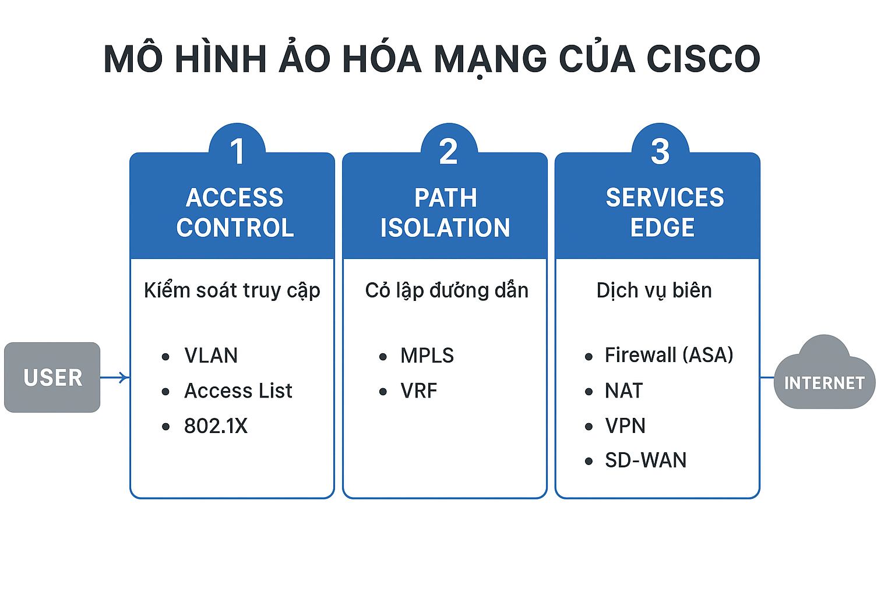
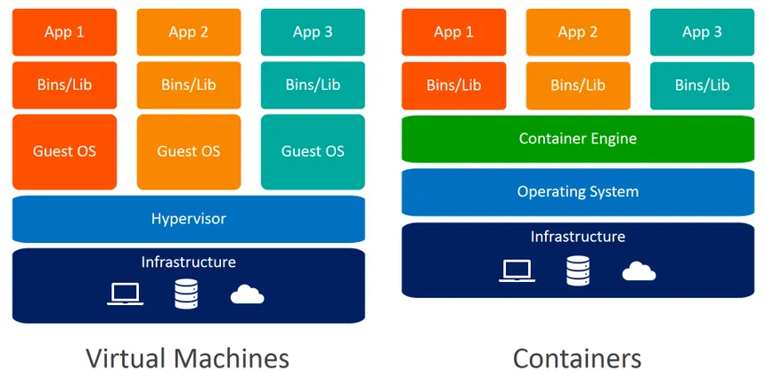
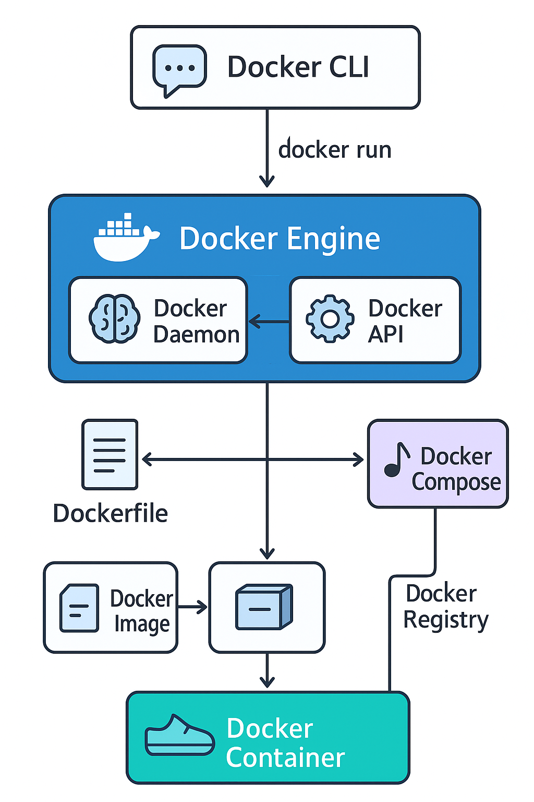
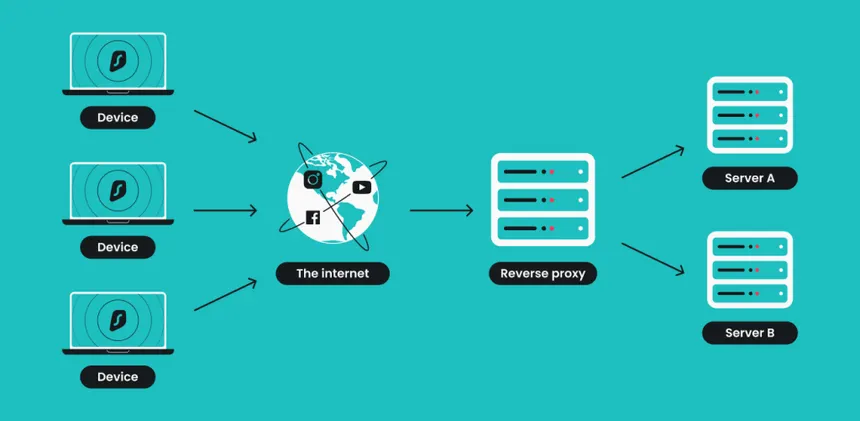
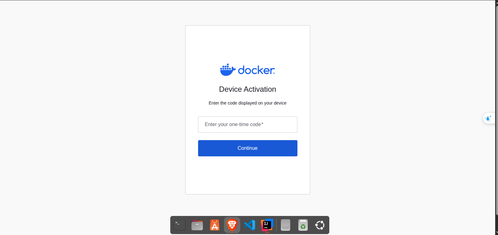
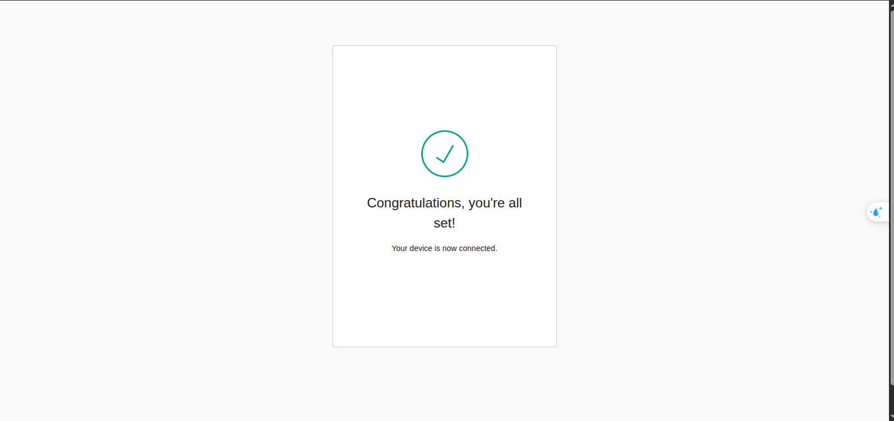
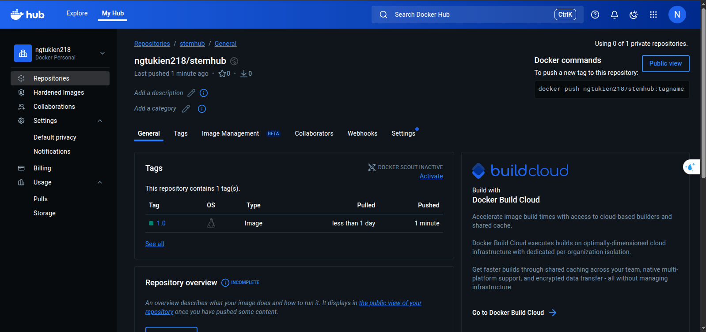

# Phần 1: Tổng quan về ảo hóa

---
## 1. Khái niệm Ảo hoá (Virtualization)
* **Ảo hoá (Virtualization)** là **công nghệ cho phép tạo ra nhiều môi trường hoặc tài nguyên “ảo”** (như máy tính, máy chủ, bộ nhớ, hay mạng) trên cùng **một phần cứng vật lý duy nhất**.
Nói cách khác, ảo hoá giúp **một máy vật lý hoạt động như nhiều máy độc lập**.
  * Ví dụ: Một máy chủ vật lý có thể “ảo hoá” thành nhiều **máy ảo (Virtual Machines – VM)**, mỗi máy ảo có thể chạy **hệ điều hành và ứng dụng riêng biệt**.
* **Lớp ảo hóa (Hypervisor)** là phần mềm trung gian **giữa phần cứng và các máy ảo**, giúp chia sẻ tài nguyên (CPU, RAM, ổ cứng,...) cho từng máy ảo.
  * Ví dụ: VMware, VirtualBox, KVM, Hyper-V.
* **Máy ảo (Virtual Machine – VM)** là **một hệ thống máy tính ảo**, mô phỏng phần cứng thật, có thể cài hệ điều hành và ứng dụng như một máy thật.


### **Mục đích của Ảo hoá**
* **Tối ưu sử dụng tài nguyên phần cứng :** Giúp nhiều hệ thống chạy trên cùng một máy vật lý, tránh lãng phí tài nguyên.
* **Giảm chi phí đầu tư và vận hành :** Không cần mua nhiều máy chủ vật lý, tiết kiệm điện năng, không gian, và chi phí bảo trì.
* **Tăng khả năng linh hoạt và mở rộng :** Dễ dàng tạo, sao chép, di chuyển, hoặc khôi phục máy ảo khi cần.
* **Tăng tính an toàn và cách ly :** Mỗi máy ảo hoạt động độc lập; lỗi hoặc tấn công trong một VM không ảnh hưởng đến VM khác.
* **Thuận tiện cho phát triển, kiểm thử và đào tạo :** Dễ tạo môi trường test, thử nghiệm hệ điều hành mới, hoặc học cấu hình server mà không sợ hỏng máy thật.

---
## 2. Các loại ảo hóa và công nghệ ảo hóa thông dụng
### a. Ảo hóa hệ thống lưu trữ (Storage Virtualization)
* **Ảo hóa lưu trữ** là quá trình **tập hợp (gộp)** nhiều thiết bị lưu trữ vật lý (như HDD, SSD, SAN, NAS...) thành **một không gian lưu trữ ảo thống nhất**.
* Người dùng và ứng dụng chỉ thấy **một khối lưu trữ duy nhất**, không cần biết dữ liệu nằm ở thiết bị nào.
* **Mục đích** : Tăng hiệu suất, dễ quản lý, phân bổ dung lượng linh hoạt và đảm bảo tính sẵn sàng cao (HA – High Availability).

| Loại ảo hóa                             | Mô tả ngắn gọn                                                              | Cách hoạt động                                                                                                                 | Một số công nghệ/giải pháp tiêu biểu                                      |
| --------------------------------------- |-----------------------------------------------------------------------------|--------------------------------------------------------------------------------------------------------------------------------| ------------------------------------------------------------------------- |
| **Host-based virtualization**           | Ngăn cách giữa lớp ảo háo và ổ đĩa vật lý là **drive điều khiển** các ổ đĩa.| Phần mềm ảo hóa tổng hợp các thiết bị lưu trữ vật lý và và sẽ truy xuất tài nguyên thông qua sự điều khiển của lớp Driver này. | Windows Storage Spaces, Linux LVM, Veritas Volume Manager                 |
| **Storage-device based virtualization** | Phần mềm ảo hóa nằm **trực tiếp trong thiết bị lưu trữ** (như SAN/NAS).     | Bộ điều khiển (controller) trong thiết bị lưu trữ tự động gộp và phân vùng tài nguyên, cung cấp cho nhiều máy chủ.             | EMC VNX, NetApp ONTAP, IBM DS8000, Dell PowerVault                        |
| **Network-based virtualization**        | Ảo hóa ở **lớp mạng lưu trữ (SAN/NAS switch)**.                             | Thiết bị hoặc phần mềm trung gian gom dữ liệu từ nhiều nguồn, phân phối động đến các máy chủ.                                  | IBM SAN Volume Controller (SVC), Brocade, Cisco MDS, DataCore SANsymphony |


### b. Ảo hóa hệ thống mạng (Network Virtualization)
* Ảo hóa mạng là kỹ thuật tạo ra **nhiều mạng ảo độc lập** hoạt động trên **một hạ tầng vật lý duy nhất**.
* Mục đích: Giúp chia hoặc gộp các thiết bị mạng (switch, router, firewall...) để sử dụng linh hoạt và hiệu quả hơn.
* **Phân loại**

| Loại ảo hóa  | Mô tả ngắn                                            | Ví dụ                       |
| ------------ | ----------------------------------------------------- | --------------------------- |
| **Internal** | Tạo nhiều mạng ảo bên trong 1 máy chủ vật lý.         | VMware vSwitch, Hyper-V     |
| **External** | Gom nhiều thiết bị vật lý thành 1 mạng ảo thống nhất. | VLAN, VXLAN, SDN, Cisco ACI |


### c. Ảo hóa hệ thống ứng dụng (Application Virtualization)
* Là công nghệ cho phép **tách rời ứng dụng khỏi hệ điều hành**, giúp **phân phối và chạy ứng dụng linh hoạt** hơn, mà **không cần cài đặt trực tiếp** lên máy người dùng.
* **Ưu điểm:**
  * Giúp dễ dàng cập nhật, quản lý và khắc phục lỗi ứng dụng.
  * Người dùng có thể trải nghiệm ứng dụng như bình thường.
  * Giảm xung đột giữa các ứng dụng hoặc giữa ứng dụng và hệ điều hành.
* **Một số nền tảng phổ biến:** Citrix XenApp, Microsoft Application Virtualization, VMware ThinApp.
#### **Hai công nghệ chính:**
* **Application Streaming**
    * Ứng dụng được chia thành các đoạn và **truyền dần đến người dùng khi cần** (không cần tải toàn bộ).
    * Dữ liệu truyền qua HTTP, CIFS hoặc RTSP.
* **Desktop Virtualization / VDI (Virtual Desktop Infrastructure)**
    * Ứng dụng được cài đặt và chạy trên **máy ảo (virtual desktop)**.
    * Hệ thống quản lý sẽ tạo và cung cấp desktop ảo cho người dùng.
### d. Ảo hóa hệ thống máy chủ (Server Virtualization)
* Là công nghệ cho phép **chạy nhiều máy ảo (VM)** trên **một máy chủ vật lý**, giúp:
* **Mục đích :**
  * Tăng **tính linh động**, dễ thiết lập và quản lý.
  * **Tiết kiệm tài nguyên**, chia sẻ tốt hơn giữa các ứng dụng.
  * **Tăng hiệu suất** và khả năng tận dụng phần cứng.
#### **Hai mô hình ảo hóa máy chủ chính**

| Loại ảo hóa                                      | Đặc điểm chính                                                                                                                                                                                                          | Ví dụ công nghệ                                                                       |
| ------------------------------------------------ | ----------------------------------------------------------------------------------------------------------------------------------------------------------------------------------------------------------------------- | ------------------------------------------------------------------------------------- |
| **Host-based** (hay Hosted Hypervisor)           | - Hypervisor chạy **trên hệ điều hành chủ (host OS)**.<br> - Dễ cài đặt, thích hợp cho **môi trường cá nhân hoặc thử nghiệm**.<br> - Hiệu năng thấp hơn do phải thông qua hệ điều hành trung gian.                      | VMware Workstation, VMware Server, Microsoft Virtual Server                           |
| **Hypervisor-based** (hay Bare-metal Hypervisor) | - Hypervisor chạy **trực tiếp trên phần cứng** của máy chủ (không qua hệ điều hành).<br> - **Hiệu năng cao hơn**, thường dùng trong **doanh nghiệp và trung tâm dữ liệu**.<br> - Quản lý tài nguyên và VM hiệu quả hơn. | Oracle VM, VMware ESX/ESXi, Microsoft Hyper-V, Citrix XenServer, IBM Power Hypervisor |
### e. Các công nghệ ảo hóa đã từng dùng
#### **VMware – Ảo hóa máy chủ (Server Virtualization)**
* **_Loại ảo hóa:_** *Ảo hóa hệ thống máy chủ (Hypervisor-based hoặc Host-based)*
* **_Công nghệ:_** VMware Workstation, VMware ESXi
* **_Nguyên lý:_** Cho phép chạy **nhiều máy ảo** (mỗi VM có hệ điều hành riêng) **trên một máy thật**.
* **_Mục đích sử dụng:_**
    * Tạo môi trường test hoặc dev độc lập.
    * Cài đặt nhiều OS để thử nghiệm phần mềm.
* **Ví dụ:**
    * Cài VMware Workstation trên Windows → chạy Ubuntu VM bên trong.
#### **Docker – Ảo hóa cấp ứng dụng (Application / OS-level Virtualization)**
* **_Loại ảo hóa:_** *Ảo hóa hệ điều hành (OS-level / Container-based Virtualization)*
* **_Công nghệ:*_* Docker Engine, Kubernetes
* **_Nguyên lý:_**
    * Không tạo máy ảo riêng biệt.
    * Thay vào đó, **chia sẻ kernel** của hệ điều hành, tạo các **container cô lập** chạy ứng dụng riêng.
* **Mục đích sử dụng:**
    * Triển khai ứng dụng nhanh, nhẹ, tách biệt môi trường.
* **Ví dụ:**
    * Chạy Spring Boot trong container riêng, database trong container khác, tất cả cùng trên 1 máy.
#### **Cloud – Ảo hóa kết hợp nhiều lớp**
* **Loại ảo hóa:**
    * Ảo hóa máy chủ (**Server Virtualization**) – chạy nhiều VM cho khách hàng.
    * Ảo hóa lưu trữ (**Storage Virtualization**) – gom nhiều ổ đĩa vật lý thành một không gian lưu trữ ảo.
    * Ảo hóa mạng (**Network Virtualization**) – chia mạng thành các subnet, VLAN, VPN riêng biệt.
* **Công nghệ:**
    * AWS EC2, Cloudflare R2, S3.
* **Mục đích:**
    * Cung cấp **tài nguyên ảo hóa on-demand** (máy ảo, ổ đĩa, mạng ảo) cho người dùng hoặc doanh nghiệp.

---
## 3. Virtual Machine
* Virtual Machine (VM) là một máy tính ảo được tạo ra bằng phần mềm (hypervisor), mô phỏng đầy đủ phần cứng của một máy thật (Host machine). Trên đó, bạn có thể cài và chạy hệ điều hành, phần mềm như trên máy vật lý.
* Khi hypervisor tạo VM, nó ảo hóa gần như toàn bộ tài nguyên phần cứng, bao gồm:

  | Thành phần                             | Ý nghĩa / Mô tả                                                      |
  | -------------------------------------- | -------------------------------------------------------------------- |
  | **CPU (Processor)**                    | Chia sẻ CPU vật lý thành nhiều CPU ảo cho từng VM.                   |
  | **RAM (Memory)**                       | Mỗi VM có vùng bộ nhớ ảo riêng, tách biệt với host và các VM khác.   |
  | **Storage (Ổ đĩa)**                    | Mỗi VM có “ổ đĩa ảo” (VDI, VMDK, v.v.) nằm trên ổ thật của host.     |
  | **Network (Card mạng)**                | Mỗi VM có card mạng ảo (vNIC), có thể kết nối LAN, NAT, hoặc Bridge. |
  | **I/O Devices (chuột, bàn phím, USB)** | Được ảo hóa để chia sẻ hoặc tách biệt giữa VM và host.               |
### a. Ảo hóa được hỗ trợ bởi phần cứng (Hardware-assisted Virtualization)
* Là cơ chế mà CPU và phần cứng của máy tính cung cấp chức năng đặc biệt để hỗ trợ ảo hóa, giúp máy ảo (VM) chạy nhanh hơn và ổn định hơn thay vì chạy qua phần mềm (hypervisor) mô phỏng.
* Một số nền tảng ảo hóa được hỗ trợ bởi phần cứng :

| Nền tảng                      | Tận dụng hardware virtualization như thế nào                     |
| ----------------------------- | ---------------------------------------------------------------- |
| **VMware Workstation / ESXi** | Sử dụng VT-x để cho phép guest OS chạy trực tiếp trên CPU        |
| **VirtualBox**                | Có tùy chọn “Enable VT-x / AMD-V” để tăng tốc VM                 |
| **KVM (Linux)**               | Dựa hoàn toàn vào VT-x/AMD-V — nếu không có, không thể chạy được |

* Kiểm tra khả năng ảo hóa của máy : `egrep -wo 'vmx|svm' /proc/cpuinfo`
  * `vmx` = Intel VT-x 
  * `svm` = AMD-V
  * Nếu không thấy, hãy vào BIOS / UEFI → bật “Intel Virtualization Technology” hoặc “SVM Mode”.
### b. Ảo hóa bán phần (Paravirtualization)
* Là hình thức ảo hóa trong đó hệ điều hành khách (Guest OS) biết rằng nó đang chạy trong môi trường ảo hóa, và hợp tác với hypervisor để thực hiện các tác vụ đặc quyền (privileged operations).
* Ví dụ: Khi máy áo cần ghi vào ổ cứng sector 1000.
  * Ảo hóa toàn phần (Full-virtualization) : Hypervisor sẽ giả lập toàn bộ ổ cứng, máy ảo sẽ nghĩ nó đang ghi trực tiếp vào ổ cứng thật. Khi máy ảo gửi lệnh "ghi sector 1000", hypervisor phải bắt (trap) lệnh đó lại, dịch nó, rồi mới thực thi trên phần cứng thật.
  * Ảo hóa bán phần (Paravirtualization) : VM sẽ gọi trực tiếp API của hypervisor (gọi là `hypercall`) để ghi vào sector 1000 trên ổ cứng thật, bỏ qua bước giả lập ổ cứng ảo.
* Ưu & nhược điểm :

| Ưu điểm                                                             | Nhược điểm                                              |
| ------------------------------------------------------------------- | ------------------------------------------------------- |
| Hiệu năng cao hơn full virtualization (vì ít mô phỏng phần cứng hơn) | Guest OS phải **được sửa đổi**, không thể dùng OS gốc |
| Giao tiếp giữa guest và hypervisor nhanh hơn (qua hypercalls)       | Không phù hợp cho OS đóng (như Windows bản thương mại)  |
| Giảm overhead xử lý I/O, CPU, memory                              | Cần hypervisor hỗ trợ kiểu này (Xen, KVM, v.v.)         |
### c. Vòng đời và quản lý VM
| Giai đoạn              | Mô tả                                                         |
| ---------------------- | ------------------------------------------------------------- |
| **Create (Tạo)**       | Hypervisor cấp tài nguyên và tạo đĩa ảo, CPU ảo, RAM cho VM.  |
| **Boot / Start**       | VM khởi động hệ điều hành của mình như máy thật.              |
| **Run**                | VM chạy ứng dụng, xử lý dữ liệu.                              |
| **Pause / Suspend**    | Tạm dừng trạng thái VM (giống sleep).                         |
| **Snapshot**           | Ghi lại trạng thái hiện tại (RAM, CPU, đĩa) để khôi phục sau. |
| **Resume**             | Khởi chạy lại VM từ snapshot hoặc trạng thái pause.           |
| **Shutdown / Destroy** | Dừng VM, giải phóng tài nguyên.                               |
* **Quản lý VM:**
  * Qua hypervisor GUI (VMware, VirtualBox, Hyper-V Manager).
  * Hoặc qua CLI / API (ví dụ: virsh, VBoxManage, vSphere API).
  * Có thể clone, migrate, backup hoặc scale dễ dàng.
  
---
# Phần 2: Container

---
## 1. Container là gì?
**Container** là công nghệ ảo hóa **ở mức hệ điều hành (OS-level virtualization)**.
Nó cho phép **nhiều ứng dụng** chạy độc lập trên cùng **một hệ điều hành** nhưng **tách biệt về môi trường** (file system, network, process,…).

Mỗi container chứa:
* Ứng dụng (App)
* Thư viện và dependencies cần thiết
* Nhưng **không có kernel riêng** (dùng chung kernel với host OS)

Công nghệ phổ biến: **Docker**, **Kubernetes**, **Podman**, **LXC**
### So sánh Container vs Virtual Machine

| Tiêu chí             | **Container**                                   | **Virtual Machine (VM)**                     |
| -------------------- | ----------------------------------------------- | -------------------------------------------- |
| **Mức độ ảo hóa**    | Ảo hóa **hệ điều hành**                         | Ảo hóa **phần cứng**                         |
| **Kernel**           | Dùng **chung kernel** của host                  | Mỗi VM có **kernel riêng**                   |
| **Tốc độ khởi động** | Rất nhanh (vài giây)                            | Chậm hơn (vài phút)                          |
| **Dung lượng**       | Nhẹ (MBs)                                       | Nặng (GBs)                                   |
| **Cách cô lập**      | Cô lập tiến trình (process-level isolation)     | Cô lập hoàn toàn (full OS isolation)         |
| **Hiệu năng**        | Gần như native (rất cao)                        | Giảm nhẹ do lớp ảo hóa                       |
| **Trường hợp dùng**  | Triển khai ứng dụng nhanh, CI/CD, microservices | Chạy nhiều OS khác nhau, môi trường phức tạp |
| **Công cụ phổ biến** | Docker, Kubernetes                              | VMware, VirtualBox, Hyper-V                  |



---
## 2. Docker
**Docker** là nền tảng mã nguồn mở giúp **tạo, triển khai và quản lý container** một cách dễ dàng.

**Các thành phần chính của Docker :**

| Thành phần | Vai trò (Nó là gì?)                                | Mục đích (Nó làm gì?) |
| :--- |:---------------------------------------------------| :--- |
| **Docker Engine (Động cơ)** | "Trái tim" của Docker, bao gồm Daemon, CLI và API. | Quản lý, xây dựng và chạy các container. |
| **Docker Daemon (Trình nền)** | "Bộ não" chạy nền, lắng nghe lệnh.                 | Thực thi các lệnh như tạo Image, chạy Container. |
| **Docker CLI (Dòng lệnh)** | "Người giao tiếp" (ví dụ: `docker run`).           | Cung cấp giao diện để người dùng ra lệnh cho Docker Daemon. |
| **Dockerfile (Tệp Docker)** | "Bản thiết kế" hoặc "Công thức".                   | Chứa các hướng dẫn từng bước để **xây dựng** một Image. |
| **Docker Image (Hình ảnh)** | "Khuôn mẫu" hoặc "Gói" chỉ đọc.                    | Một gói độc lập chứa mọi thứ (mã, thư viện) cần thiết để chạy ứng dụng. |
| **Docker Container (Vùng chứa)** | "Một phiên bản đang chạy" của Image.               | Môi trường bị cô lập nơi ứng dụng của bạn thực sự hoạt động. |
| **Docker Registry (Kho chứa)** | "Thư viện" hoặc "Nhà kho" (như Docker Hub).        | Dùng để **lưu trữ và chia sẻ** các Docker Image. |
| **Docker Compose** | "Nhạc trưởng" của dàn nhạc.                      | Một công cụ để **định nghĩa và chạy** các ứng dụng gồm nhiều container. |



---
## 2.1. Cài đặt Docker

### 2.1.1. Overview về docker container.
**Docker Container** là một **phiên bản đang chạy (running instance)** của một **Docker Image**.

Nếu **Image** (Hình ảnh) là một **"Class"** (lớp) trong lập trình hướng đối tượng—một bản thiết kế chỉ đọc, chứa mọi thứ bạn cần—thì **Container** chính là một **"Object"** (đối tượng), một thực thể sống động được tạo ra từ bản thiết kế đó. Bạn có thể tạo, chạy, dừng, và xóa Container.

Một container đóng gói ứng dụng của bạn cùng với tất cả các phụ thuộc của nó (thư viện, tệp cấu hình, runtime) vào một môi trường bị cô lập hoàn toàn.

---
**Các đặc tính quan trọng nhất :**

**_a. Tính cô lập (Isolation)_**

Một container chạy trong một "cái hộp"(sandbox) hoàn toàn tách biệt với các container khác và với máy chủ (host).
* **Cô lập hệ thống tệp:** Container có hệ thống tệp riêng của nó (được tạo từ Image). Nó không thể thấy các tệp trên máy chủ hoặc trong các container khác (trừ khi bạn cố tình chia sẻ).
* **Cô lập tiến trình (Process):** Container chỉ thấy các tiến trình đang chạy *bên trong* nó. Tiến trình gốc (PID 1) bên trong container là ứng dụng của bạn. Nó không thể thấy các tiến trình của máy chủ.
* **Cô lập mạng:** Mỗi container có địa chỉ IP và cổng (port) riêng.

**_b. Tính nhẹ (Lightweight)_**

Đây là điểm khác biệt lớn nhất so với **Máy ảo (VM)**.
* **VM (Máy ảo):** Ảo hóa toàn bộ phần cứng và chạy một hệ điều hành khách (Guest OS) hoàn chỉnh bên trên hệ điều hành chủ (Host OS). Điều này rất nặng nề, tốn nhiều tài nguyên (RAM, CPU) và khởi động mất vài phút.
* **Container:** Không chạy hệ điều hành khách. Thay vào đó, nó **chia sẻ nhân (kernel) của hệ điều hành chủ (Host OS)**. Tất cả các container trên một máy chủ đều dùng chung một kernel. Chúng chỉ ảo hóa ở cấp độ tiến trình và thư viện.
Vì vậy, container khởi động chỉ trong **vài giây** (hoặc nhanh hơn) và tốn ít tài nguyên hơn rất nhiều.

**_c. Tính di động (Portability)_**

Container giải quyết triệt để vấn đề kinh điển: "Ủa, trên máy tớ chạy được mà!"
Bởi vì container đóng gói *mọi thứ* (mã, runtime, thư viện), bạn có thể "Build" nó một lần và chạy nó ở bất cứ đâu có Docker Engine: trên máy tính cá nhân (Windows, macOS, Linux), trên máy chủ nội bộ, hay trên mọi đám mây (AWS, Google Cloud, Azure). Nó sẽ chạy **giống hệt nhau** ở mọi nơi.

**_d. Tính tạm thời (Ephemeral)_**

Đây là một khái niệm quan trọng cần nắm: Container được thiết kế để **dễ dàng vứt bỏ và thay thế**.
* Mọi dữ liệu bạn ghi vào hệ thống tệp *bên trong* container sẽ **mất vĩnh viễn** khi container đó bị xóa.
* **Giải pháp:** Để lưu trữ dữ liệu vĩnh viễn (như cơ sở dữ liệu), bạn phải sử dụng **Docker Volumes**. Volumes là một cơ chế cho phép dữ liệu tồn tại bên ngoài vòng đời của container, được lưu trữ an toàn trên máy chủ.
### 2.1.2. Cài đặt docker
**_a. Yêu cầu trước khi cài đặt Docker Engine trên Ubuntu_**

**1\. Cảnh báo quan trọng về Tường lửa (Firewall)**

Đây là điểm rất quan trọng cần lưu ý:
* **Bỏ qua (Bypass) UFW / Firewalld:** Nếu bạn sử dụng `ufw` (phổ biến trên Ubuntu) hoặc `firewalld` để quản lý tường lửa, hãy cẩn thận. Khi Docker mở (expose) một cổng cho container, cổng đó sẽ **bỏ qua các quy tắc tường lửa** của bạn.
* **Không tương thích với `nft`:** Docker **chỉ** tương thích với `iptables-nft` và `iptables-legacy`. Nó **không** hỗ trợ các quy tắc tường lửa được tạo bằng `nft`. Bạn phải đảm bảo các quy tắc được tạo bằng `iptables` hoặc `ip6tables`.

**2\. Yêu cầu Hệ điều hành (OS)**
* Bạn cần phiên bản **64-bit** của một trong các bản Ubuntu sau:
    * Ubuntu 25.10 (Questing)
    * Ubuntu 25.04 (Plucky)
    * Ubuntu 24.04 (Noble LTS)
    * Ubuntu 22.04 (Jammy LTS)
* **Không hỗ trợ chính thức:** Các bản phái sinh từ Ubuntu (như Linux Mint) không được hỗ trợ chính thức, mặc dù chúng có thể hoạt động.

**3\. Gỡ cài đặt các phiên bản cũ (Bắt buộc)**

Trước khi cài đặt phiên bản Docker Engine chính thức, bạn **phải** gỡ cài đặt bất kỳ gói nào có khả năng xung đột.

* **Tại sao phải gỡ?**
  * Bản phân phối Linux của bạn có thể cung cấp các gói Docker "không chính thức" (như `docker.io`) và chúng sẽ xung đột với gói chính thức của Docker.
* **Các gói cần gỡ:**
    * `docker.io`
    * `docker-compose`
    * `docker-compose-v2`
    * `docker-doc`
    * `podman-docker`
* **Gỡ cả các phụ thuộc:** Docker Engine mới đã bao gồm `containerd` và `runc`. Nếu bạn đã cài đặt chúng theo cách thủ công trước đó, bạn cũng nên gỡ bỏ (`containerd`, `runc`) để tránh xung đột phiên bản.

**Lệnh gỡ cài đặt tất cả:**
```bash
for pkg in docker.io docker-doc docker-compose docker-compose-v2 podman-docker containerd runc; do sudo apt-get remove $pkg; done
```
**Lưu ý quan trọng về dữ liệu cũ:**
* Việc chạy lệnh `remove` ở trên **KHÔNG** tự động xóa dữ liệu Docker cũ của bạn (như images, containers, volumes).
* Tất cả dữ liệu này vẫn được lưu trữ tại `/var/lib/docker/`.
* Nếu bạn muốn bắt đầu cài đặt "sạch" hoàn toàn và muốn xóa tất cả dữ liệu cũ, bạn cần phải tự xóa thư mục đó.

**_b. Các cách cài đặt Docker_**

Có 4 cách khác nhau để cài đặt Docker Engine, tùy thuộc vào nhu cầu của bạn:
* Dùng Docker Desktop.
* Dùng quản lý gói `apt`.
* Tự tải về và cài đặt các gói.
* Sử dụng một kịch bản (script) cài đặt tự động.

Tuy nhiên ở đây tôi chỉ trình bày cách cài đặt Docker Engine bằng kho lưu trữ `apt`.

Các cách còn lại bạn có thể tham khảo tại trang chính thức của [Docker](https://docs.docker.com/engine/install/ubuntu/)

**_c. Cài đặt Docker Engine bằng `apt`_**

**Bước 1: Thiết lập kho lưu trữ `apt` của Docker**

(Bạn chỉ cần làm điều này một lần trên mỗi máy chủ mới)
1.  **Thêm GPG key chính thức của Docker:**
    Điều này để đảm bảo rằng các gói bạn tải về là xác thực.
    ```bash
    # Cập nhật danh sách gói và cài các gói cần thiết
    sudo apt-get update
    sudo apt-get upgrade
    sudo apt-get install ca-certificates curl

    # Tạo thư mục cho keyrings
    sudo install -m 0755 -d /etc/apt/keyrings

    # Tải về GPG key của Docker
    sudo curl -fsSL https://download.docker.com/linux/ubuntu/gpg -o /etc/apt/keyrings/docker.asc

    # Cấp quyền đọc cho key
    sudo chmod a+r /etc/apt/keyrings/docker.asc
    ```
2.  **Thêm kho lưu trữ (repository) vào nguồn Apt:**
    Lệnh này thêm kho lưu trữ Docker chính thức vào danh sách các nguồn mà `apt` sẽ kiểm tra khi tìm kiếm phần mềm.
    ```bash
    echo \
      "deb [arch=$(dpkg --print-architecture) signed-by=/etc/apt/keyrings/docker.asc] https://download.docker.com/linux/ubuntu \
      $(. /etc/os-release && echo "${UBUNTU_CODENAME:-$VERSION_CODENAME}") stable" | \
      sudo tee /etc/apt/sources.list.d/docker.list > /dev/null

    # Cập nhật lại danh sách gói để nhận diện kho lưu trữ Docker mới
    sudo apt-get update
    ```
**Bước 2: Cài đặt các gói Docker**
1.  **Chạy lệnh cài đặt:**
    Lệnh này sẽ cài đặt phiên bản mới nhất của Docker Engine, CLI, containerd, và các plugin `buildx` và `compose`.
    ```bash
    sudo apt-get install docker-ce docker-ce-cli containerd.io docker-buildx-plugin docker-compose-plugin
    ```
2.  **Xác minh cài đặt:**
    * Dịch vụ Docker sẽ tự động khởi động sau khi cài đặt. Bạn có thể kiểm tra trạng thái bằng lệnh:
      ```bash
      sudo systemctl status docker
      ```
    * Chạy image `hello-world` để xác nhận Docker đang hoạt động chính xác. Lệnh này sẽ tải một image thử nghiệm, chạy nó trong container, in ra thông báo xác nhận và thoát.
      ```bash
      sudo docker run hello-world
      ```
> Theo mặc định, bạn phải dùng `sudo` khi chạy các lệnh Docker. Điều này là do nhóm người dùng `docker` đã được tạo nhưng không có người dùng nào trong đó. Bạn cần thực hiện các bước [Linux postinstall](https://docs.docker.com/engine/install/linux-postinstall) (bên dưới) để cho phép người dùng không phải root chạy Docker mà không cần `sudo`.

**Chạy Docker với tư cách người dùng không phải root**
1.  **Tạo nhóm (group) `docker`:**
    *(Nhóm này có thể đã tồn tại sau khi cài đặt)*
    ```bash
    sudo groupadd docker
    ```
2.  **Thêm người dùng của bạn vào nhóm `docker`:**
    ```bash
    sudo usermod -aG docker $USER
    ```
3.  **Kích hoạt các thay đổi:**
    Bạn cần **đăng xuất và đăng nhập lại** để máy tính nhận diện tư cách thành viên nhóm mới của bạn.

    * *Lưu ý:* Nếu bạn dùng máy ảo Linux, bạn có thể cần **khởi động lại máy ảo**.
    * *Cách thay thế (áp dụng ngay lập...*): Bạn có thể chạy lệnh sau để kích hoạt ngay thay đổi trong cửa sổ terminal hiện tại:
      ```bash
      newgrp docker
      ```
4.  **Xác minh:**
    Kiểm tra xem bạn có thể chạy Docker mà không cần `sudo` hay không:
    ```bash
    docker run hello-world
    ```
**Xử lý lỗi "Permission Denied" (Từ chối quyền)**

Nếu bạn đã từng chạy lệnh `sudo docker` *trước khi* thực hiện các bước trên, bạn có thể gặp lỗi liên quan đến tệp `.../.docker/config.json`.
* **Nguyên nhân:** Thư mục `~/.docker/` đã được tạo và thuộc sở hữu của `root` (do bạn dùng `sudo`).
* **Cách khắc phục (Chọn 1):**
    * **Cách 1 (Xóa):** Xóa thư mục `~/.docker/`. Docker sẽ tự động tạo lại nó với quyền sở hữu chính xác.
      *(Mọi cài đặt tùy chỉnh trong đó sẽ bị mất)*
    * **Cách 2 (Sửa quyền):** Thay đổi chủ sở hữu và quyền của thư mục:
      ```bash
      sudo chown "$USER":"$USER" /home/"$USER"/.docker -R
      sudo chmod g+rwx "$HOME/.docker" -R
      ```
> **Nâng cấp Docker Engine:**
  Để nâng cấp, bạn chỉ cần **chạy lại lệnh ở Bước 2** (`sudo apt-get install ...`). `apt` sẽ tự động tìm và cài đặt phiên bản mới nhất từ kho lưu trữ bạn đã thiết lập.
### 2.1.3. Cấu hình proxy cho docker

_a. Proxy là gì?_
Một **Proxy** (hay **Proxy Server**) hiểu đơn giản là một **"người gác cổng"** hoặc một **"người trung gian"** đứng giữa máy tính của bạn và Internet.

Ví dụ:
* **Khi không có Proxy:** Máy tính của bạn (Client) gửi yêu cầu trực tiếp đến một trang web (ví dụ: `google.com`) và trang web đó gửi dữ liệu trực tiếp về cho bạn.
* **Khi có Proxy:** Máy tính của bạn gửi yêu cầu đến **máy chủ Proxy** trước. Máy chủ Proxy sau đó *thay mặt bạn* gửi yêu cầu đó đến `google.com`, nhận dữ liệu về, và *sau đó* mới chuyển dữ liệu đó cho bạn.

Các tổ chức (như công ty, trường học) thường sử dụng Proxy vì 3 lý do chính:
1.  **Bảo mật & Kiểm soát (Quan trọng nhất):** Proxy hoạt động như một bức tường lửa. Nó kiểm tra mọi yêu cầu đi ra ngoài. Nếu bạn cố gắng truy cập một trang web bị cấm (như mạng xã hội, web đen), proxy sẽ chặn bạn lại.
2.  **Ẩn danh tính:** Đối với trang web bên ngoài, họ chỉ thấy địa chỉ IP của máy chủ Proxy, không phải địa chỉ IP thật của bạn.
3.  **Tăng tốc (Caching):** Nếu 100 người trong công ty cùng truy cập một trang tin tức, proxy chỉ cần tải trang đó về 1 lần và lưu vào bộ nhớ đệm (cache), sau đó phân phát cho 99 người còn lại, giúp tiết kiệm băng thông.

**_b. Tại sao Docker cần cấu hình Proxy?_**

Lý do là: **Docker tạo ra các môi trường bị cô lập, và các môi trường này không tự động biết "người gác cổng" (Proxy) của bạn là ai.**

Khi máy tính của bạn (laptop, máy chủ) nằm trong mạng công ty, 100% kết nối ra Internet *đều phải* đi qua Proxy. Docker không phải là ngoại lệ.

Bạn cần cấu hình proxy cho Docker ở **hai nơi** hoàn toàn khác nhau, vì chúng giải quyết hai vấn đề khác nhau:

**Vấn đề A: Cấu hình Proxy cho DAEMON (Dịch vụ Docker)**

* **Ai cần:** Dịch vụ Docker (`dockerd`) chạy nền trên máy của bạn.
* **Làm gì:** Để thực thi các lệnh như `docker pull ubuntu` hoặc `docker push ...`
* **Tại sao:** Khi bạn gõ `docker pull ubuntu`, chính **dịch vụ Docker** cần phải kết nối đến **Docker Hub** (trên Internet) để tải image về. Nếu dịch vụ này không biết địa chỉ proxy, nó sẽ cố gắng kết nối trực tiếp, và sẽ bị "người gác cổng" của công ty chặn lại.
* **Hậu quả nếu thiếu:** Mọi lệnh `docker pull` hoặc `docker push` sẽ bị lỗi (thường là "Connection timed out").

**Vấn đề B: Cấu hình Proxy cho CLIENT (Các Container)**

* **Ai cần:** Các container khi bạn `docker build` hoặc `docker run`.
* **Làm gì:** Để thực thi các lệnh *bên trong* `Dockerfile`, ví dụ: `RUN apt-get update` hoặc `RUN pip install ...`
* **Tại sao:** Container là một "máy tính mini" bị cô lập. Nó có hệ thống mạng riêng và **không** thừa hưởng cài đặt proxy của Daemon. Khi bạn `build` một image, lệnh `RUN apt-get update` bên trong container sẽ cố gắng kết nối ra Internet. Giống như trên, nó không biết proxy là ai, nên nó kết nối trực tiếp và bị chặn.
* **Hậu quả nếu thiếu:** Lệnh `docker build` sẽ bị lỗi (thường là "Failed to fetch..." hoặc "Connection timed out") ngay tại các bước cần tải tài nguyên từ mạng.

#### 2.1.3.1. Cấu hình proxy cho docker client
Mục đích là để các **container** của bạn (khi `build` hoặc `run`) có thể sử dụng proxy để truy cập Internet (ví dụ: để chạy `apt-get install` hoặc `curl`).

Có hai cách chính để thực hiện cấu hình proxy cho docker client :
* Cấu hình qua file `config.json`
* Cấu hình thủ công qua CLI (dùng `--build-arg` hoặc `--env`)

**a\. Cấu hình Docker Client thông qua file `config.json`**
* **Cách làm:** Tạo hoặc chỉnh sửa tệp `~/.docker/config.json` (nằm trong thư mục `home` của người dùng).
* **Nội dung:** Thêm một khối JSON `"proxies"`:
  ```json
  {
    "proxies": {
      "default": {
        "httpProxy": "http://proxy.example.com:3128",
        "httpsProxy": "https://proxy.example.com:3129",
        "noProxy": "*.test.example.com,.example.org,127.0.0.0/8"
      },
      "tcp://docker-daemon1.example.com": {
        "noProxy": "*.internal.example.net"
      }
    }
  }
  ```
  * **`"proxies"`**: Đây là "khối" chính chứa tất cả các cấu hình proxy.
  * **`"default"`**: Khóa này có nghĩa là các cài đặt bên trong nó sẽ được áp dụng **mặc định** cho mọi hoạt động `build` và `run` của bạn.
    * Để cấu hình proxy cho từng daemon riêng lẻ, hãy sử dụng địa chỉ của daemon đó thay vì khóa default.
  * **`"httpProxy": "..."`**: Chỉ định địa chỉ của máy chủ proxy cho các kết nối **HTTP**. Khi một container chạy (ví dụ `apt-get`), nó sẽ tự động được "tiêm" biến môi trường `HTTP_PROXY` với giá trị này.
  * **`"httpsProxy": "..."`**: Chỉ định địa chỉ của máy chủ proxy cho các kết nối **HTTPS**. Tương tự, nó sẽ tự động thiết lập biến `HTTPS_PROXY` bên trong container.
  * **`"noProxy": "..."`**: Đây là tham số **rất quan trọng**. Nó liệt kê các địa chỉ, tên miền, hoặc dải IP mà container nên kết nối **trực tiếp**, *không* đi qua proxy.
    * Trong ví dụ: `*.test.example.com` (mọi trang con của `test.example.com`), `.example.org` (mọi trang con của `example.org`), và `127.0.0.0/8` (toàn bộ dải `localhost`) sẽ không dùng proxy.
* **Cách hoạt động:**
    * Docker sẽ tự động đọc tệp này và "tiêm" các biến môi trường tương ứng (ví dụ: `HTTP_PROXY`, `HTTPS_PROXY`, `no_proxy`) vào mọi container **mới** được bạn `run` hoặc `build`.
    * Cấu hình này có hiệu lực **ngay lập tức** sau khi lưu tệp, không cần khởi động lại Docker.

> **Cảnh báo bảo mật:**
> * Cài đặt proxy (đặc biệt nếu chứa thông tin xác thực/mật khẩu) là **thông tin nhạy cảm**.
> * Chúng được lưu dưới dạng **văn bản thuần túy (plain text)** trong cấu hình của container và có thể bị lộ nếu bạn dùng lệnh `docker commit`.

**b\. Thiết lập Proxy qua CLI (Thủ công)**
* **Khi xây dựng Image (với `docker build`):**
    * Sử dụng cờ `--build-arg`. Docker sẽ tự động nhận diện các `ARG` này.
  ```bash
  docker build --build-arg HTTP_PROXY="http://proxy.example.com:3128" .
  ```
* **Khi chạy Container (với `docker run`):**
    * Sử dụng cờ `--env` (hoặc `-e`).
  ```bash
  docker run --env HTTP_PROXY="http://proxy.example.com:3128" redis
  ```
> **Cảnh báo quan trọng nhất: KHÔNG Dùng `ENV` trong Dockerfile**
> * Tuyệt đối **không** sử dụng lệnh `ENV` (ví dụ: `ENV HTTP_PROXY=...`) bên trong `Dockerfile` để cài đặt proxy.
>> * **Lý do:**
>>  * **Rủi ro bảo mật:** Làm như vậy sẽ **nhúng (embed)** cài đặt proxy (có thể chứa mật khẩu) thẳng vào image cuối cùng, làm **lộ thông tin nhạy cảm** cho bất kỳ ai có image của bạn.
>>  * **Mất tính di động:** Image đó sẽ bị hỏng hoặc không chạy được trên một môi trường khác không có quyền truy cập vào proxy đó.
> * **Giải pháp:** Luôn luôn sử dụng `ARG` (`--build-arg`) cho các cài đặt proxy trong lúc build.
#### 2.1.3.2. Cấu hình proxy cho docker daemon
Mục đích
* Tải (pull) image từ Docker Hub hoặc các registry bên ngoài.
* Kết nối với các node khác trong Docker swarm.

Có hai cách chính để cấu hình, và **cấu hình trực tiếp (`daemon.json`) sẽ ưu tiên hơn** biến môi trường.

**_1\. Phương pháp `daemon.json` (Khuyến nghị)_**

Đây là cách được khuyên dùng. Bạn chỉnh sửa (hoặc tạo) tệp `/etc/docker/daemon.json` và thêm khóa `"proxies"`:

```json
{
  "proxies": {
    "http-proxy": "http://proxy.example.com:3128",
    "https-proxy": "https://proxy.example.com:3129",
    "no-proxy": "localhost,127.0.0.1,registry-noi-bo.com"
  }
}
```
* **`http-proxy`**: Dành cho kết nối HTTP.
* **`https-proxy`**: Dành cho kết nối HTTPS.
* **`no-proxy`**: Danh sách các địa chỉ (phân cách bằng dấu phẩy) sẽ *không* đi qua proxy (ví dụ: các registry nội bộ).

Sau khi lưu tệp, bạn phải **khởi động lại Docker**:
```bash
sudo systemctl restart docker
```

**_2\. Phương pháp Biến Môi trường (Dùng systemd)_**

Phương pháp này thường được sử dụng nếu bạn chạy Docker như một dịch vụ `systemd`. Docker daemon sẽ tự động đọc các biến môi trường như `HTTP_PROXY`, `HTTPS_PROXY`, và `NO_PROXY` khi nó khởi động.

**Cách thực hiện:**

1.  Tạo một thư mục "drop-in" cho dịch vụ Docker:
    ```bash
    sudo mkdir -p /etc/systemd/system/docker.service.d
    ```
2.  Tạo một tệp cấu hình mới, ví dụ `http-proxy.conf`, trong thư mục đó:
    ```bash
    sudo nano /etc/systemd/system/docker.service.d/http-proxy.conf
    ```
3.  Thêm nội dung sau vào tệp:
    ```ini
    [Service]
    Environment="HTTP_PROXY=http://proxy.example.com:3128"
    Environment="HTTPS_PROXY=https://proxy.example.com:3129"
    Environment="NO_PROXY=localhost,127.0.0.1,registry-noi-bo.com"
    ```
    > **Lưu ý:** Nếu giá trị proxy (ví dụ: mật khẩu) có ký tự đặc biệt như `#`, `\`, `!`, bạn phải **thoát kép (double escape)** chúng bằng `%%` (ví dụ: `complex%%23pass`).
4.  **Tải lại và Khởi động lại:**
    Sau khi lưu tệp, bạn phải thông báo cho systemd về thay đổi, sau đó khởi động lại Docker:
    ```bash
    sudo systemctl daemon-reload
    sudo systemctl restart docker
    ```
5.  **(Tùy chọn) Kiểm tra:**
    Bạn có thể xác minh xem các biến môi trường đã được nạp chưa:
    ```bash
    sudo systemctl show --property=Environment docker
    ```
### 2.1.4. Cấu hình trusted registry trong daemon.json tham khảo Local Repos
**_a\. Tại sao cần "Trusted Registry"? (`insecure-registries`)_**

Lý do chính là vì **bảo mật**.

Theo mặc định, Docker daemon được thiết kế để chỉ giao tiếp với các registry (kho chứa image) một cách an toàn. Điều này có nghĩa là Docker *bắt buộc* registry phải:
* Sử dụng **HTTPS** (kết nối mã hóa). 
* Có một **chứng chỉ SSL/TLS hợp lệ** được cấp bởi một Tổ chức Chứng thực (CA) mà hệ điều hành của máy chủ tin tưởng.

Tuy nhiên, trong các môi trường nội bộ, môi trường phát triển (dev) hoặc thử nghiệm (test), các "Local Repo" (registry nội bộ) thường không đáp ứng được 2 yêu cầu này. Chúng thường rơi vào một trong hai trường hợp:

* **Trường hợp 1: Chạy bằng HTTP** (không mã hóa).
* **Trường hợp 2: Chạy bằng HTTPS nhưng dùng Chứng chỉ tự ký** (self-signed certificate) mà hệ thống không tự động tin tưởng.

Khi Docker daemon cố gắng `pull` hoặc `push` tới một registry như vậy, nó sẽ thất bại và báo lỗi (ví dụ: "http: server gave HTTP response to HTTPS client" hoặc "certificate signed by unknown authority").

Bằng cách thêm registry vào danh sách `insecure-registries`, bạn đang nói rõ với Docker daemon rằng:

> "Tôi biết registry này (ví dụ: `my-local-repo.com:5000`) không an toàn theo tiêu chuẩn (dùng HTTP hoặc chứng chỉ tự ký), nhưng tôi hoàn toàn tin tưởng nó. Vui lòng bỏ qua kiểm tra bảo mật và cho phép kết nối."

**_2\. "Local Repos" (Registry Nội bộ) của Docker là gì?_**

"Local Repo" (hay là **Local Registry** hoặc **Registry Nội bộ/Riêng tư**) là một máy chủ lưu trữ image Docker mà **bạn tự quản lý và vận hành** trong mạng nội bộ của mình, thay vì sử dụng các dịch vụ công cộng như Docker Hub.

Nó giống như bạn có một "Docker Hub thu nhỏ" của riêng mình.

**Lợi ích của việc dùng Registry Nội bộ:**

* **Tốc độ:** Tải (pull) và đẩy (push) image qua mạng LAN/nội bộ nhanh hơn rất nhiều so với qua Internet.
* **Bảo mật & Quyền riêng tư:** Bạn có thể lưu trữ các image chứa mã nguồn hoặc dữ liệu nhạy cảm của công ty mà không bị lộ ra bên ngoài.
* **Kiểm soát:** Bạn toàn quyền quản lý truy cập, ai được push/pull image nào.
* **Hoạt động ngoại tuyến (Offline):** Hệ thống CI/CD và các máy chủ khác vẫn có thể hoạt động ngay cả khi mất kết nối Internet.

**Ví dụ phổ biến:**
* Chạy image `registry:2` chính thức của Docker.
* Sử dụng các giải pháp như Harbor, Sonatype Nexus, hoặc JFrog Artifactory.

**_3\. Làm sao để cấu hình `insecure-registries`?_**

**Bước 1:** Mở tệp `daemon.json`. Tệp này thường nằm ở `/etc/docker/daemon.json`.
```bash
sudo nano /etc/docker/daemon.json
```
**Bước 2:** Thêm khóa `insecure-registries`. Đây là một **mảng (array)** chứa các địa chỉ (`domain:port`) của các registry bạn muốn tin tưởng.

* **Nếu tệp rỗng hoặc chưa có:**
  ```json
  {
    "insecure-registries": ["my-local-repo.com:5000", "192.168.1.100:8080"]
  }
  ```
* **Quan trọng: Nếu tệp đã có nội dung** (ví dụ: đã có cấu hình proxy từ trước), bạn phải thêm khóa này vào, đảm bảo cú pháp JSON hợp lệ (thêm dấu phẩy `,`):
  ```json
  {
    "proxies": {
      "http-proxy": "http://proxy.example.com:3128"
    },
    "insecure-registries": ["my-local-repo.com:5000"]
  }
  ```
**Bước 3:** Lưu tệp và **khởi động lại Docker daemon** để áp dụng thay đổi.
```bash
sudo systemctl restart docker
```
#### 2.1.5. Hello world với Docker
```shell
ngtukien@NgTuKien:~/Documents/TYP/typ-training-2025/kiennt_b23dccn465_training_gd1/Tuan_3_Docker$ docker run hello-world

Hello from Docker!
This message shows that your installation appears to be working correctly.

To generate this message, Docker took the following steps:
 1. The Docker client contacted the Docker daemon.
 2. The Docker daemon pulled the "hello-world" image from the Docker Hub.
    (amd64)
 3. The Docker daemon created a new container from that image which runs the
    executable that produces the output you are currently reading.
 4. The Docker daemon streamed that output to the Docker client, which sent it
    to your terminal.

To try something more ambitious, you can run an Ubuntu container with:
 $ docker run -it ubuntu bash

Share images, automate workflows, and more with a free Docker ID:
 https://hub.docker.com/

For more examples and ideas, visit:
 https://docs.docker.com/get-started/

ngtukien@NgTuKien:~/Documents/TYP/typ-training-2025/kiennt_b23dccn465_training_gd1/Tuan_3_Docker$ docker run -it ubuntu bash
Unable to find image 'ubuntu:latest' locally
latest: Pulling from library/ubuntu
4b3ffd8ccb52: Pull complete 
Digest: sha256:66460d557b25769b102175144d538d88219c077c678a49af4afca6fbfc1b5252
Status: Downloaded newer image for ubuntu:latest
root@72162535cc15:/# ls -la
total 56
drwxr-xr-x   1 root root 4096 Nov  5 05:55 .
drwxr-xr-x   1 root root 4096 Nov  5 05:55 ..
-rwxr-xr-x   1 root root    0 Nov  5 05:55 .dockerenv
lrwxrwxrwx   1 root root    7 Apr 22  2024 bin -> usr/bin
drwxr-xr-x   2 root root 4096 Apr 22  2024 boot
drwxr-xr-x   5 root root  360 Nov  5 05:55 dev
drwxr-xr-x   1 root root 4096 Nov  5 05:55 etc
drwxr-xr-x   3 root root 4096 Oct  1 02:10 home
lrwxrwxrwx   1 root root    7 Apr 22  2024 lib -> usr/lib
lrwxrwxrwx   1 root root    9 Apr 22  2024 lib64 -> usr/lib64
drwxr-xr-x   2 root root 4096 Oct  1 02:03 media
drwxr-xr-x   2 root root 4096 Oct  1 02:03 mnt
drwxr-xr-x   2 root root 4096 Oct  1 02:03 opt
dr-xr-xr-x 423 root root    0 Nov  5 05:55 proc
drwx------   2 root root 4096 Oct  1 02:09 root
drwxr-xr-x   4 root root 4096 Oct  1 02:10 run
lrwxrwxrwx   1 root root    8 Apr 22  2024 sbin -> usr/sbin
drwxr-xr-x   2 root root 4096 Oct  1 02:03 srv
dr-xr-xr-x  13 root root    0 Nov  5 05:55 sys
drwxrwxrwt   2 root root 4096 Oct  1 02:09 tmp
drwxr-xr-x  12 root root 4096 Oct  1 02:03 usr
drwxr-xr-x  11 root root 4096 Oct  1 02:09 var
root@72162535cc15:/#     
```
___
## 2.2. Kiến trúc Docker
### 2.2.1. Docker CE/Docker EE
**Docker CE (Community Edition)** là phiên bản miễn phí và mã nguồn mở, lý tưởng cho các nhà phát triển cá nhân, nhóm nhỏ và những người mới bắt đầu. **Docker EE (Enterprise Edition)** (nay là một phần của các gói trả phí như **Docker Business**) là phiên bản thương mại, có trả phí, cung cấp các tính năng bảo mật, quản lý nâng cao và hỗ trợ chuyên nghiệp cho các doanh nghiệp lớn.
#### a. Docker CE (Community Edition)
**Docker Community Edition (CE)** là phiên bản Docker miễn phí và phổ biến nhất.
* **Lý tưởng cho:** Các nhà phát triển (developers), nhóm DevOps nhỏ, và bất kỳ ai muốn học hoặc thử nghiệm với container.
* **Tính năng chính:**
    * Bao gồm **Docker Engine** (cốt lõi để chạy container).
    * Đi kèm **Docker Compose** và **Docker Swarm** (công cụ điều phối container).
    * Có hai kênh phát hành:
        * **Stable (Ổn định):** Phát hành hàng quý, được kiểm thử kỹ lưỡng.
        * **Edge (Thử nghiệm):** Phát hành hàng tháng với các tính năng mới nhất.
* **Hạn chế:** Không có hỗ trợ kỹ thuật chính thức (chỉ có hỗ trợ từ cộng đồng) và thiếu các công cụ quản lý/bảo mật cấp doanh nghiệp.
#### b. Docker EE (Enterprise Edition)
**Docker Enterprise Edition (EE)** là phiên bản thương mại, được thiết kế cho các ứng dụng quan trọng trong môi trường doanh nghiệp. Gần đây, Docker đã tái cấu trúc các gói của mình, và các tính năng của EE giờ đây là một phần của các gói trả phí như **Docker Business**.
* **Lý tưởng cho:** Các tổ chức, doanh nghiệp cần một nền tảng container ổn định, an toàn và có hỗ trợ.
* **Tính năng chính (ngoài những gì CE có):**
    * **Hỗ trợ chuyên nghiệp:** Được Docker hỗ trợ kỹ thuật chính thức, cam kết thời gian phản hồi (SLA).
    * **Universal Control Plane (UCP):** Một giao diện quản lý web tập trung để triển khai, quản lý và giám sát cụm Docker (cluster).
    * **Docker Trusted Registry (DTR):** Một kho lưu trữ (registry) image riêng tư, bảo mật, tích hợp tính năng quét lỗ hổng (vulnerability scanning) và kiểm soát truy cập (RBAC).
    * **Bảo mật nâng cao:** Các chính sách bảo mật, chứng nhận FIPS 140-2, và quản lý truy cập chặt chẽ hơn.
    * **Nền tảng được chứng nhận:** Đảm bảo hoạt động ổn định trên các hệ điều hành (như RHEL, SLES) và cơ sở hạ tầng đám mây (Azure, AWS) đã được chứng nhận.
### 2.2.2. Docker Engine
**Docker Engine** là công nghệ thực hiện tất cả công việc tạo, chạy và quản lý container.

Nó hoạt động theo mô hình **client-server** và bao gồm 3 thành phần chính:
#### a. Docker Daemon (Máy chủ)
* Đây là một dịch vụ (service) chạy ngầm liên tục trên máy chủ của bạn, thường được gọi là `dockerd`.
* Đây là "bộ não" thực sự, chịu trách nhiệm lắng nghe các yêu cầu và thực hiện công việc nặng nhọc:
    * Xây dựng (build) images.
    * Chạy và quản lý containers (khởi động, dừng).
    * Quản lý mạng (networks) và lưu trữ (volumes).
#### b. REST API (Giao diện)
* Đây là "ngôn ngữ" hay "bộ quy tắc" mà Daemon cung cấp để các chương trình bên ngoài có thể giao tiếp và ra lệnh cho nó.
* API này cho phép các công cụ (như CLI) yêu cầu Daemon làm việc gì đó, ví dụ: "Hãy tạo cho tôi một container mới".
#### c. Docker CLI (Máy khách)
* Đây là công cụ dòng lệnh (command-line) mà bạn tương tác trực tiếp.
* Khi bạn gõ các lệnh như `docker run`, `docker build`, hay `docker ps`, bạn đang sử dụng **CLI**.
* **CLI** sẽ lấy lệnh của bạn, "dịch" nó thành một yêu cầu API và gửi nó đến **Docker Daemon** để thực thi.
#### d. Luồng xử lý của Docker Engine
* **Người dùng**: Mở terminal và gõ lệnh `docker run nginx`.
* **Docker CLI (Client)**: Nhận lệnh này. Nó *không* tự chạy container.
* **REST API**: CLI sử dụng API để gửi một yêu cầu "Tạo và chạy container từ image nginx" đến Docker Daemon.
* **Docker Daemon (Server)**: Nhận yêu cầu này.
    * Nó kiểm tra xem image `nginx` đã có trên máy (local) chưa.
    * Nếu chưa, nó sẽ kéo (pull) image `nginx` từ Docker Hub (hoặc registry khác).
    * Sau khi có image, nó tạo và khởi động một container mới từ image đó.
    * Cuối cùng, nó gửi lại thông tin (như ID container hoặc lỗi) cho CLI, và CLI hiển thị kết quả ra terminal cho bạn xem.
### 2.2.3. Docker Compose
**Docker Compose** là một công cụ giúp bạn **định nghĩa và chạy các ứng dụng Docker có nhiều container** một cách dễ dàng.

Nếu Docker Engine dùng để quản lý *từng container một* (qua lệnh `docker run`), thì Docker Compose dùng để quản lý *toàn bộ ứng dụng* (gồm nhiều container) chỉ bằng một lệnh duy nhất.

#### Ví dụ tính huống:

Hãy tưởng tượng mình có một ứng dụng web đơn giản, cần ít nhất 3 dịch vụ:

1.  Một **Web Server** (ví dụ: Nginx)
2.  Một **Ứng dụng** (ví dụ: Python/Node.js)
3.  Một **Database** (ví dụ: Postgres/MySQL)

Nếu không có Compose, mình sẽ phải:

* Tạo một mạng (network) để chúng liên lạc với nhau.
* Chạy container database (với `docker run ...`) và thiết lập volume.
* Chạy container ứng dụng (với `docker run ...`), link nó vào database, và đặt biến môi trường.
* Chạy container web server (với `docker run ...`) và link nó vào ứng dụng.

Nếu có Docker Compose, nó giải quyết vấn đề này bằng cách cho phép bạn định nghĩa tất cả các dịch vụ đó trong một tệp tin duy nhất, thường được gọi là `docker-compose.yml`.
### 2.2.4. Docker Registry
**Docker Registry** là một dịch vụ (service) phía máy chủ (server-side) cho phép bạn lưu trữ (push) và lấy về (pull) các Docker image.

Có hai loại Docker Registry chính:

#### a. Public Registry (Registry công khai)
* **Docker Hub** là Registry công khai lớn nhất và là **Registry mặc định** cho Docker.
* Bất kỳ ai cũng có thể pull các image công khai (như `nginx`, `ubuntu`, `postgres`).
* Nó giống như **GitHub** nhưng là dành cho Docker images.
* Các nhà cung cấp cloud khác cũng có Registry công khai của riêng họ (ví dụ: Google Container Registry (GCR), Amazon Elastic Container Registry (ECR), Azure Container Registry (ACR)).
#### b. Private Registry (Registry riêng tư)
* Đây là một Registry mà bạn tự host (tự chạy) hoặc mua dịch vụ để kiểm soát truy cập.
* **Tại sao cần?**
    * **Bảo mật:** Bạn không muốn chia sẻ các image chứa mã nguồn hoặc thông tin nhạy cảm của công ty mình lên Docker Hub công khai.
    * **Tốc độ:** Một Registry riêng tư đặt trong mạng nội bộ (LAN) sẽ cho tốc độ pull/push image nhanh hơn nhiều.
    * **Kiểm soát:** Quản lý quyền truy cập (ai được push, ai được pull).
* **Ví dụ:**
    * Sử dụng chính image `registry` của Docker để tự chạy Registry của riêng bạn.
    * Sử dụng các giải pháp bên thứ ba như **Harbor** (mã nguồn mở, nhiều tính năng) hoặc **DTR** (của Docker Enterprise).
    * Sử dụng các dịch vụ Registry riêng tư trên cloud (GCR, ECR, ACR).
### 2.2.5. Docker Network
**Docker Network** là cơ chế cho phép các container (và máy chủ Docker) giao tiếp với nhau và với thế giới bên ngoài. Docker sửs dụng các "trình điều khiển" (drivers) mạng để tạo ra các loại mạng khác nhau, tùy thuộc vào nhu cầu của bạn.
Có một số loại mạng phổ biến :

#### a. Bridge (Mặc định)

Đây là trình điều khiển mạng **mặc định** và được sử dụng phổ biến nhất.

* **Cách hoạt động:** Khi Docker khởi động, nó tạo ra một mạng "cầu" (virtual bridge) riêng tư tên là `docker0` trên máy chủ. Mỗi container kết nối vào mạng này sẽ được gán một địa chỉ IP nội bộ (ví dụ: `172.17.0.2`).
* **Phạm vi:** Chỉ hoạt động **trong phạm vi một máy chủ (single-host)**. Các container trên cùng một mạng bridge có thể giao tiếp với nhau bằng tên (nếu là user-defined bridge) hoặc IP.
* **Kết nối ra ngoài:** Docker tự động quản lý NAT (Network Address Translation) để các container này có thể truy cập ra mạng bên ngoài (như internet).
* **Khi nào dùng:**
    * Lý tưởng cho các ứng dụng chạy trên **một máy chủ duy nhất**.
    * Đây là mạng mặc định khi bạn dùng `docker-compose`. Ví dụ: Một container `web` và một container `db` trên cùng một máy chủ, nói chuyện với nhau qua mạng bridge riêng của chúng.

> **Lưu ý:** Luôn nên tạo mạng bridge của riêng bạn (`docker network create my-net`) thay vì dùng mạng `default` bridge. Mạng do người dùng tự định nghĩa (user-defined) cung cấp khả năng phân giải DNS nội bộ tự động (container có thể gọi nhau bằng tên).
#### b. Host
* **Cách hoạt động:** Loại bỏ hoàn toàn sự cô lập về mạng. Container sẽ **sử dụng chung** không gian mạng (network namespace) của máy chủ (host).
* **Kết quả:**
    * Container không có IP riêng. Nó sử dụng IP của máy chủ.
    * Nếu bạn chạy một container web trên cổng 80, nó sẽ chiếm dụng cổng 80 của máy chủ.
    * Tùy chọn `-p` (publish port) bị bỏ qua.
* **Khi nào dùng:**
    * Khi bạn cần **hiệu suất mạng tối đa** (vì không có lớp NAT trung gian).
    * Khi một ứng dụng cần quản lý một lượng lớn các cổng.
* **Nhược điểm:** Rủi ro về bảo mật, vì container có thể truy cập bất kỳ dịch vụ mạng nào đang chạy trên host (và ngược lại).
#### c. Overlay
* **Cách hoạt động:** Đây là mạng dành cho **nhiều máy chủ (multi-host)**. Nó tạo ra một mạng ảo phân tán, trải dài (overlay) trên nhiều máy chủ Docker, cho phép các container trên các máy chủ khác nhau giao tiếp với nhau như thể chúng đang ở trên cùng một mạng riêng.
* **Phạm vi:** Hoạt động trên toàn bộ cụm (cluster) Docker.
* **Yêu cầu:** Thường được sử dụng với **Docker Swarm** (công cụ điều phối cụm của Docker).
* **Khi nào dùng:**
    * Bắt buộc khi chạy các ứng dụng phân tán trên nhiều máy chủ.
    * Khi bạn sử dụng Docker Swarm để các service (ví dụ: 3 bản sao của `web-app`) nằm trên 3 máy chủ khác nhau vẫn có thể giao tiếp với service `database`.
#### d. None
* **Cách hoạt động:** Đúng như tên gọi, nó không cung cấp cho container bất kỳ kết nối mạng nào.
* **Kết quả:** Container bị cô lập hoàn toàn về mạng. Nó chỉ có một giao diện "loopback" (cho chính nó).
* **Khi nào dùng:**
    * Khi bạn muốn một container bị vô hiệu hóa mạng hoàn toàn (ví dụ: để chạy một tác vụ xử lý batch chỉ đọc/ghi dữ liệu từ một volume mà không cần mạng).
#### 2.2.6. Docker volume
* **Dữ liệu bên trong container sẽ bị mất** khi container bị xóa.
* **Volume** và **Mount** là hai cơ chế chính để lưu trữ dữ liệu *bên ngoài* container, giúp dữ liệu tồn tại ngay cả khi container bị xóa.
    * **Volume:** Là cách được khuyến nghị. Docker tự quản lý việc lưu trữ.
    * **Mount (Bind Mount):** Là cách bạn "chỉ" cho Docker một thư mục cụ thể trên máy của bạn để dùng.
#### a. Docker Volume (Cách được khuyên dùng)

**Volume** là một thư mục được **Docker quản lý hoàn toàn**.
* **Nó được lưu ở đâu?** Docker tạo ra một thư mục riêng trên máy chủ của bạn (ví dụ: trên Linux là `/var/lib/docker/volumes/`) để lưu trữ dữ liệu của volume. Bạn không cần quan tâm chính xác nó ở đâu, chỉ cần biết tên của nó.
* **Vòng đời:** Volume tồn tại độc lập với container. Bạn có thể xóa container nhưng volume và dữ liệu bên trong nó vẫn còn đó.
* **Ưu điểm:**
    * **Dễ quản lý:** Dễ dàng sao lưu, di chuyển, và quản lý bằng các lệnh (`docker volume create`, `docker volume ls`).
    * **An toàn:** Được Docker quản lý, không can thiệp vào các tệp tin hệ thống của máy chủ.
    * **Chia sẻ:** Nhiều container có thể sử dụng chung một volume.
    * **Hỗ trợ Driver:** Có thể dùng các "volume driver" để lưu dữ liệu trên các dịch vụ đám mây (như AWS, Azure) thay vì máy local.
* **Khi nào dùng:**
    * **Lưu trữ dữ liệu vĩnh viễn** cho các ứng dụng có trạng thái, đặc biệt là **database** (như Postgres, MySQL, MongoDB).
    * Lưu trữ dữ liệu upload của người dùng.
    * Khi bạn cần chia sẻ dữ liệu giữa nhiều container.
#### b. Mount (Cụ thể là "Bind Mount")

**Bind Mount** là hành động "gắn" (mount) một tệp tin hoặc thư mục **cụ thể** từ máy chủ (host) của bạn vào bên trong container.
* **Nó được lưu ở đâu?** Bất cứ đâu trên máy chủ của bạn mà bạn chỉ định.
* **Cách hoạt động:** Bạn cung cấp một đường dẫn tuyệt đối trên máy chủ và một đường dẫn bên trong container. Hai thư mục này sẽ được đồng bộ hóa.
* **Ưu điểm:**
    * **Phát triển (Development):** Cực kỳ hữu ích khi lập trình. Bạn có thể "mount" thư mục code của bạn vào container. Khi bạn sửa code trên máy chủ, container sẽ thấy thay đổi ngay lập tức mà không cần build lại image.
    * **Chia sẻ tệp cấu hình:** Dễ dàng chia sẻ các tệp config từ máy chủ vào container.
* **Nhược điểm:**
    * **Kém di động:** Phụ thuộc vào cấu trúc thư mục của máy chủ. Nếu bạn mang ứng dụng sang máy khác, thư mục đó có thể không tồn tại.
    * **Rủi ro bảo mật:** Container có quyền truy cập (thậm chí là ghi) vào thư mục trên máy chủ, có thể vô tình làm hỏng tệp tin hệ thống nếu không cẩn thận.
> **Lưu ý:** `Mount` là một thuật ngữ chung. Cả **Volume** và **Bind Mount** đều là các loại "mount". Khi nói "mount", người ta thường ngầm hiểu là "bind mount".
* **Khi nào dùng:**
    * Khi bạn đang phát triển ứng dụng và cần thay đổi code thường xuyên.
    * Khi bạn cần truy cập các tệp tin cụ thể trên máy chủ từ bên trong container (ví dụ: tệp cấu hình).
___
## 2.3. Dockerfile
Docker xây dựng image (ảnh) bằng cách đọc các chỉ dẫn (instruction) từ một Dockerfile. Dockerfile là một tệp văn bản chứa các chỉ dẫn để xây dựng mã nguồn của bạn. Cú pháp chỉ dẫn của Dockerfile được định nghĩa trong tài liệu tham khảo tại [Dockerfile reference](https://docs.docker.com/engine/reference/builder/).

Các cú pháp chính được dùng trong 'Dockerfile':

| Chỉ dẫn | Mục đích | Ví dụ |
| :--- | :--- | :--- |
| **`FROM`** | **(Bắt buộc)** Đặt image cơ sở (base image) để bắt đầu. Luôn là lệnh đầu tiên. | `FROM ubuntu:22.04` <br> `FROM eclipse-temurin:17-jre` |
| **`WORKDIR`** | Đặt thư mục làm việc (working directory) cho các lệnh theo sau nó. Giúp file sạch sẽ hơn. | `WORKDIR /app` |
| **`COPY`** | Sao chép tệp/thư mục từ *máy của bạn* (context) vào *bên trong* image. | `COPY . /app` <br> `COPY target/app.jar app.jar` |
| **`RUN`** | Thực thi một lệnh shell. Dùng để cài đặt phần mềm, thư viện (ví dụ: `apt-get`, `pip install`). | `RUN apt-get update && apt-get install -y curl` <br> `RUN ./mvnw dependency:go-offline` |
| **`ENV`** | Đặt một biến môi trường (environment variable) cố định bên trong image. | `ENV APP_VERSION=1.0` <br> `ENV PORT=8080` |
| **`LABEL`** | Thêm metadata (siêu dữ liệu) vào image, ví dụ như tên tác giả, phiên bản, email. | `LABEL maintainer="kiennt@email.com"` <br> `LABEL version="1.0"` |
| **`EXPOSE`** | Chỉ là một "ghi chú" (tài liệu) thông báo rằng container sẽ lắng nghe trên một cổng cụ thể khi chạy. | `EXPOSE 8080` |
| **`VOLUME`** | Tạo một "điểm gắn" (mount point) cho volume để lưu trữ dữ liệu bền bỉ (ví dụ: dữ liệu database). | `VOLUME /var/lib/mysql` <br> `VOLUME /app/data` |
| **`ENTRYPOINT`** | Đặt lệnh chính (executable) của container. Khó bị ghi đè hơn `CMD`. | `ENTRYPOINT ["java", "-jar", "app.jar"]` |
| **`CMD`** | Cung cấp đối số (argument) **mặc định** cho `ENTRYPOINT`, hoặc là lệnh chính *nếu* `ENTRYPOINT` không được đặt. | `CMD ["--server.port=8080"]` <br> *(Hoặc: `CMD ["bash"]` nếu không có `ENTRYPOINT`)* |
---
## 2.4. Các câu lệnh cơ bản
### 2.4.1. Docker pull
* Cú pháp: `docker pull [OPTIONS] <image_name>[:<tag>]`
  * `<image_name>`: Tên của image bạn muốn tải (ví dụ: `ubuntu`, `nginx`, `redis`).
  * `[:<tag>]` (Tùy chọn): Chỉ định phiên bản (version) của image _(mặc địch là `latest`)_
* Mục đích : Nó dùng để tải (download) một image từ một remote registry (kho chứa image) về máy tính local của bạn. Nơi tải phổ biến nhất chính là Docker Hub.
* Ví dụ : 
```shell 
ngtukien@NgTuKien:~/Documents/TYP/typ-training-2025$ docker pull mcr.microsoft.com/mssql/server:2022-latest
2022-latest: Pulling from mssql/server
8766c39c3679: Already exists 
dde0fd524f40: Already exists 
41c97bdb589f: Already exists 
Digest: sha256:b1395aa51b4ec39981883560f1379ea9eba2a1c0719bf8e6477902769316bb79
Status: Downloaded newer image for mcr.microsoft.com/mssql/server:2022-latest
mcr.microsoft.com/mssql/server:2022-latest
ngtukien@NgTuKien:~/Documents/TYP/typ-training-2025$ docker image ls
REPOSITORY                       TAG           IMAGE ID       CREATED        SIZE
mcr.microsoft.com/mssql/server   2022-latest   3c94bf005911   2 months ago   1.61GB
```
* Một số `option` thường dùng : 
  * `--platform <platform>` : Buộc Docker pull image cho một kiến trúc (architecture) CPU cụ thể, ngay cả khi nó không phải là kiến trúc máy của bạn.
    * Ví dụ : Bạn đang dùng Mac M1 _(kiến trúc `linux/arm64`)_ nhưng muốn chạy một image cũ chỉ có bản cho Intel _(kiến trúc `linux/amd64`)_.
        ```shell
        docker pull --platform linux/amd64 mysql:8.0
        ```
### 2.4.2. Docker run
* **Cú pháp :** `docker run [OPTIONS] IMAGE [COMMAND] [ARG...]`
  * `COMMAND`: Đây là lệnh (instruction) mà bạn muốn thực thi bên trong container thay thế cho `CMD` hoặc `ENTRYPOINT` đã định nghĩa trong `Dockerfile`.
  * `ARG...`: Các đối số (arguments) bổ sung cho lệnh `COMMAND`.
* **Mục đích :** Lệnh `docker run` được dùng để **tạo và khởi chạy một container mới** từ một image đã có.
    * Nó sẽ lấy một image (ví dụ: `nginx:latest` mà bạn đã `pull` về), tạo ra một "thực thể" (instance) chạy được từ image đó, gọi là container.
    * Khi chạy, nó sẽ tạo một lớp (layer) có thể ghi (writable) trên cùng các lớp chỉ đọc (read-only) của image.
    * Nó sẽ khởi động tiến trình chính được định nghĩa trong `Dockerfile` (bằng `CMD` hoặc `ENTRYPOINT`), hoặc chạy `[COMMAND]` mà bạn chỉ định ngay trên lệnh `run`.
* Ví dụ : 
    ```shell
    ngtukien@NgTuKien:~/Documents/TYP/typ-training-2025$ docker run -e "ACCEPT_EULA=Y" -e "SA_PASSWORD=TestAcc@1234" -p "1433:1433" --name sqlserver -d mcr.microsoft.com/mssql/server:2022-latest
    570a5e9233518a6a01344125bfc83f952df092b947bc2beb4febbf02d037201c
    ngtukien@NgTuKien:~/Documents/TYP/typ-training-2025$ docker ps
    CONTAINER ID   IMAGE                                        COMMAND                  CREATED          STATUS          PORTS                                         NAMES
    570a5e923351   mcr.microsoft.com/mssql/server:2022-latest   "/opt/mssql/bin/laun…"   37 seconds ago   Up 36 seconds   0.0.0.0:1433->1433/tcp, [::]:1433->1433/tcp   sqlserver
    ```
* **Một số `option` phổ biến :**
    * `-d` (hoặc `--detach`): Chạy container ở chế độ **ngầm** (detached mode). Thay vì chiếm giữ terminal của bạn, nó sẽ chạy ở background và chỉ in ra ID của container.
    * `-p` (hoặc `--publish`): **Ánh xạ cổng** (port) từ máy host vào cổng của container.
        * Cú pháp: `hostPort:containerPort`.
        * Ví dụ: `-p 8080:80` (Truy cập `localhost:8080` trên máy bạn sẽ trỏ vào cổng `80` của container).
    * `--name <tên>`: Đặt một **tên cụ thể** cho container để dễ quản lý, thay vì để Docker tự tạo một tên ngẫu nhiên (ví dụ: `goofy_einstein`).
    * `-v` (hoặc `--volume`): **Gắn (mount) một volume** (ổ đĩa) từ máy host vào container để lưu trữ dữ liệu bền bỉ. Dữ liệu trong volume sẽ không bị mất kể cả khi container bị xóa.
        * Ví dụ: `-v /my/data:/app/data` (Gắn thư mục `/my/data` của host vào `/app/data` trong container).
    * `-e` (hoặc `--env`): Dùng để **truyền các biến môi trường** (environment variables) vào bên trong container.
        * Ví dụ: `-e "MYSQL_ROOT_PASSWORD=matkhau"`
    * `--rm`: Tự động **xóa container** ngay sau khi nó dừng (exited). Rất hữu ích cho các tác vụ chạy một lần hoặc để test, giúp giữ hệ thống sạch sẽ.
    * `-it` (kết hợp của `-i` và `-t`): Chạy container ở chế độ **tương tác** (interactive).
        * `-i` (`--interactive`): Giữ STDIN (đầu vào chuẩn) mở, cho phép bạn gõ lệnh.
        * `-t` (`--tty`): Cấp cho container một pseudo-TTY (terminal ảo).
        * Ví dụ: `docker run -it ubuntu bash` (Chạy container `ubuntu` và mở ngay một `bash` shell để bạn tương tác).
    * `--network <tên_mạng>`: Kết nối container vào một mạng Docker (network) cụ thể.
    * `--restart <policy>`: Thiết lập chính sách **tự động khởi động lại** container khi nó bị dừng.
        * Ví dụ: `--restart unless-stopped` (Luôn khởi động lại, trừ khi bạn chủ động `stop` nó).
### 2.4.3. Docker build
* Cú pháp : `docker build [OPTIONS] PATH`
* Mục đích : Lệnh `docker build` được sử dụng để **xây dựng một Docker image** (một "khuôn mẫu" ứng dụng) từ các chỉ dẫn (instructions) chứa trong một tệp `Dockerfile` và một "context" (ngữ cảnh).
  * **Dockerfile:** Là một tệp văn bản (`Dockerfile`) chứa các hướng dẫn từng bước để tạo ra image (ví dụ: `FROM` image nền nào, `COPY` tệp nào vào, `RUN` lệnh gì, `CMD` chạy gì khi khởi động).
  * **Context:** Là tập hợp các tệp và thư mục tại đường dẫn (PATH) bạn chỉ định. Docker sẽ đóng gói "context" này (thường là thư mục dự án của bạn, ký hiệu là `.`) và gửi nó đến Docker daemon để thực hiện build.
* Ví dụ : 
```shell
ngtukien@NgTuKien:~/Documents/Team7/StemHub$ docker build --tag stemhub:1.0 .
[+] Building 43.8s (13/15)                                                                                                                                                  docker:default
[+] Building 44.0s (13/15)                                                                                                                                                  docker:default
 => => sha256:1efb71aa46e6fc6589b7af5382eceb462d8a2544336a0c294d3715ef0ead06d7 53.14MB / 53.14MB                                                                                      5.2s 
...                                                                                           0.0s 
 => [internal] load build context                                                                                                                                                     0.0s 
 => => transferring context: 122.79kB                                                                                                                                                 0.0s 
 => [stage-1 2/3] WORKDIR /app                                                                                                                                                        0.3s 
 => [build 2/5] WORKDIR /app                                                                                                                                                          0.3s 
 => [build 3/5] COPY pom.xml .                                                                                                                                                        0.0s 
 => [build 4/5] COPY src ./src                                                                                                                                                        0.1s 
 => [build 5/5] RUN mvn clean package -DskipTests                                                                                                                                    68.0s 
 => [stage-1 3/3] COPY --from=build /app/target/*.jar ./app.jar                                                                                                                       0.2s 
 => exporting to image                                                                                                                                                                0.3s 
 => => exporting layers                                                                                                                                                               0.3s 
 => => writing image sha256:06fe73a9a64ee81f8fff8e1c04dc0f3fdd8bac1bcdb80ee8fda2d27b4bf2a185                                                                                          0.0s 
 => => naming to docker.io/library/stemhub:1.0  
 ngtukien@NgTuKien:~/Documents/Team7/StemHub$ docker image ls 
REPOSITORY                       TAG           IMAGE ID       CREATED              SIZE
stemhub                          1.0           06fe73a9a64e   About a minute ago   390MB
mcr.microsoft.com/mssql/server   2022-latest   3c94bf005911   2 months ago         1.61GB
mcr.microsoft.com/mssql/server   latest        3c94bf005911   2 months ago         1.61GB
```
* Một số `option` phổ biến : 
  * `-t` (hoặc `--tag`): Dùng để **đặt tên (repository) và nhãn (tag)** cho image của bạn theo định dạng `name:tag`. Nếu không dùng cờ này, image build xong sẽ không có tên (chỉ có ID), rất khó quản lý.
  * `-f` (hoặc `--file`): Chỉ định vị trí hoặc tên của `Dockerfile` nếu nó không tên là `Dockerfile` hoặc không nằm ở thư mục gốc của context.
  * `--no-cache` : Buộc Docker build lại từ đầu, **không sử dụng cache** (bộ nhớ đệm) của các layer (lớp) trước đó.
  * `--build-arg <key>=<value>`: Truyền các **biến môi trường lúc build** (build-time variables) vào bên trong `Dockerfile`.
### 2.4.4. Docker tag
Lệnh `docker tag` dùng để **tạo một "biệt danh" (alias) mới** cho một image đã tồn tại.

Nó **không sao chép** image. Nó chỉ là một thao tác gán tên siêu nhẹ, giống như tạo một file shortcut (phím tắt) trên desktop trỏ đến một file gốc.
* Cú pháp : `docker tag <tên_gốc>:<tag_gốc> <tên_mới>:<tag_mới>`
* Mục đích : chia làm 2 trường hợp chính:
  * Đánh dấu image ở local
  * Chuẩn bị cho `push`
#### _a\. Tagging Local (Đánh dấu image ở local)_
* **Mục đích:** Để tổ chức, quản lý phiên bản trên máy của bạn. Ví dụ phổ biến nhất là gán nhãn `latest` cho một phiên bản cụ thể.
* **Ví dụ:**
    ```shell
    ngtukien@NgTuKien:~/Documents/Team7/StemHub$   docker tag stemhub:1.0 stemhub:latest
    ngtukien@NgTuKien:~/Documents/Team7/StemHub$ docker image ls
    REPOSITORY                       TAG           IMAGE ID       CREATED          SIZE
    stemhub                          1.0           06fe73a9a64e   29 minutes ago   390MB
    stemhub                          latest        06fe73a9a64e   29 minutes ago   390MB
    mcr.microsoft.com/mssql/server   2022-latest   3c94bf005911   2 months ago     1.61GB
    mcr.microsoft.com/mssql/server   latest        3c94bf005911   2 months ago     1.61GB
    ```
#### _b\. ☁️ Tagging cho Registry (Để chuẩn bị `push`)_
* **Mục đích:** Đây là bước **bắt buộc** trước khi `docker push`. Registry (như Docker Hub) cần biết image này thuộc về *ai* (username) và *dự án nào* (repository name).
* **Định dạng:** Tên mới **phải** theo cấu trúc của registry.
    * **Docker Hub:** `<username>/<repository_name>:<tag>`
    * **Registry khác:** `<địa_chỉ_registry>/<repository_name>:<tag>`
* **Ví dụ (với Docker Hub):**
  
> **Ghi nhớ:** `docker tag` là một thao tác *siêu nhẹ* và *siêu nhanh*. Nó chỉ chỉnh sửa "tên" (metadata), chứ không đụng gì đến "dữ liệu" (các layer) của image.
#### 2.4.5. Docker push   
* Cú pháp : `docker push [OPTIONS] <name>:<tag>`
  * **`<name>:<tag>`:** Tên và tag của image bạn muốn đẩy lên.
* Lệnh `docker push` dùng để **đẩy (upload) một image** từ máy local của bạn lên một remote registry (như Docker Hub, Amazon ECR, Google GCR).
> **_Yêu cầu quan trọng (Bắt buộc)_** 
> * Bạn **không thể** `push` một image có tên "local" (như `stemhub:1.0`).
> * Trước khi `push`, bạn **bắt buộc** phải `docker tag` image đó thành một tên mới theo đúng định dạng của registry.
> **Đối với Docker Hub:** Định dạng phải là `<username>/<repository_name>:<tag>`.

#### Các bước để `push` image
* **_Bước 1: Đăng nhập (Chỉ cần làm 1 lần)_**
  * Đầu tiên, bạn cần xác thực với Docker Hub:
    ```shell
    ngtukien@NgTuKien:~/Documents/TYP/typ-training-2025$ docker login
    
    USING WEB-BASED LOGIN
    
    i Info → To sign in with credentials on the command line, use 'docker login -u <username>'
             
    
    Your one-time device confirmation code is: RNTN-GHSR
    Press ENTER to open your browser or submit your device code here: https://login.docker.com/activate
    
    Waiting for authentication in the browser…
    
    WARNING! Your credentials are stored unencrypted in '/home/ngtukien/.docker/config.json'.
    Configure a credential helper to remove this warning. See
    https://docs.docker.com/go/credential-store/
    
    ```
    
    
  * **_Bước 2: Tag lại image_**
      ```shell
      ngtukien@NgTuKien:~/Documents/TYP/typ-training-2025/kiennt_b23dccn465_training_gd1/Tuan_3_Docker$ docker rmi ngtukien/stemhub:1.0
      Untagged: ngtukien/stemhub:1.0
      ngtukien@NgTuKien:~/Documents/TYP/typ-training-2025/kiennt_b23dccn465_training_gd1/Tuan_3_Docker$ docker tag stemhub:1.0 ngtukien218/stemhub:1.0
      ngtukien@NgTuKien:~/Documents/TYP/typ-training-2025/kiennt_b23dccn465_training_gd1/Tuan_3_Docker$ docker image ls
      REPOSITORY                       TAG           IMAGE ID       CREATED          SIZE
      stemhub                          1.0           06fe73a9a64e   40 minutes ago   390MB
      stemhub                          latest        06fe73a9a64e   40 minutes ago   390MB
      ngtukien218/stemhub              1.0           06fe73a9a64e   40 minutes ago   390MB
      mcr.microsoft.com/mssql/server   2022-latest   3c94bf005911   2 months ago     1.61GB
      mcr.microsoft.com/mssql/server   latest        3c94bf005911   2 months ago     1.61GB
        ```
  * **_Bước 3: Đẩy (Push) image_**
    * Bây giờ bạn dùng cái tên mới (đã tag ở Bước 2) để đẩy lên:
      ```shell
      ngtukien@NgTuKien:~/Documents/TYP/typ-training-2025/kiennt_b23dccn465_training_gd1/Tuan_3_Docker$ docker push ngtukien218/stemhub:1.0
      The push refers to repository [docker.io/ngtukien218/stemhub]
      34a9ce35bcba: Pushed
      9e189077e069: Pushed
      5751ebdb6b76: Pushed
      f619a5196ff0: Pushed
      7a00580daedd: Pushed
      8328f252b6fc: Pushed
      256f393e029f: Pushed
      1.0: digest: sha256:56ab4cce69c9aa4d2a0f859e51ab20d4b38ac0e84a88855ba722472ba54165bf size: 1786
      ```
      
    
---
## 2.5. Docker compose
`Docker compose` như một công cụ giúp **định nghĩa và chạy các ứng dụng Docker có nhiều container** một cách dễ dàng.

Một số khái Niệm Quan Trọng Trong Docker Compose
* **`Services`** : Chứa các container chạy các dịch vụ bên trong một project (Ví dụ: `backend`, `frontend`, `mysql`, ...). Mỗi service thường được định nghĩa từ một **Docker Image** cụ thể hoặc được xây dựng từ một **Dockerfile**.
  * **Cấu hình Service:** Định nghĩa chi tiết cho từng service, bao gồm:
    * **`image`**: Chỉ định **Docker Image** được sử dụng.
    * **`build`**: Chỉ định đường dẫn đến thư mục chứa **Dockerfile** để tự xây dựng image.
    * **`ports`**: Ánh xạ các cổng (port) từ container ra máy host.
    * **`volumes`**: Gắn các thư mục hoặc file từ máy host vào container (thường dùng để lưu trữ dữ liệu hoặc đồng bộ mã nguồn).
    * **`environment`**: Thiết lập các **biến môi trường** (environment variables) cho container.
    * **`depends_on`**: Chỉ định sự phụ thuộc giữa các service, đảm bảo một service chỉ được khởi động sau khi các service mà nó phụ thuộc đã sẵn sàng (ví dụ: `backend` phải khởi động sau `mysql`).
* **`Networks`** : Cho phép các container trong cùng một ứng dụng giao tiếp với nhau. **Docker Compose** tự động tạo ra một network mặc định cho project của bạn.
    * Các service được định nghĩa trong file **`docker-compose.yml`** sẽ được tự động kết nối vào network này và có thể giao tiếp với nhau bằng cách sử dụng **tên service** làm hostname.
* **`Volumes`** : Được sử dụng để **lưu trữ dữ liệu** một cách bền vững.
    * **Volume** giúp dữ liệu không bị mất khi container bị dừng, xóa hoặc được tạo lại.
    * Chúng có thể được định nghĩa rõ ràng (named volumes) hoặc sử dụng tính năng **bind mounts** để ánh xạ thư mục từ máy host.
* **`docker-compose.yml`** (hoặc `docker-compose.yaml`): Là **trái tim** của **Docker Compose**.
    * Đây là một file cấu hình định dạng **YAML** nơi bạn định nghĩa toàn bộ ứng dụng của mình, bao gồm **các service**, **networks**, và **volumes** cần thiết.
    * File này mô tả cách các thành phần của ứng dụng hoạt động cùng nhau.

**_Các lệnh Cơ Bản:_**
* **`docker compose build`**: Xây dựng các image cho các service có sử dụng `build`.
* **`docker compose up`**: Khởi động toàn bộ ứng dụng được định nghĩa trong file `docker-compose.yml`. Thường dùng kèm cờ `-d` để chạy ở chế độ nền (detached mode).
* **`docker compose down`**: Dừng và xóa các container, network và volumes (nếu có cờ `-v`) đã được tạo bởi `up`.

---
# [ Phần 3 : Thực hành](README.md)