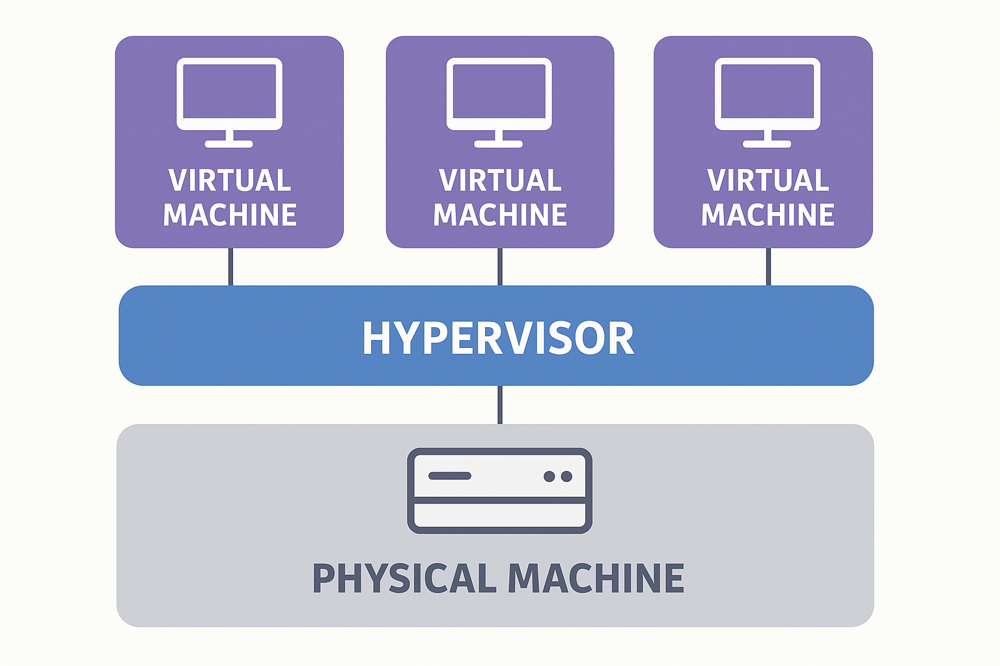
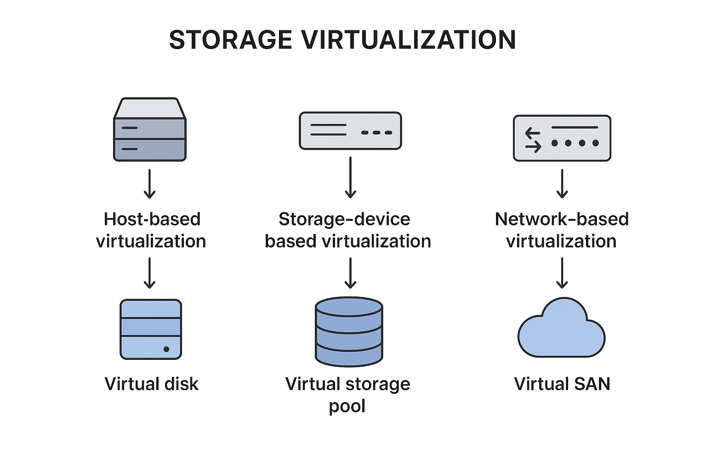
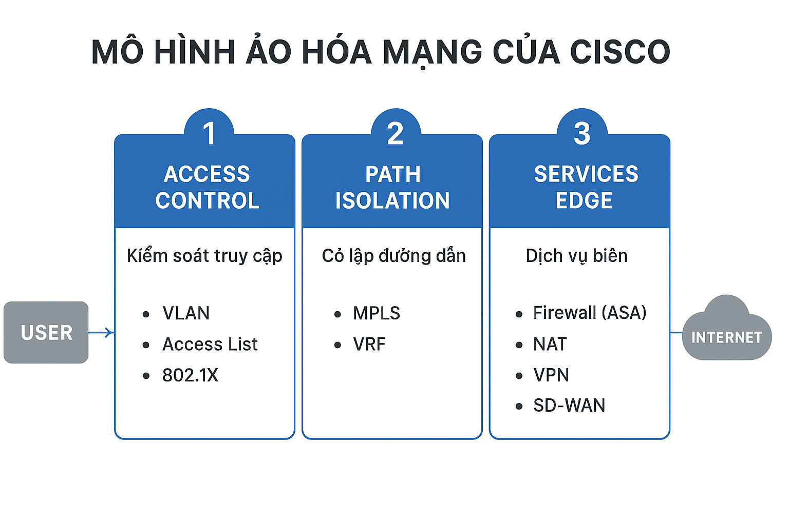
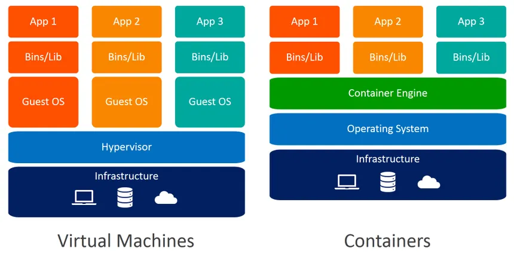
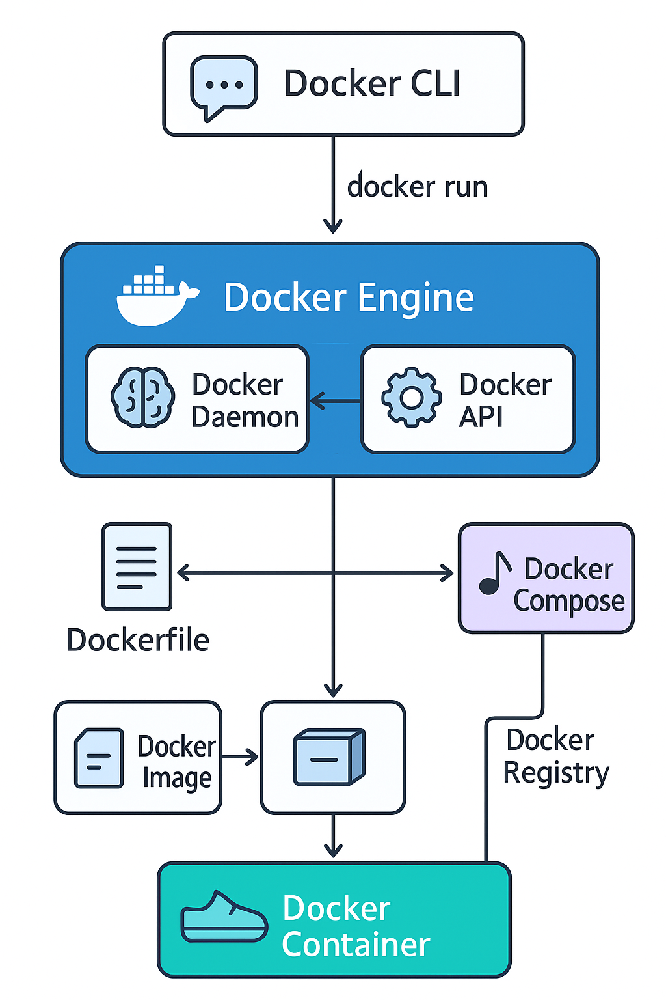
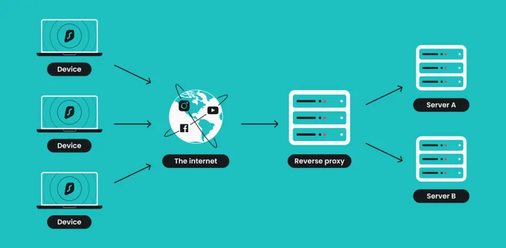

# Phần 1: Tổng quan về ảo hóa

---
## 1. Khái niệm Ảo hoá (Virtualization)
* **Ảo hoá (Virtualization)** là **công nghệ cho phép tạo ra nhiều môi trường hoặc tài nguyên “ảo”** (như máy tính, máy chủ, bộ nhớ, hay mạng) trên cùng **một phần cứng vật lý duy nhất**.
Nói cách khác, ảo hoá giúp **một máy vật lý hoạt động như nhiều máy độc lập**.
  * Ví dụ: Một máy chủ vật lý có thể “ảo hoá” thành nhiều **máy ảo (Virtual Machines – VM)**, mỗi máy ảo có thể chạy **hệ điều hành và ứng dụng riêng biệt**.
* **Lớp ảo hóa (Hypervisor)** là phần mềm trung gian **giữa phần cứng và các máy ảo**, giúp chia sẻ tài nguyên (CPU, RAM, ổ cứng,...) cho từng máy ảo.
  * Ví dụ: VMware, VirtualBox, KVM, Hyper-V.
* **Máy ảo (Virtual Machine – VM)** là **một hệ thống máy tính ảo**, mô phỏng phần cứng thật, có thể cài hệ điều hành và ứng dụng như một máy thật.


### **Mục đích của Ảo hoá**
* **Tối ưu sử dụng tài nguyên phần cứng :** Giúp nhiều hệ thống chạy trên cùng một máy vật lý, tránh lãng phí tài nguyên.
* **Giảm chi phí đầu tư và vận hành :** Không cần mua nhiều máy chủ vật lý, tiết kiệm điện năng, không gian, và chi phí bảo trì.
* **Tăng khả năng linh hoạt và mở rộng :** Dễ dàng tạo, sao chép, di chuyển, hoặc khôi phục máy ảo khi cần.
* **Tăng tính an toàn và cách ly :** Mỗi máy ảo hoạt động độc lập; lỗi hoặc tấn công trong một VM không ảnh hưởng đến VM khác.
* **Thuận tiện cho phát triển, kiểm thử và đào tạo :** Dễ tạo môi trường test, thử nghiệm hệ điều hành mới, hoặc học cấu hình server mà không sợ hỏng máy thật.

---
## 2. Các loại ảo hóa và công nghệ ảo hóa thông dụng
### a. Ảo hóa hệ thống lưu trữ (Storage Virtualization)
* **Ảo hóa lưu trữ** là quá trình **tập hợp (gộp)** nhiều thiết bị lưu trữ vật lý (như HDD, SSD, SAN, NAS...) thành **một không gian lưu trữ ảo thống nhất**.
* Người dùng và ứng dụng chỉ thấy **một khối lưu trữ duy nhất**, không cần biết dữ liệu nằm ở thiết bị nào.
* **Mục đích** : Tăng hiệu suất, dễ quản lý, phân bổ dung lượng linh hoạt và đảm bảo tính sẵn sàng cao (HA – High Availability).
  

| Loại ảo hóa                             | Mô tả ngắn gọn                                                              | Cách hoạt động                                                                                                                 | Một số công nghệ/giải pháp tiêu biểu                                      |
| --------------------------------------- |-----------------------------------------------------------------------------|--------------------------------------------------------------------------------------------------------------------------------| ------------------------------------------------------------------------- |
| **Host-based virtualization**           | Ngăn cách giữa lớp ảo háo và ổ đĩa vật lý là **drive điều khiển** các ổ đĩa.| Phần mềm ảo hóa tổng hợp các thiết bị lưu trữ vật lý và và sẽ truy xuất tài nguyên thông qua sự điều khiển của lớp Driver này. | Windows Storage Spaces, Linux LVM, Veritas Volume Manager                 |
| **Storage-device based virtualization** | Phần mềm ảo hóa nằm **trực tiếp trong thiết bị lưu trữ** (như SAN/NAS).     | Bộ điều khiển (controller) trong thiết bị lưu trữ tự động gộp và phân vùng tài nguyên, cung cấp cho nhiều máy chủ.             | EMC VNX, NetApp ONTAP, IBM DS8000, Dell PowerVault                        |
| **Network-based virtualization**        | Ảo hóa ở **lớp mạng lưu trữ (SAN/NAS switch)**.                             | Thiết bị hoặc phần mềm trung gian gom dữ liệu từ nhiều nguồn, phân phối động đến các máy chủ.                                  | IBM SAN Volume Controller (SVC), Brocade, Cisco MDS, DataCore SANsymphony |
### b. Ảo hóa hệ thống mạng (Network Virtualization)
* Ảo hóa mạng là kỹ thuật tạo ra **nhiều mạng ảo độc lập** hoạt động trên **một hạ tầng vật lý duy nhất**.
* Mục đích: Giúp chia hoặc gộp các thiết bị mạng (switch, router, firewall...) để sử dụng linh hoạt và hiệu quả hơn.

  
* **Phân loại**

| Loại ảo hóa  | Mô tả ngắn                                            | Ví dụ                       |
| ------------ | ----------------------------------------------------- | --------------------------- |
| **Internal** | Tạo nhiều mạng ảo bên trong 1 máy chủ vật lý.         | VMware vSwitch, Hyper-V     |
| **External** | Gom nhiều thiết bị vật lý thành 1 mạng ảo thống nhất. | VLAN, VXLAN, SDN, Cisco ACI |
### c. Ảo hóa hệ thống ứng dụng (Application Virtualization)
* Là công nghệ cho phép **tách rời ứng dụng khỏi hệ điều hành**, giúp **phân phối và chạy ứng dụng linh hoạt** hơn, mà **không cần cài đặt trực tiếp** lên máy người dùng.
* **Ưu điểm:**
  * Giúp dễ dàng cập nhật, quản lý và khắc phục lỗi ứng dụng.
  * Người dùng có thể trải nghiệm ứng dụng như bình thường.
  * Giảm xung đột giữa các ứng dụng hoặc giữa ứng dụng và hệ điều hành.
* **Một số nền tảng phổ biến:** Citrix XenApp, Microsoft Application Virtualization, VMware ThinApp.
#### **Hai công nghệ chính:**
* **Application Streaming**
    * Ứng dụng được chia thành các đoạn và **truyền dần đến người dùng khi cần** (không cần tải toàn bộ).
    * Dữ liệu truyền qua HTTP, CIFS hoặc RTSP.
* **Desktop Virtualization / VDI (Virtual Desktop Infrastructure)**
    * Ứng dụng được cài đặt và chạy trên **máy ảo (virtual desktop)**.
    * Hệ thống quản lý sẽ tạo và cung cấp desktop ảo cho người dùng.
### d. Ảo hóa hệ thống máy chủ (Server Virtualization)
* Là công nghệ cho phép **chạy nhiều máy ảo (VM)** trên **một máy chủ vật lý**, giúp:
* **Mục đích :** 
  * Tăng **tính linh động**, dễ thiết lập và quản lý.
  * **Tiết kiệm tài nguyên**, chia sẻ tốt hơn giữa các ứng dụng.
  * **Tăng hiệu suất** và khả năng tận dụng phần cứng.
#### **Hai mô hình ảo hóa máy chủ chính**

| Loại ảo hóa                                      | Đặc điểm chính                                                                                                                                                                                                          | Ví dụ công nghệ                                                                       |
| ------------------------------------------------ | ----------------------------------------------------------------------------------------------------------------------------------------------------------------------------------------------------------------------- | ------------------------------------------------------------------------------------- |
| **Host-based** (hay Hosted Hypervisor)           | - Hypervisor chạy **trên hệ điều hành chủ (host OS)**.<br> - Dễ cài đặt, thích hợp cho **môi trường cá nhân hoặc thử nghiệm**.<br> - Hiệu năng thấp hơn do phải thông qua hệ điều hành trung gian.                      | VMware Workstation, VMware Server, Microsoft Virtual Server                           |
| **Hypervisor-based** (hay Bare-metal Hypervisor) | - Hypervisor chạy **trực tiếp trên phần cứng** của máy chủ (không qua hệ điều hành).<br> - **Hiệu năng cao hơn**, thường dùng trong **doanh nghiệp và trung tâm dữ liệu**.<br> - Quản lý tài nguyên và VM hiệu quả hơn. | Oracle VM, VMware ESX/ESXi, Microsoft Hyper-V, Citrix XenServer, IBM Power Hypervisor |
### e. Các công nghệ ảo hóa đã từng dùng
#### **VMware – Ảo hóa máy chủ (Server Virtualization)**
* **Loại ảo hóa:** *Ảo hóa hệ thống máy chủ (Hypervisor-based hoặc Host-based)*
* **Công nghệ:** VMware Workstation, VMware ESXi
* **Nguyên lý:** Cho phép chạy **nhiều máy ảo** (mỗi VM có hệ điều hành riêng) **trên một máy thật**.
* **Mục đích sử dụng:**
    * Tạo môi trường test hoặc dev độc lập.
    * Cài đặt nhiều OS để thử nghiệm phần mềm.
* **Ví dụ:**
    * Cài VMware Workstation trên Windows → chạy Ubuntu VM bên trong.
#### **Docker – Ảo hóa cấp ứng dụng (Application / OS-level Virtualization)**
* **Loại ảo hóa:** *Ảo hóa hệ điều hành (OS-level / Container-based Virtualization)*
* **Công nghệ:** Docker Engine, Kubernetes
* **Nguyên lý:**
    * Không tạo máy ảo riêng biệt.
    * Thay vào đó, **chia sẻ kernel** của hệ điều hành, tạo các **container cô lập** chạy ứng dụng riêng.
* **Mục đích sử dụng:**
    * Triển khai ứng dụng nhanh, nhẹ, tách biệt môi trường.
* **Ví dụ:**
    * Chạy Spring Boot trong container riêng, database trong container khác, tất cả cùng trên 1 máy.
#### **Cloud – Ảo hóa kết hợp nhiều lớp**
* **Loại ảo hóa:**
    * Ảo hóa máy chủ (**Server Virtualization**) – chạy nhiều VM cho khách hàng.
    * Ảo hóa lưu trữ (**Storage Virtualization**) – gom nhiều ổ đĩa vật lý thành một không gian lưu trữ ảo.
    * Ảo hóa mạng (**Network Virtualization**) – chia mạng thành các subnet, VLAN, VPN riêng biệt.
* **Công nghệ:**
    * AWS EC2, Cloudflare R2, S3.
* **Mục đích:**
    * Cung cấp **tài nguyên ảo hóa on-demand** (máy ảo, ổ đĩa, mạng ảo) cho người dùng hoặc doanh nghiệp.

---
## 3. Virtual Machine
* Virtual Machine (VM) là một máy tính ảo được tạo ra bằng phần mềm (hypervisor), mô phỏng đầy đủ phần cứng của một máy thật (Host machine). Trên đó, bạn có thể cài và chạy hệ điều hành, phần mềm như trên máy vật lý.
* Khi hypervisor tạo VM, nó ảo hóa gần như toàn bộ tài nguyên phần cứng, bao gồm:

  | Thành phần                             | Ý nghĩa / Mô tả                                                      |
  | -------------------------------------- | -------------------------------------------------------------------- |
  | **CPU (Processor)**                    | Chia sẻ CPU vật lý thành nhiều CPU ảo cho từng VM.                   |
  | **RAM (Memory)**                       | Mỗi VM có vùng bộ nhớ ảo riêng, tách biệt với host và các VM khác.   |
  | **Storage (Ổ đĩa)**                    | Mỗi VM có “ổ đĩa ảo” (VDI, VMDK, v.v.) nằm trên ổ thật của host.     |
  | **Network (Card mạng)**                | Mỗi VM có card mạng ảo (vNIC), có thể kết nối LAN, NAT, hoặc Bridge. |
  | **I/O Devices (chuột, bàn phím, USB)** | Được ảo hóa để chia sẻ hoặc tách biệt giữa VM và host.               |
### a. Ảo hóa được hỗ trợ bởi phần cứng (Hardware-assisted Virtualization)
* Là cơ chế mà CPU và phần cứng của máy tính cung cấp chức năng đặc biệt để hỗ trợ ảo hóa, giúp máy ảo (VM) chạy nhanh hơn và ổn định hơn thay vì chạy qua phần mềm (hypervisor) mô phỏng.
* Một số nền tảng ảo hóa được hỗ trợ bởi phần cứng :

| Nền tảng                      | Tận dụng hardware virtualization như thế nào                     |
| ----------------------------- | ---------------------------------------------------------------- |
| **VMware Workstation / ESXi** | Sử dụng VT-x để cho phép guest OS chạy trực tiếp trên CPU        |
| **VirtualBox**                | Có tùy chọn “Enable VT-x / AMD-V” để tăng tốc VM                 |
| **KVM (Linux)**               | Dựa hoàn toàn vào VT-x/AMD-V — nếu không có, không thể chạy được |

* Kiểm tra khả năng ảo hóa của máy : `egrep -wo 'vmx|svm' /proc/cpuinfo`
  * `vmx` = Intel VT-x 
  * `svm` = AMD-V
  * Nếu không thấy, hãy vào BIOS / UEFI → bật “Intel Virtualization Technology” hoặc “SVM Mode”.
### b. Ảo hóa bán phần (Paravirtualization)
* Là hình thức ảo hóa trong đó hệ điều hành khách (Guest OS) biết rằng nó đang chạy trong môi trường ảo hóa, và hợp tác với hypervisor để thực hiện các tác vụ đặc quyền (privileged operations).
* Ví dụ: Khi máy áo cần ghi vào ổ cứng sector 1000.
  * Ảo hóa toàn phần (Full-virtualization) : Hypervisor sẽ giả lập toàn bộ ổ cứng, máy ảo sẽ nghĩ nó đang ghi trực tiếp vào ổ cứng thật. Khi máy ảo gửi lệnh "ghi sector 1000", hypervisor phải bắt (trap) lệnh đó lại, dịch nó, rồi mới thực thi trên phần cứng thật.
  * Ảo hóa bán phần (Paravirtualization) : VM sẽ gọi trực tiếp API của hypervisor (gọi là `hypercall`) để ghi vào sector 1000 trên ổ cứng thật, bỏ qua bước giả lập ổ cứng ảo.
* Ưu & nhược điểm :

| Ưu điểm                                                             | Nhược điểm                                              |
| ------------------------------------------------------------------- | ------------------------------------------------------- |
| Hiệu năng cao hơn full virtualization (vì ít mô phỏng phần cứng hơn) | Guest OS phải **được sửa đổi**, không thể dùng OS gốc |
| Giao tiếp giữa guest và hypervisor nhanh hơn (qua hypercalls)       | Không phù hợp cho OS đóng (như Windows bản thương mại)  |
| Giảm overhead xử lý I/O, CPU, memory                              | Cần hypervisor hỗ trợ kiểu này (Xen, KVM, v.v.)         |
### c. Vòng đời và quản lý VM
| Giai đoạn              | Mô tả                                                         |
| ---------------------- | ------------------------------------------------------------- |
| **Create (Tạo)**       | Hypervisor cấp tài nguyên và tạo đĩa ảo, CPU ảo, RAM cho VM.  |
| **Boot / Start**       | VM khởi động hệ điều hành của mình như máy thật.              |
| **Run**                | VM chạy ứng dụng, xử lý dữ liệu.                              |
| **Pause / Suspend**    | Tạm dừng trạng thái VM (giống sleep).                         |
| **Snapshot**           | Ghi lại trạng thái hiện tại (RAM, CPU, đĩa) để khôi phục sau. |
| **Resume**             | Khởi chạy lại VM từ snapshot hoặc trạng thái pause.           |
| **Shutdown / Destroy** | Dừng VM, giải phóng tài nguyên.                               |
* **Quản lý VM:**
  * Qua hypervisor GUI (VMware, VirtualBox, Hyper-V Manager).
  * Hoặc qua CLI / API (ví dụ: virsh, VBoxManage, vSphere API).
  * Có thể clone, migrate, backup hoặc scale dễ dàng.
  
---
# Phần 2: Container
## 1. Container là gì?
**Container** là công nghệ ảo hóa **ở mức hệ điều hành (OS-level virtualization)**.
Nó cho phép **nhiều ứng dụng** chạy độc lập trên cùng **một hệ điều hành** nhưng **tách biệt về môi trường** (file system, network, process,…).

Mỗi container chứa:
* Ứng dụng (App)
* Thư viện và dependencies cần thiết
* Nhưng **không có kernel riêng** (dùng chung kernel với host OS)

Công nghệ phổ biến: **Docker**, **Kubernetes**, **Podman**, **LXC**
### So sánh Container vs Virtual Machine

| Tiêu chí             | **Container**                                   | **Virtual Machine (VM)**                     |
| -------------------- | ----------------------------------------------- | -------------------------------------------- |
| **Mức độ ảo hóa**    | Ảo hóa **hệ điều hành**                         | Ảo hóa **phần cứng**                         |
| **Kernel**           | Dùng **chung kernel** của host                  | Mỗi VM có **kernel riêng**                   |
| **Tốc độ khởi động** | Rất nhanh (vài giây)                            | Chậm hơn (vài phút)                          |
| **Dung lượng**       | Nhẹ (MBs)                                       | Nặng (GBs)                                   |
| **Cách cô lập**      | Cô lập tiến trình (process-level isolation)     | Cô lập hoàn toàn (full OS isolation)         |
| **Hiệu năng**        | Gần như native (rất cao)                        | Giảm nhẹ do lớp ảo hóa                       |
| **Trường hợp dùng**  | Triển khai ứng dụng nhanh, CI/CD, microservices | Chạy nhiều OS khác nhau, môi trường phức tạp |
| **Công cụ phổ biến** | Docker, Kubernetes                              | VMware, VirtualBox, Hyper-V                  |

## 2. Docker
### 2.1 Tổng quan & Cài đặt Docker
**Docker** là nền tảng mã nguồn mở giúp **tạo, triển khai và quản lý container** một cách dễ dàng.

**Các thành phần chính của Docker :**
    
| Thành phần | Vai trò (Nó là gì?)                                | Mục đích (Nó làm gì?) |
| :--- |:---------------------------------------------------| :--- |
| **Docker Engine (Động cơ)** | "Trái tim" của Docker, bao gồm Daemon, CLI và API. | Quản lý, xây dựng và chạy các container. |
| **Docker Daemon (Trình nền)** | "Bộ não" chạy nền, lắng nghe lệnh.                 | Thực thi các lệnh như tạo Image, chạy Container. |
| **Docker CLI (Dòng lệnh)** | "Người giao tiếp" (ví dụ: `docker run`).           | Cung cấp giao diện để người dùng ra lệnh cho Docker Daemon. |
| **Dockerfile (Tệp Docker)** | "Bản thiết kế" hoặc "Công thức".                   | Chứa các hướng dẫn từng bước để **xây dựng** một Image. |
| **Docker Image (Hình ảnh)** | "Khuôn mẫu" hoặc "Gói" chỉ đọc.                    | Một gói độc lập chứa mọi thứ (mã, thư viện) cần thiết để chạy ứng dụng. |
| **Docker Container (Vùng chứa)** | "Một phiên bản đang chạy" của Image.               | Môi trường bị cô lập nơi ứng dụng của bạn thực sự hoạt động. |
| **Docker Registry (Kho chứa)** | "Thư viện" hoặc "Nhà kho" (như Docker Hub).        | Dùng để **lưu trữ và chia sẻ** các Docker Image. |
| **Docker Compose** | "Nhạc trưởng" của dàn nhạc.                      | Một công cụ để **định nghĩa và chạy** các ứng dụng gồm nhiều container. |

#### 2.1.1. Overview về docker container.
**Docker Container** là một **phiên bản đang chạy (running instance)** của một **Docker Image**.

Nếu **Image** (Hình ảnh) là một **"Class"** (lớp) trong lập trình hướng đối tượng—một bản thiết kế chỉ đọc, chứa mọi thứ bạn cần—thì **Container** chính là một **"Object"** (đối tượng), một thực thể sống động được tạo ra từ bản thiết kế đó. Bạn có thể tạo, chạy, dừng, và xóa Container.

Một container đóng gói ứng dụng của bạn cùng với tất cả các phụ thuộc của nó (thư viện, tệp cấu hình, runtime) vào một môi trường bị cô lập hoàn toàn.

---
**Các đặc tính quan trọng nhất :**

**_a. Tính cô lập (Isolation)_**

Một container chạy trong một "cái hộp"(sandbox) hoàn toàn tách biệt với các container khác và với máy chủ (host).
* **Cô lập hệ thống tệp:** Container có hệ thống tệp riêng của nó (được tạo từ Image). Nó không thể thấy các tệp trên máy chủ hoặc trong các container khác (trừ khi bạn cố tình chia sẻ).
* **Cô lập tiến trình (Process):** Container chỉ thấy các tiến trình đang chạy *bên trong* nó. Tiến trình gốc (PID 1) bên trong container là ứng dụng của bạn. Nó không thể thấy các tiến trình của máy chủ.
* **Cô lập mạng:** Mỗi container có địa chỉ IP và cổng (port) riêng.

**_b. Tính nhẹ (Lightweight)_**

Đây là điểm khác biệt lớn nhất so với **Máy ảo (VM)**.
* **VM (Máy ảo):** Ảo hóa toàn bộ phần cứng và chạy một hệ điều hành khách (Guest OS) hoàn chỉnh bên trên hệ điều hành chủ (Host OS). Điều này rất nặng nề, tốn nhiều tài nguyên (RAM, CPU) và khởi động mất vài phút.
* **Container:** Không chạy hệ điều hành khách. Thay vào đó, nó **chia sẻ nhân (kernel) của hệ điều hành chủ (Host OS)**. Tất cả các container trên một máy chủ đều dùng chung một kernel. Chúng chỉ ảo hóa ở cấp độ tiến trình và thư viện.
Vì vậy, container khởi động chỉ trong **vài giây** (hoặc nhanh hơn) và tốn ít tài nguyên hơn rất nhiều.

**_c. Tính di động (Portability)_**

Container giải quyết triệt để vấn đề kinh điển: "Ủa, trên máy tớ chạy được mà!"
Bởi vì container đóng gói *mọi thứ* (mã, runtime, thư viện), bạn có thể "Build" nó một lần và chạy nó ở bất cứ đâu có Docker Engine: trên máy tính cá nhân (Windows, macOS, Linux), trên máy chủ nội bộ, hay trên mọi đám mây (AWS, Google Cloud, Azure). Nó sẽ chạy **giống hệt nhau** ở mọi nơi.

**_d. Tính tạm thời (Ephemeral)_**

Đây là một khái niệm quan trọng cần nắm: Container được thiết kế để **dễ dàng vứt bỏ và thay thế**.
* Mọi dữ liệu bạn ghi vào hệ thống tệp *bên trong* container sẽ **mất vĩnh viễn** khi container đó bị xóa.
* **Giải pháp:** Để lưu trữ dữ liệu vĩnh viễn (như cơ sở dữ liệu), bạn phải sử dụng **Docker Volumes**. Volumes là một cơ chế cho phép dữ liệu tồn tại bên ngoài vòng đời của container, được lưu trữ an toàn trên máy chủ.
#### 2.1.2. Cài đặt docker
**_a. Yêu cầu trước khi cài đặt Docker Engine trên Ubuntu_**

**1\. Cảnh báo quan trọng về Tường lửa (Firewall)**

Đây là điểm rất quan trọng cần lưu ý:
* **Bỏ qua (Bypass) UFW / Firewalld:** Nếu bạn sử dụng `ufw` (phổ biến trên Ubuntu) hoặc `firewalld` để quản lý tường lửa, hãy cẩn thận. Khi Docker mở (expose) một cổng cho container, cổng đó sẽ **bỏ qua các quy tắc tường lửa** của bạn.
* **Không tương thích với `nft`:** Docker **chỉ** tương thích với `iptables-nft` và `iptables-legacy`. Nó **không** hỗ trợ các quy tắc tường lửa được tạo bằng `nft`. Bạn phải đảm bảo các quy tắc được tạo bằng `iptables` hoặc `ip6tables`.

**2\. Yêu cầu Hệ điều hành (OS)**
* Bạn cần phiên bản **64-bit** của một trong các bản Ubuntu sau:
    * Ubuntu 25.10 (Questing)
    * Ubuntu 25.04 (Plucky)
    * Ubuntu 24.04 (Noble LTS)
    * Ubuntu 22.04 (Jammy LTS)
* **Không hỗ trợ chính thức:** Các bản phái sinh từ Ubuntu (như Linux Mint) không được hỗ trợ chính thức, mặc dù chúng có thể hoạt động.

**3\. Gỡ cài đặt các phiên bản cũ (Bắt buộc)**

Trước khi cài đặt phiên bản Docker Engine chính thức, bạn **phải** gỡ cài đặt bất kỳ gói nào có khả năng xung đột.

* **Tại sao phải gỡ?**
  * Bản phân phối Linux của bạn có thể cung cấp các gói Docker "không chính thức" (như `docker.io`) và chúng sẽ xung đột với gói chính thức của Docker.
* **Các gói cần gỡ:**
    * `docker.io`
    * `docker-compose`
    * `docker-compose-v2`
    * `docker-doc`
    * `podman-docker`
* **Gỡ cả các phụ thuộc:** Docker Engine mới đã bao gồm `containerd` và `runc`. Nếu bạn đã cài đặt chúng theo cách thủ công trước đó, bạn cũng nên gỡ bỏ (`containerd`, `runc`) để tránh xung đột phiên bản.

**Lệnh gỡ cài đặt tất cả:**
```bash
for pkg in docker.io docker-doc docker-compose docker-compose-v2 podman-docker containerd runc; do sudo apt-get remove $pkg; done
```
**Lưu ý quan trọng về dữ liệu cũ:**
* Việc chạy lệnh `remove` ở trên **KHÔNG** tự động xóa dữ liệu Docker cũ của bạn (như images, containers, volumes).
* Tất cả dữ liệu này vẫn được lưu trữ tại `/var/lib/docker/`.
* Nếu bạn muốn bắt đầu cài đặt "sạch" hoàn toàn và muốn xóa tất cả dữ liệu cũ, bạn cần phải tự xóa thư mục đó.

**_b. Các cách cài đặt Docker_**

Có 4 cách khác nhau để cài đặt Docker Engine, tùy thuộc vào nhu cầu của bạn:
* Dùng Docker Desktop.
* Dùng quản lý gói `apt`.
* Tự tải về và cài đặt các gói.
* Sử dụng một kịch bản (script) cài đặt tự động.

Tuy nhiên ở đây tôi chỉ trình bày cách cài đặt Docker Engine bằng kho lưu trữ `apt`.

Các cách còn lại bạn có thể tham khảo tại trang chính thức của [Docker](https://docs.docker.com/engine/install/ubuntu/)

**_c. Cài đặt Docker Engine bằng `apt`_**

**Bước 1: Thiết lập kho lưu trữ `apt` của Docker**

(Bạn chỉ cần làm điều này một lần trên mỗi máy chủ mới)
1.  **Thêm GPG key chính thức của Docker:**
    Điều này để đảm bảo rằng các gói bạn tải về là xác thực.
    ```bash
    # Cập nhật danh sách gói và cài các gói cần thiết
    sudo apt-get update
    sudo apt-get upgrade
    sudo apt-get install ca-certificates curl

    # Tạo thư mục cho keyrings
    sudo install -m 0755 -d /etc/apt/keyrings

    # Tải về GPG key của Docker
    sudo curl -fsSL https://download.docker.com/linux/ubuntu/gpg -o /etc/apt/keyrings/docker.asc

    # Cấp quyền đọc cho key
    sudo chmod a+r /etc/apt/keyrings/docker.asc
    ```
2.  **Thêm kho lưu trữ (repository) vào nguồn Apt:**
    Lệnh này thêm kho lưu trữ Docker chính thức vào danh sách các nguồn mà `apt` sẽ kiểm tra khi tìm kiếm phần mềm.
    ```bash
    echo \
      "deb [arch=$(dpkg --print-architecture) signed-by=/etc/apt/keyrings/docker.asc] https://download.docker.com/linux/ubuntu \
      $(. /etc/os-release && echo "${UBUNTU_CODENAME:-$VERSION_CODENAME}") stable" | \
      sudo tee /etc/apt/sources.list.d/docker.list > /dev/null

    # Cập nhật lại danh sách gói để nhận diện kho lưu trữ Docker mới
    sudo apt-get update
    ```
**Bước 2: Cài đặt các gói Docker**
1.  **Chạy lệnh cài đặt:**
    Lệnh này sẽ cài đặt phiên bản mới nhất của Docker Engine, CLI, containerd, và các plugin `buildx` và `compose`.
    ```bash
    sudo apt-get install docker-ce docker-ce-cli containerd.io docker-buildx-plugin docker-compose-plugin
    ```
2.  **Xác minh cài đặt:**
    * Dịch vụ Docker sẽ tự động khởi động sau khi cài đặt. Bạn có thể kiểm tra trạng thái bằng lệnh:
      ```bash
      sudo systemctl status docker
      ```
    * Chạy image `hello-world` để xác nhận Docker đang hoạt động chính xác. Lệnh này sẽ tải một image thử nghiệm, chạy nó trong container, in ra thông báo xác nhận và thoát.
      ```bash
      sudo docker run hello-world
      ```
> Theo mặc định, bạn phải dùng `sudo` khi chạy các lệnh Docker. Điều này là do nhóm người dùng `docker` đã được tạo nhưng không có người dùng nào trong đó. Bạn cần thực hiện các bước [Linux postinstall](https://docs.docker.com/engine/install/linux-postinstall) (bên dưới) để cho phép người dùng không phải root chạy Docker mà không cần `sudo`.

**Chạy Docker với tư cách người dùng không phải root**
1.  **Tạo nhóm (group) `docker`:**
    *(Nhóm này có thể đã tồn tại sau khi cài đặt)*
    ```bash
    sudo groupadd docker
    ```
2.  **Thêm người dùng của bạn vào nhóm `docker`:**
    ```bash
    sudo usermod -aG docker $USER
    ```
3.  **Kích hoạt các thay đổi:**
    Bạn cần **đăng xuất và đăng nhập lại** để máy tính nhận diện tư cách thành viên nhóm mới của bạn.

    * *Lưu ý:* Nếu bạn dùng máy ảo Linux, bạn có thể cần **khởi động lại máy ảo**.
    * *Cách thay thế (áp dụng ngay lập...*): Bạn có thể chạy lệnh sau để kích hoạt ngay thay đổi trong cửa sổ terminal hiện tại:
      ```bash
      newgrp docker
      ```
4.  **Xác minh:**
    Kiểm tra xem bạn có thể chạy Docker mà không cần `sudo` hay không:
    ```bash
    docker run hello-world
    ```
**Xử lý lỗi "Permission Denied" (Từ chối quyền)**

Nếu bạn đã từng chạy lệnh `sudo docker` *trước khi* thực hiện các bước trên, bạn có thể gặp lỗi liên quan đến tệp `.../.docker/config.json`.
* **Nguyên nhân:** Thư mục `~/.docker/` đã được tạo và thuộc sở hữu của `root` (do bạn dùng `sudo`).
* **Cách khắc phục (Chọn 1):**
    * **Cách 1 (Xóa):** Xóa thư mục `~/.docker/`. Docker sẽ tự động tạo lại nó với quyền sở hữu chính xác.
      *(Mọi cài đặt tùy chỉnh trong đó sẽ bị mất)*
    * **Cách 2 (Sửa quyền):** Thay đổi chủ sở hữu và quyền của thư mục:
      ```bash
      sudo chown "$USER":"$USER" /home/"$USER"/.docker -R
      sudo chmod g+rwx "$HOME/.docker" -R
      ```
> **Nâng cấp Docker Engine:**
  Để nâng cấp, bạn chỉ cần **chạy lại lệnh ở Bước 2** (`sudo apt-get install ...`). `apt` sẽ tự động tìm và cài đặt phiên bản mới nhất từ kho lưu trữ bạn đã thiết lập.
#### 2.1.3. Cấu hình proxy cho docker

_a. Proxy là gì?_
Một **Proxy** (hay **Proxy Server**) hiểu đơn giản là một **"người gác cổng"** hoặc một **"người trung gian"** đứng giữa máy tính của bạn và Internet.

Ví dụ:
* **Khi không có Proxy:** Máy tính của bạn (Client) gửi yêu cầu trực tiếp đến một trang web (ví dụ: `google.com`) và trang web đó gửi dữ liệu trực tiếp về cho bạn.
* **Khi có Proxy:** Máy tính của bạn gửi yêu cầu đến **máy chủ Proxy** trước. Máy chủ Proxy sau đó *thay mặt bạn* gửi yêu cầu đó đến `google.com`, nhận dữ liệu về, và *sau đó* mới chuyển dữ liệu đó cho bạn.

Các tổ chức (như công ty, trường học) thường sử dụng Proxy vì 3 lý do chính:
1.  **Bảo mật & Kiểm soát (Quan trọng nhất):** Proxy hoạt động như một bức tường lửa. Nó kiểm tra mọi yêu cầu đi ra ngoài. Nếu bạn cố gắng truy cập một trang web bị cấm (như mạng xã hội, web đen), proxy sẽ chặn bạn lại.
2.  **Ẩn danh tính:** Đối với trang web bên ngoài, họ chỉ thấy địa chỉ IP của máy chủ Proxy, không phải địa chỉ IP thật của bạn.
3.  **Tăng tốc (Caching):** Nếu 100 người trong công ty cùng truy cập một trang tin tức, proxy chỉ cần tải trang đó về 1 lần và lưu vào bộ nhớ đệm (cache), sau đó phân phát cho 99 người còn lại, giúp tiết kiệm băng thông.

**_b. Tại sao Docker cần cấu hình Proxy?_**

Lý do là: **Docker tạo ra các môi trường bị cô lập, và các môi trường này không tự động biết "người gác cổng" (Proxy) của bạn là ai.**

Khi máy tính của bạn (laptop, máy chủ) nằm trong mạng công ty, 100% kết nối ra Internet *đều phải* đi qua Proxy. Docker không phải là ngoại lệ.

Bạn cần cấu hình proxy cho Docker ở **hai nơi** hoàn toàn khác nhau, vì chúng giải quyết hai vấn đề khác nhau:

**Vấn đề A: Cấu hình Proxy cho DAEMON (Dịch vụ Docker)**

* **Ai cần:** Dịch vụ Docker (`dockerd`) chạy nền trên máy của bạn.
* **Làm gì:** Để thực thi các lệnh như `docker pull ubuntu` hoặc `docker push ...`
* **Tại sao:** Khi bạn gõ `docker pull ubuntu`, chính **dịch vụ Docker** cần phải kết nối đến **Docker Hub** (trên Internet) để tải image về. Nếu dịch vụ này không biết địa chỉ proxy, nó sẽ cố gắng kết nối trực tiếp, và sẽ bị "người gác cổng" của công ty chặn lại.
* **Hậu quả nếu thiếu:** Mọi lệnh `docker pull` hoặc `docker push` sẽ bị lỗi (thường là "Connection timed out").

**Vấn đề B: Cấu hình Proxy cho CLIENT (Các Container)**

* **Ai cần:** Các container khi bạn `docker build` hoặc `docker run`.
* **Làm gì:** Để thực thi các lệnh *bên trong* `Dockerfile`, ví dụ: `RUN apt-get update` hoặc `RUN pip install ...`
* **Tại sao:** Container là một "máy tính mini" bị cô lập. Nó có hệ thống mạng riêng và **không** thừa hưởng cài đặt proxy của Daemon. Khi bạn `build` một image, lệnh `RUN apt-get update` bên trong container sẽ cố gắng kết nối ra Internet. Giống như trên, nó không biết proxy là ai, nên nó kết nối trực tiếp và bị chặn.
* **Hậu quả nếu thiếu:** Lệnh `docker build` sẽ bị lỗi (thường là "Failed to fetch..." hoặc "Connection timed out") ngay tại các bước cần tải tài nguyên từ mạng.

#### 2.1.3.1. Cấu hình proxy cho docker client
Mục đích là để các **container** của bạn (khi `build` hoặc `run`) có thể sử dụng proxy để truy cập Internet (ví dụ: để chạy `apt-get install` hoặc `curl`).

Có hai cách chính để thực hiện cấu hình proxy cho docker client :
* Cấu hình qua file `config.json`
* Cấu hình thủ công qua CLI (dùng `--build-arg` hoặc `--env`)

**a\. Cấu hình Docker Client thông qua file `config.json`**
* **Cách làm:** Tạo hoặc chỉnh sửa tệp `~/.docker/config.json` (nằm trong thư mục `home` của người dùng).
* **Nội dung:** Thêm một khối JSON `"proxies"`:
  ```json
  {
    "proxies": {
      "default": {
        "httpProxy": "http://proxy.example.com:3128",
        "httpsProxy": "https://proxy.example.com:3129",
        "noProxy": "*.test.example.com,.example.org,127.0.0.0/8"
      },
      "tcp://docker-daemon1.example.com": {
        "noProxy": "*.internal.example.net"
      }
    }
  }
  ```
  * **`"proxies"`**: Đây là "khối" chính chứa tất cả các cấu hình proxy.
  * **`"default"`**: Khóa này có nghĩa là các cài đặt bên trong nó sẽ được áp dụng **mặc định** cho mọi hoạt động `build` và `run` của bạn.
    * Để cấu hình proxy cho từng daemon riêng lẻ, hãy sử dụng địa chỉ của daemon đó thay vì khóa default.
  * **`"httpProxy": "..."`**: Chỉ định địa chỉ của máy chủ proxy cho các kết nối **HTTP**. Khi một container chạy (ví dụ `apt-get`), nó sẽ tự động được "tiêm" biến môi trường `HTTP_PROXY` với giá trị này.
  * **`"httpsProxy": "..."`**: Chỉ định địa chỉ của máy chủ proxy cho các kết nối **HTTPS**. Tương tự, nó sẽ tự động thiết lập biến `HTTPS_PROXY` bên trong container.
  * **`"noProxy": "..."`**: Đây là tham số **rất quan trọng**. Nó liệt kê các địa chỉ, tên miền, hoặc dải IP mà container nên kết nối **trực tiếp**, *không* đi qua proxy.
    * Trong ví dụ: `*.test.example.com` (mọi trang con của `test.example.com`), `.example.org` (mọi trang con của `example.org`), và `127.0.0.0/8` (toàn bộ dải `localhost`) sẽ không dùng proxy.
* **Cách hoạt động:**
    * Docker sẽ tự động đọc tệp này và "tiêm" các biến môi trường tương ứng (ví dụ: `HTTP_PROXY`, `HTTPS_PROXY`, `no_proxy`) vào mọi container **mới** được bạn `run` hoặc `build`.
    * Cấu hình này có hiệu lực **ngay lập tức** sau khi lưu tệp, không cần khởi động lại Docker.

> **Cảnh báo bảo mật:**
> * Cài đặt proxy (đặc biệt nếu chứa thông tin xác thực/mật khẩu) là **thông tin nhạy cảm**.
> * Chúng được lưu dưới dạng **văn bản thuần túy (plain text)** trong cấu hình của container và có thể bị lộ nếu bạn dùng lệnh `docker commit`.

**b\. Thiết lập Proxy qua CLI (Thủ công)**
* **Khi xây dựng Image (với `docker build`):**
    * Sử dụng cờ `--build-arg`. Docker sẽ tự động nhận diện các `ARG` này.
  ```bash
  docker build --build-arg HTTP_PROXY="http://proxy.example.com:3128" .
  ```
* **Khi chạy Container (với `docker run`):**
    * Sử dụng cờ `--env` (hoặc `-e`).
  ```bash
  docker run --env HTTP_PROXY="http://proxy.example.com:3128" redis
  ```
> **Cảnh báo quan trọng nhất: KHÔNG Dùng `ENV` trong Dockerfile**
> * Tuyệt đối **không** sử dụng lệnh `ENV` (ví dụ: `ENV HTTP_PROXY=...`) bên trong `Dockerfile` để cài đặt proxy.
>> * **Lý do:**
>>  * **Rủi ro bảo mật:** Làm như vậy sẽ **nhúng (embed)** cài đặt proxy (có thể chứa mật khẩu) thẳng vào image cuối cùng, làm **lộ thông tin nhạy cảm** cho bất kỳ ai có image của bạn.
>>  * **Mất tính di động:** Image đó sẽ bị hỏng hoặc không chạy được trên một môi trường khác không có quyền truy cập vào proxy đó.
> * **Giải pháp:** Luôn luôn sử dụng `ARG` (`--build-arg`) cho các cài đặt proxy trong lúc build.


