## Phần 2: Làm việc với repository
1. **Repository là gì?**
 * Repository (repo) là một kho lưu trữ chứa mã nguồn, tài liệu và các tệp tin khác của một dự án phần mềm.
 * Repo có thể kiểm tra lịch sử thay đổi, theo dõi các phiên bản khác nhau và hỗ trợ làm việc nhóm.
 * Repo có thể được lưu trữ cục bộ trên máy tính của bạn hoặc trên các dịch vụ lưu trữ mã nguồn trực tuyến như GitHub, GitLab hoặc Bitbucket.
 2. **Tạo mới một repository**
 * Trên GitHub:
     - Nhấp vào biểu tượng "+" ở góc trên bên phải và chọn "New repository".
   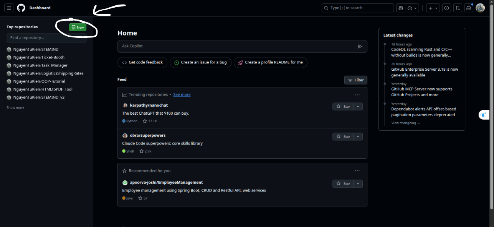
     - Nhập tên repository, mô tả (tùy chọn), chọn chế độ công khai (public) hoặc riêng tư (private).
     - Chọn khởi tạo với README (tùy chọn), .gitignore và giấy phép (license) nếu cần.
   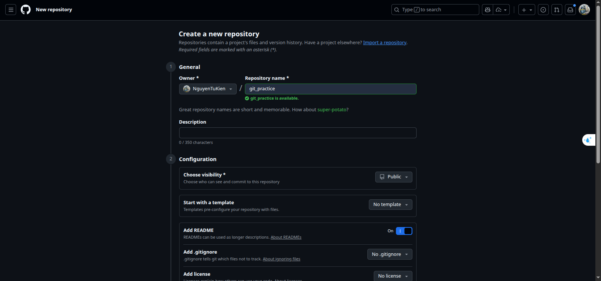
     - Nhấp vào "Create repository" để tạo mới.
   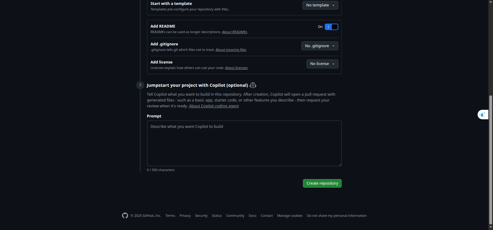
   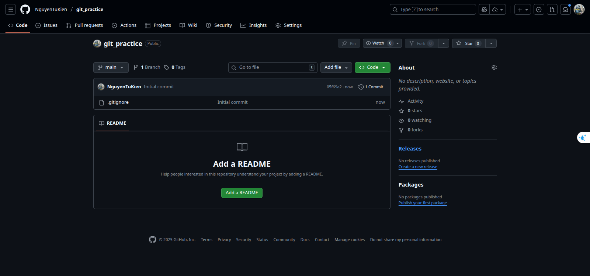
 * Trên máy tính cục bộ:
     - Mở terminal hoặc command prompt.
     - Điều hướng đến thư mục bạn muốn tạo repository mới.
     - Chạy lệnh `git init` để khởi tạo một repository Git mới trong thư mục hiện tại.
   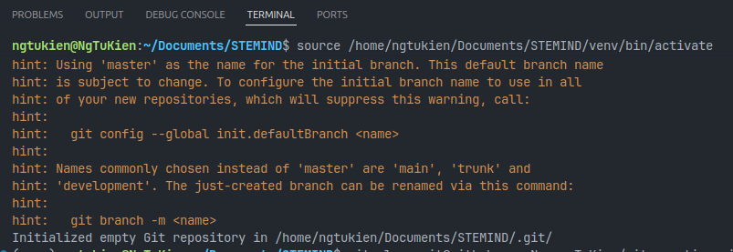
 3. **Clone một repository từ GitHub về máy tính**
 * Trên GitHub:
     - Điều hướng đến trang repository bạn muốn clone.
     - Nhấp vào nút "Code" và sao chép URL SSH hoặc HTTPS của repository.
   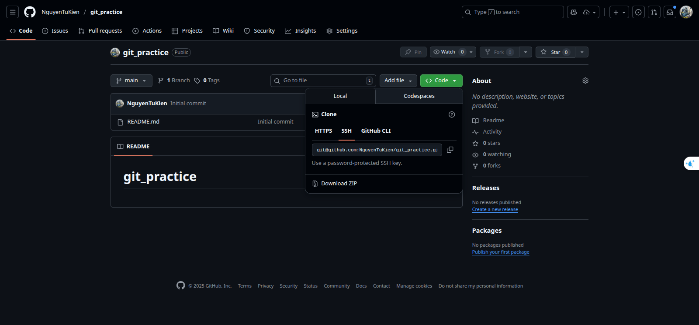
 * Trên máy tính cục bộ:
        - Mở terminal hoặc command prompt.
        - Điều hướng đến thư mục bạn muốn lưu trữ repository.
        - Chạy lệnh `git clone <repository-url>` (thay `<repository-url>` bằng URL bạn đã sao chép).
    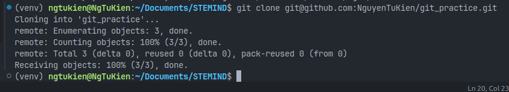
4. **Cấu trúc thư mục .git**
- Thư mục `.git` là một thư mục ẩn nằm trong thư mục gốc của một repository Git, chứa tất cả các dữ liệu và cấu hình cần thiết để quản lý phiên bản của dự án.
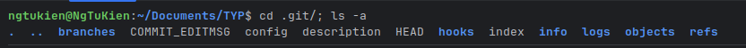
- Các thành phần chính trong thư mục `.git` bao gồm:
  - `HEAD`: Tệp này chứa tham chiếu đến nhánh hiện tại mà bạn đang làm việc.
  - `config`: Tệp cấu hình của repository, chứa các thiết lập như remote repository, user information, và các tùy chọn khác.
  - `objects/`: Thư mục này chứa tất cả các đối tượng Git, bao gồm các commit, tree, và blob (nội dung tệp).
  - `refs/`: Thư mục này chứa các tham chiếu đến các nhánh và tag trong repository.
  - `branches/`: Chứa các tham chiếu đến các nhánh trong repository.
  - `descriptions`: Chứa mô tả của repository (chủ yếu dùng trong các repository bare).
  - `logs/`: Chứa lịch sử các thay đổi của các tham chiếu (như nhánh và HEAD).
  - `info/`: Chứa các tệp thông tin bổ sung về repository.
  - `hooks/`: Chứa các script hook mà bạn có thể sử dụng để tự động hóa các tác vụ khi xảy ra các sự kiện Git (như commit, push, v.v.).
  - `index`: Tệp này chứa thông tin về trạng thái hiện tại của các tệp trong khu vực staging (chưa được commit). -> Staging Area
  - `COMMIT_EDITMSG`: Tệp này chứa thông điệp commit gần nhất.
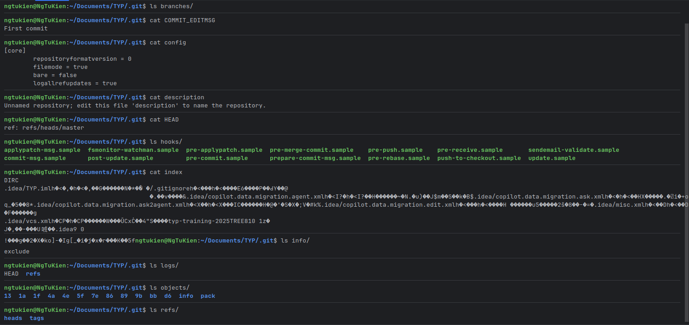
5. **Các trạng thái trong file**
* Git có 3 khu vực chính :
  - Working Directory (Thư mục làm việc): Là thư mục chứa các file dự án của bạn. Đây là nơi bạn chỉnh sửa, thêm, xóa file.
  - Staging Area (Khu vực trung gian): Giống như một bản nháp cho lần commit tiếp theo. Bạn chọn những thay đổi nào trong Working Directory để đưa vào đây bằng lệnh `git add`.
  - Repository (.git directory - Kho chứa): Nơi Git lưu trữ vĩnh viễn lịch sử các thay đổi của dự án. Khi bạn `commit`, Git sẽ lấy snapshot của Staging Area và lưu vào đây.
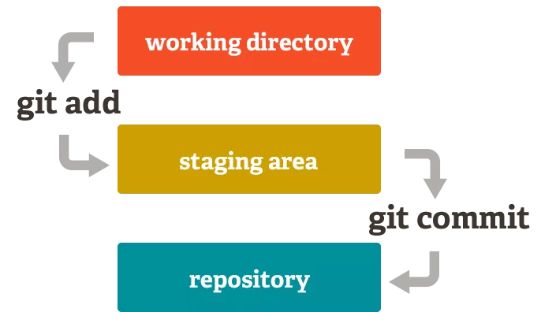
* Các trạng thái file
  - Untracked(Chưa được theo dõi): Là trạng thái của file hoàn toàn mới trong Working Directory mà git chưa từng biết đến (chưa được `add`)
  - Modified(Chưa thay đổi): Là trạng thái của file đã được theo dõi, nhưng nội dung của nó trong working directory bị thay đổi so với phiên bản gần nhất của nó trong stagging area.
  - Stagging(Đã lưu vào khu vực trung gian): Là trạng thái của file đã được đánh dấu để đưa vào lần commit tiếp theo. Trạng thái này có nghĩa là phiên bản hiện tại của file đã nằm trong Staging Area. Một file có thể vừa _staged_ vừa _modified_ cùng lúc.
  - Commited(Đã được commit): Là trạng thái của những file mà các thay đổi đã được lưu vào repo. Trạng thái này thường được gọi là "clean" hoặc "unmodified".
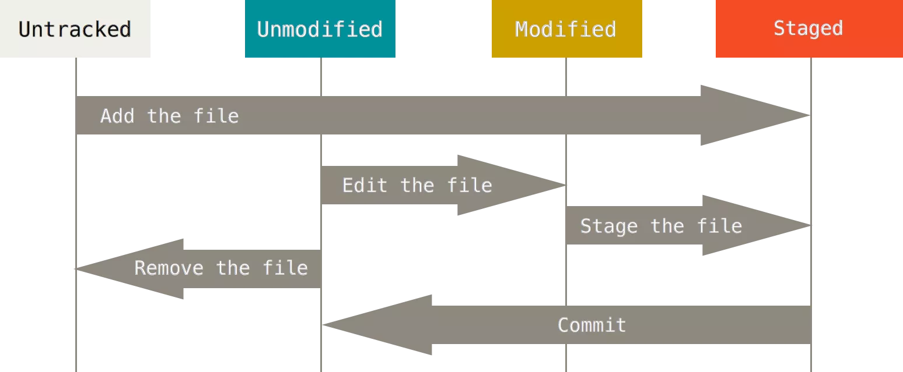
* Các cách kiểm tra trạng thái
  - `git status`: Đây là lệnh để bạn biết "chuyện gì đang xảy ra". Nó sẽ cho bạn biết:
    + Các file đang ở trạng thái Modified nhưng chưa được add (Changes not staged for commit). 
    + Các file đang ở trạng thái Staged và sẵn sàng để commit (Changes to be committed). 
    + Các file đang ở trạng thái Untracked (Untracked files).
    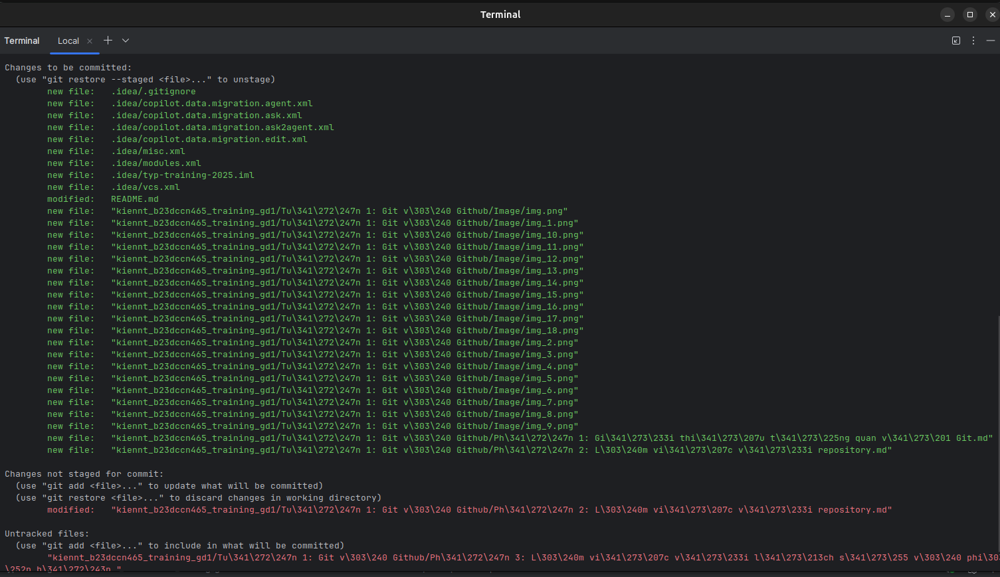
    + `git diff`: Hiển thị sự khác biệt giữa các file trong Working Directory và Staging Area. Nó giúp bạn xem những thay đổi cụ thể mà bạn đã thực hiện trước khi quyết định add chúng vào Staging Area.
    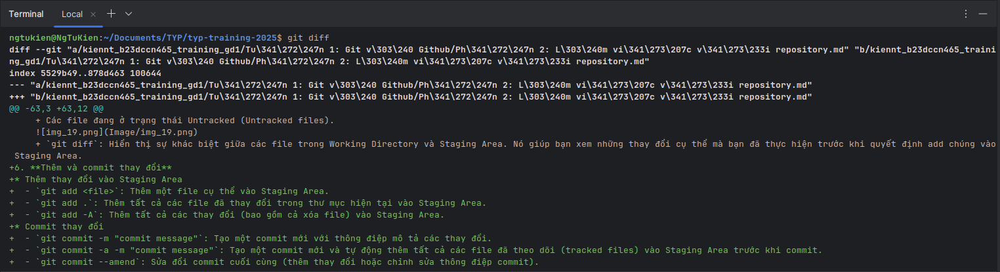
6. **Thêm và commit thay đổi**
* Thêm thay đổi vào Staging Area
  - `git add <file>`: Thêm một file cụ thể vào Staging Area.
  - `git add .`: Thêm tất cả các file đã thay đổi trong thư mục hiện tại vào Staging Area.
  - `git add -A`: Thêm tất cả các thay đổi (bao gồm cả xóa file) ở Repo vào Staging Area.
* Commit thay đổi
  - `git commit -m "commit message"`: Tạo một commit mới với thông điệp mô tả các thay đổi.
  - `git commit -a -m "commit message"`: Tạo một commit mới và tự động thêm tất cả các file đã theo dõi (tracked files) vào Staging Area trước khi commit (giống như chạy `git add` cho tất cả các file đã theo dõi trước).
  - `git commit --amend`: Sửa đổi commit cuối cùng (thêm thay đổi hoặc chỉnh sửa thông điệp commit).
7. **Cấu trúc nên có cho 1 commit**
- 1 commit nên bao gồm:
  - Một tiêu đề ngắn gọn tóm tắt các thay đổi.
  - Phần mô tả chi tiết (nếu cần) giải thích lý do và bối cảnh của các thay đổi.
  - Phần tham chiếu (nếu cần) liên kết đến các issue hoặc pull request liên quan.
  - Giữa các phần nên có dòng trắng để tách biệt.
- 7 quy tắc viết commit message:
  1. Sử dụng dòng trắng để tách tiêu đề, mô tả và phần tham chiếu.
  2. Nên giới hạn tiêu đề commit trong khoảng 50 ký tự.
  3. Viết hoa dòng tiêu đề commit.
  4. Không sử dụng dấu câu để kết thúc dòng tiêu đề commit.
  5. Viết tiêu đề có dạng mệnh lệnh (imperative mood).
  6. Trình bày mô tả commit bằng những dòng không quá 72 ký tự.
  7. Sử dụng phần mô tả của commit để trả lời câu hỏi "Cái gì", "Tại sao" và "Như thế nào".
- Ví dụ về commit message tốt:
```
commit eb0b56b19017ab5c16c745e6da39c53126924ed6
Author: Pieter Wuille <pieter.wuille@gmail.com>
Date:   Fri Aug 1 22:57:55 2014 +0200

   Simplify serialize.h's exception handling

   Remove the 'state' and 'exceptmask' from serialize.h's stream
   implementations, as well as related methods.

   As exceptmask always included 'failbit', and setstate was always
   called with bits = failbit, all it did was immediately raise an
   exception. Get rid of those variables, and replace the setstate
   with direct exception throwing (which also removes some dead
   code).

   As a result, good() is never reached after a failure (there are
   only 2 calls, one of which is in tests), and can just be replaced
   by !eof().

   fail(), clear(n) and exceptions() are just never called. Delete
   them.
```

  
 
