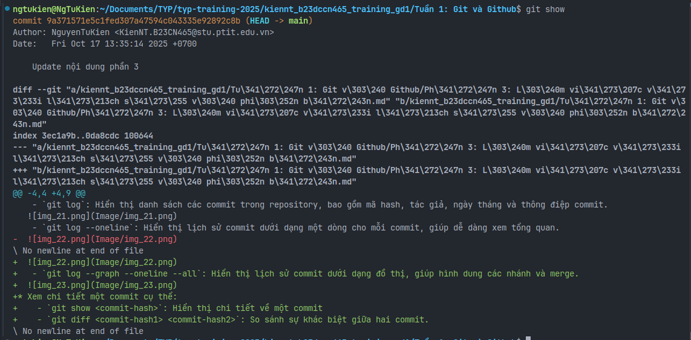

# Phần 3 : Làm việc với lịch sử và phiên bản    
## 1. **Cách xem lịch sử và phiên bản commit.**
* Xem lịch sử commit:
   - `git log`: Hiển thị danh sách các commit trong repository, bao gồm mã hash, tác giả, ngày tháng và thông điệp commit.
  
   - `git log --oneline`: Hiển thị lịch sử commit dưới dạng một dòng cho mỗi commit, giúp dễ dàng xem tổng quan.
  
   - `git log --graph --oneline --all`: Hiển thị lịch sử commit dưới dạng đồ thị, giúp hình dung các nhánh và merge.
  
* Xem chi tiết một commit cụ thể:
    - `git show <commit-hash>`: Hiển thị chi tiết về một commit
    - Nếu không có mã hash, `git show` sẽ hiển thị chi tiết của commit gần nhất.
    - 
    - `git diff <commit-hash1> <commit-hash2>`: So sánh sự khác biệt giữa hai commit cụ thể.
* Tìm người thay đổi một file cụ thể:
    - `git blame <file>`: Hiển thị thông tin về từng dòng trong file, bao gồm người đã thay đổi và commit liên quan.
  
## 2. **Giải thích commit ID (SHA-1 hash).**
* Commit ID (SHA-1 hash) là một chuỗi ký tự duy nhất được tạo ra bởi Git để xác định mỗi commit trong repository.
* SHA-1 (Secure Hash Algorithm 1) là một thuật toán băm (hashing algorithm) tạo ra một chuỗi 40 ký tự hex từ dữ liệu đầu vào (trong trường hợp này là nội dung của commit).
* Commit ID được tạo dựa trên các yếu tố sau:
   - Nội dung của commit (thay đổi mã nguồn, tài liệu, v.v.)
   - Thông tin về tác giả và người committer (tên, email)
   - Thời gian tạo commit
   - Mã hash của commit cha (nếu có)
* Chi tiết hơn :
    [Phần 3.2: Thuật toán SHA1.md](Ph%E1%BA%A7n%203.2%3A%20Thu%E1%BA%ADt%20to%C3%A1n%20SHA1.md)
    [Phần 3.2: Cách SHA1 tạo ra commit ID.md](Ph%E1%BA%A7n%203.2%3A%20C%C3%A1ch%20SHA1%20t%E1%BA%A1o%20ra%20commit%20ID.md)
## 3. **Undo / Revert / Reset thay đổi**
- Undo thay đổi
   - `git checkout -- <file>`: Hoàn tác các thay đổi trong Working Directory, đưa file trở về trạng thái của lần commit gần nhất.
   - `git restore <file>`: Tương tự như lệnh trên, nhưng là lệnh mới hơn và được khuyến nghị sử dụng (vì `git checkout` có nhiều chức năng khác nhau).
   - `git restore --staged <file>`: Gỡ file khỏi Staging Area (nếu đã `git add`).
- Revert thay đổi
   - `git revert <commit-hash>`: Tạo một commit mới để đảo ngược các thay đổi của commit đã chỉ định, giữ nguyên lịch sử commit.
- Reset thay đổi
   - `git reset --soft <commit-hash>`: Đưa HEAD về commit đã chỉ định, giữ nguyên các thay đổi trong Staging Area và Working Directory.
   - `git reset --mixed <commit-hash>`: Đưa HEAD về commit đã chỉ định, giữ nguyên các thay đổi trong Working Directory nhưng xóa Staging Area.
   - `git reset --hard <commit-hash>`: Đưa HEAD về commit đã chỉ định và xóa tất cả các thay đổi trong Staging Area và Working Directory (cẩn thận khi sử dụng lệnh này).
- Lưu ý: Trước khi sử dụng các lệnh này, đặc biệt là `git reset --hard`, hãy chắc chắn rằng bạn hiểu rõ về tác động của chúng để tránh mất dữ liệu không mong muốn.
